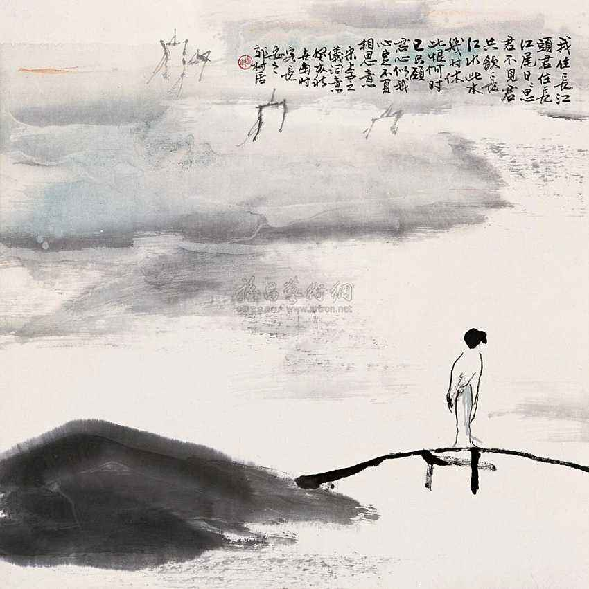

# 只愿君心似我心

> 我住长江头，君住长江尾。
> 日日思君不见君，共饮长江水。
>
> 此水几时休，此恨何时已。
> 只愿君心似我心，定不负相思意。
>
> ——李之仪《卜算子》

读惯了写爱情的锦绣词句，遇到这首铅华落尽的《卜算子》反倒让我眼前一亮。那种感觉就像从花团锦簇的春城走出，在郊外的陌上看到一株野百合，不蔓不枝，清丽可人。

我不能不为之驻足，面对着相思汹涌的江水。

这江水是发源于《诗经》吧，逆流而上，会看到参差荇菜在水底舞动，苍苍蒹葭在岸边摇摆，还会听到雎鸠在江心小洲上关关地吟唱。而那个在水一方的伊人，已经从先秦走进北宋。她不再像从前那样娇羞矜持，不再故意躲避君子执着的追问，溯洄从之，道阻且长，这一等就是千年啊。此水几时休，此恨何时已，她不愿再次错过，对这江水许下自己纯真的期盼：只愿君心似我心，希望住在江尾的那个人可以听到。

只愿君心似我心，定不负相思意，一句期盼加一句诺言就勾勒出了她心底关于爱情的蓝图，简单归简单，却不匮乏，实在道出了天下有情人的共同心愿。灵犀一点，心心相印，两个人若能情深至此，余下的尽可心照不宣，连局外人都可以猜出最后会是童话里的结局——从此，王子和公主过着幸福的生活。

爱情本身其实是件简单的事，太多的雕饰反而会产生一种无形的隔膜，如同在赏景的窗前挑起一层刺着苏绣的纱帘，美则美矣，整体的境界终究要下一层。有时候素面朝天倒可造就出不流于俗的风华。

比如在暮春的江南，长亭带柳，碧草连天，兰舟催发，帐饮无绪，一对恋人转作一对离人。她低首抚弄着绿色的裙摆，无语凝噎，未对心上人诉尽的千言万语都化作幽幽一句，说道：“记得绿罗裙，处处怜芳草。”

比如在浪漫的七夕，夜色如水，银河垂地，情思缱绻，神游鹊桥，牛郎织女之间不老的故事还在秦观耳畔传诵。他暗想红尘百态人生离合，恍惚中有所顿悟，此时，他知道华词丽句已经苍白，信口吟出：“两情若是久长时，又岂在朝朝暮暮！”

再比如一个女子指天为誓：“上邪！我欲与君相知，长命无绝衰。山无陵，江水为竭，冬雷震震，夏雨雪，天地合，乃敢与君绝！”

以上几句和“只愿君心似我心”一样的简单，但是谁敢因为简单而否认它们摄人心魄的魅力？

简单是一种不需映衬就能绽放的美丽，一种不需技巧就能呈现的精彩，一种不需相识就能拥抱的亲切，一种不需剥解就能吞咽的真实，一种不需解释就能感知的温存，一种不需酝酿就能触发的感动……

简单多好。

诚然，情之一字用多华丽的词句来修饰都不为过。然而当我们小心翼翼地拨开层层叠叠的装束时，却经常发现包裹其中的是一颗朴素的心。

相思与相恋是个天生丽质的话题，即便没有义山的沧海明珠蓝田暖玉作点缀，没有少游的一帘柔情十里春梦作陪衬，也一样的妩媚动人。

我相信一个人与一首词的相遇是需要缘分的。当然我说的这种缘分不是眼睛与字迹在纸面上的厮磨，而是那种让你一见如故一见倾心一见钟情的邂逅。就如人与人之间一般，有的即便有过千百次相遇，留在彼此心中的仍是擦肩而过的漠然，两个人注定只是彼此生命中的过客。而有的人就算身在两个不同的世界，也能因着一次偶然的相遇走到一起。

当复杂成为一种由来已久的习惯，简单就会成为望眼欲穿的奢求。因此当我们读到“只愿君心似我心”时会感到无所适从，茫然若失。

如今的社会太多了对物质的追求，太少了对精神的倾注；太多了对浮华的追求，太少了对质朴的向往。我们不自觉地逐流于混沌的人群，因过分追求细腻而变得粗糙，因过分追求高贵而变得卑微，尽管这并不是我们的初衷。遇到“只愿君心似我心”时我们甚至找不到一片净土来储存如此纯净的理想。

曾经在一个情感类节目中听到过这样的爱情故事：两个人在大学里相识、相恋，共同经历了很多磨难之后，他们终于如愿在一座大都市里找到各自的工作。看到这里，我一厢情愿地以为接下来是幸福的开始，事实上恰恰相反。几年之后，两个人在各自的世界变得精明圆滑了，她对他说，你如果不能买房买车我们及早分手，不要耽误各自的幸福。我不禁惘然，她的坦率让人佩服，但她忘记了幸福最原始的定义，也忘记了当初和他在一起的理由。

还有一个故事是这样讲的：森林里有一个狮王非常爱它的妻子，后来妻子因病去世了，狮王悲痛欲绝，在一处风光秀丽的山谷安葬了妻子，日夜在墓前守护。后来狮王在墓地栽满了四季常开的鲜花，再后来它建起了一座漂亮的别墅，把墓地开辟为后花园。再后来它为了建一座假山把妻子的墓迁往了别处。显然，狮王忘记了它最初来这里的理由。其实人也常常做类似的事情。

生活是海，爱情是船，但这只船是邮轮而不是货轮，不要妄想把钻戒、豪宅、名车统统装上而使其增重，那样只能增加楫毁船倾的危险。

“只愿君心似我心”是古诗词里的古典意象，离现代人的现实生活确实有些遥远。但遗憾的是它所代表的那种质朴与简单也一并变得遥远起来。“一路上有你，苦一点也愿意”是在歌词里才能听到的情话，“和你在一起就是幸福”是在台词里才能看到的告白。

爱一个人，何必要那么复杂？

爱一个人，就是在逛商场的时候看中一款毛衣，心里想到“他穿上一定很好看”。

爱一个人，就是在听完天气预报后，打电话告诉她今晚有雨，记得早些回家。

爱一个人，就是有时候托着腮想象他此刻在做什么，会不会想你。

爱一个人，就是有时突然想给她打个电话，接通后又不知该说些什么，这才发现只是想听听她的声音。

爱一个人，就是在他惹你生气后暗暗发誓以后再也不理他，可没过多久就盼着他跑过来向你道歉，然后你故意板着脸警告他下不为例。

爱一个人，就是喜欢听她质问你手机上的陌生号码是谁，是否单身，漂不漂亮，然后看着她冲你发脾气，自己不说一句话，反而站在那里开心地傻笑。

……

爱一个人，只愿君心似我心，应该如此简单。
