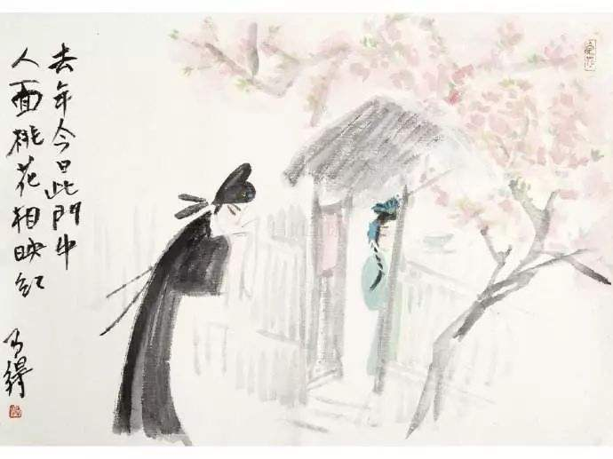

# 桃花依旧笑春风

> 去年今日此门中，
> 人面桃花相映红。
> 人面不知何处去，
> 桃花依旧笑春风。
>
> ——崔护《题都城南庄》

这是一首不用翻译，也不可翻译的诗。它本身就像一枝春风中的桃花，开放在长安郊外的田间陌上，恬淡而静美。二十八个字，轻描淡写，毫不张扬，却把一场故事的结局演绎得绚烂无比，凄美绝伦。读到最后，很少有人能够躲开它悄悄挥出的温柔一刀，因为在人生路上，每个人都曾是故事中的主角，被物是人非的凄凉深深刺痛过。古老的忧伤，在诗的字里行间形成的暗流，千年之后，仍没有干涸。

那是一个属于大唐的春天，乱花渐欲迷人眼，浅草才能没马蹄。骀荡的春风指引着崔护来到一处农家小院，春意骤然变浓。

桃之夭夭，灼灼其华。

崔护显然被探出墙外的桃花吸引了，心头一动，鬼使神差地推开了小院的木门。

这时，一位明眸皓齿的少女走上前来，让满树的桃花黯然失色。

这位公子有什么事吗？

崔护马上清醒过来，俯身作揖，顺势答道：

小生出城踏青，口渴难耐，不揣冒昧，来贵庄讨碗水喝，望姑娘行个方便，小生不胜感激。

少女嫣然一笑，讨碗水也用这么客气吗？你在这等一下，我去给你取来。

少女翩翩地走进，又翩翩地走出。

崔护痴痴地看来，又痴痴地看去。

一时忘情的崔护去接水碗时，不小心碰到了少女宛若葱根般的手指，少女的手触电般缩回，脸颊飞上一片红晕。崔护见状，心里暗叫一声“该死”，只顾抬头喝水，不敢再看少女一眼。他只知道，这是他此生喝到的最甘美的水。

崔护归还水碗，期期艾艾地说：

冒犯之处，敬请见谅，多谢姑娘惠赐琼浆，小生，告辞了。

少女始终低着头，只轻轻地“嗯”了一声。

崔护转身向林边的小径走去，用手摸了摸兀自忐忑不止的心口。

在转弯处，他还是忍不住回头了，看到了一幅让他永生难忘的画面：少女捧着那只玲珑的瓷碗，站在缀满桃花的树下，望着林边的小径出神。

只听“吱”的一声，木门猝然合上。他眼中，只剩下墙外的几枝桃花在春风中摇曳。

第二年，春天如约而至。崔护的心事和桃花一起在枝头发芽，含苞，开放。他终于可以带着期盼出发了。同样在一个春风骀荡的午后，同样走的是去年的小路，甚至同样穿着去年踏青时的衣服，他希望这么多的同样加在一起，可以让他遇到同样的人。

桃之夭夭，其叶蓁蓁。风景依稀似去年。

这位公子有什么事吗？

说这句话的，是一位两鬓如雪的老人。

桃花依旧寂寞地开着，树下，却再也不见去年的身影。

她也许搬往别处了，也许出嫁了，也许……崔护没敢继续想下去。恍惚中，吟成四句诗，题在墙上，然后向着夕阳慢慢走去。

“此情可待成追忆，只是当时已惘然。”

很多事情都是这样，在它经过时我们一时犹豫，没有抓住，过后再去寻找，已是芳菲落尽，人去楼空。

读《题都城南庄》，就像在读一场故事，故事的具体情节由读者填充，结局却已被崔护敲定在千年之前。说起来有些宿命式的悲哀，无论我们费尽心思去编出多少浪漫的情节，最终都逃不过结局的封杀。崔护在依旧笑春风的桃花面前，大概产生过同样的感慨，所以他只用两句回忆过去，两句描写现在，除此之外，没有再说一句话。人在痛到极点时，往往会选择沉默。

其实，还有一个故事的版本，并没有接受崔护定下的结局，而是少女因崔护害下相思病，茶饭不思，日见消瘦，最后卧床不起，奄奄一息，第二年春天，崔护重访桃花，再次与少女相见，少女的病奇迹般好转，最后与崔护喜结良缘。古人的浪漫手法当真让人佩服，硬是把故事的凄美改成了完美。大团圆是人们百看不厌的结局，因为现实中抹不去的缺憾多少能在故事中找回些补偿，可现实终究是现实，不容改写，再完美的故事也不会得到演出的机会。我们总不能靠着海市蜃楼般的幻景来医治现实中的伤。人生需要喜剧，同时需要悲剧。我就更偏爱诗中原始的凄美与忧伤。

不刻意的相遇加上不经意的离别，很容易被岁月酿成一杯苦酒，千般滋味，让人品不透，道不出，忘不掉。春归时节，桃花对崔护来说恐怕已成为粉红色的断章，悔恨、忧郁如旧伤般年年复发。不知他有没有再去都城南庄凭吊他们美丽的相遇，以提醒自己故事确实存在过。不过我相信那个如桃花般娇艳的少女一定和崔护一样，都把遇见对方当作此生最美丽的意外。

人生是由无数个相遇和离别串连而成，绝大多数的相遇只如昙花一现，就不得不凋谢在离别的雨中了，短暂得来不及细细品味，我们就已进入下一个轮回，留在记忆中的，可能仅是一个背影，一个眼神，或是一句温暖的话。短暂的相遇同样能催生出难忘的精彩，如流星划过夜空，让人怦然心动。于千万人中，擦肩而过都是莫大的缘分，相遇的本身就已美丽之极。两个人的生命若能在某处有个交点，足以大慰平生，君不见，有多少人的生命似平行线，一路同行，却始终没有——相遇。

一路走来，我们会遇到很多人，可又有多少值得我们驻足留恋？相遇是美丽而脆弱的，经不起任何一方的冷落，很容易就会被离别彻底切断。在洞晓世事，谙尽愁滋味之前，也许有很多相遇来得很是炫目，让我们欣喜不已，以为孤单的生活会因此而改变，可最后常常失望地发现，彼此只是对方生命中的过客。于是，继续在相遇和离别之间游走。总会有人在下一站等我们出现，我们也曾在上一站等过别人。在历尽千山万水后，已是遍体鳞伤，蓦然回首，终于发现我们寻找的那个人，就在灯火阑珊处。这时的相遇，不必欣喜若狂，如张爱玲所说，只需轻轻地走近，对她（他）问一声：“噢，你也在这里吗？”然后牵起她（他）的手，一路走下去，再也不用担心离别。

“人面不知何处去，桃花依旧笑春风”道出的是一种人生中普遍的荒凉。桃花自开自落，从不会因为某个人的消失而改变，崔护等待的是那个少女，而桃花等待的是春风，并无意做一场相遇的见证者。“年年岁岁花相似，岁岁年年人不同”是人在花前的感慨，可如果桃花真的如人般多愁善感，是不是会发出“年年岁岁人相似，岁岁年年花不同”的感慨呢？

相遇若想躲过离别的催折，需要来自双方的默契与果断。然而我们在相遇时，常常是迷茫的，很少有人敢在一瞬间毫不犹豫地作出决定。真的遇到那个人时，就算再小心翼翼，也躲不过命运设下的劫。她（他）的一个眼神，就能轻易击穿最高明的防备。没有谁能决定自己会在何时何地对何人动心，相遇，一向不喜欢被人设计，总爱以一种意料之外的方式出现。

生命如不系之舟，在时间的洪流里漂向未来。

一路上，两岸的风景不断从隐隐约约变得真真切切，最后再归于朦朦胧胧，绝大多数都逃不掉被遗忘的宿命，只有浓缩了整个春天的一瓣桃花，或者聚焦了全部秋思的一片红叶能永留心间，如夹在书中的标本，多年之后，虽已干枯，但色泽一如从前。

在漫漫旅途中，你会在某一天与一段风景不期而遇，让你在刹那间沉醉，迷恋，情不自禁，毕竟，这段风景太过熟悉，竟像来自重温了无数遍的梦境。它的美，不属于千千万万个过客，只属于你一个人，为了等你，它仿佛已在此守候了几十年，几百年，甚至几千年。于是，你第一次为了岸边的风景停下脚步，在它面前欣赏着，感动着，忍不住想要终止旅行，和它一起慢慢老去。可是，你还有此生更重要的梦想要去实现，远方已经向你发出频频的催促，最后你还是无奈地离开了。

在余下的生命里，你一直在苦苦地寻觅，可就算后面的风景美若仙境，你也再也找不回从前那种美妙的感觉了。过去一旦成为过去，就无法回游。只能期盼逝去的梦境能重现，在一个似曾相识的春天，只是，你再也停不下生命的脚步，唯有随着时间的河流向前，向前……

并不是每场相遇都能得到完美的结局，正如都城南庄的桃花，虽然已把全部的美丽交给春风，可秋天的枝头，并不一定会有幸福的果实。

相遇，只是一场舞会的入场券，入场时你孤身一人，出场时，也许仍是孤身一人。
