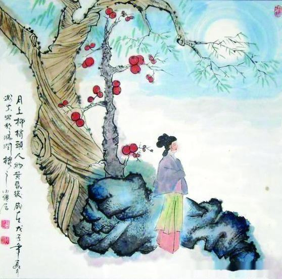

# 此情可待成追忆

> ——欧阳修《生查子·元夕》
>
> 去年元夜时，花市灯如昼。
> 月上柳梢头，人约黄昏后。
>
> 今年元夜时，月与灯依旧。
> 不见去年人，泪湿春衫袖。

汴京的元夕无非是这个样子。

人影渐稀，笙歌渐断，夜，已经很深了。

纵是我千百次回首，灯火阑珊处，依旧寂然。

烟水亭边，月依旧，灯依旧。桥上飞落一块石子，在原本如镜的水面上激起圈圈涟漪，很圆，只是开始。

月光从树隙间漏下，我试着捧在手心，不料却摔碎在地上。柳枝招摇地舞弄清影，撩拨着我的心事。不远处的画舫上，谁在唱着回肠的歌？有风吧，不然我的眼中何以贮满了泪水？

去年元夜时，你从桥边拂柳而来，冲我浅浅一笑，就步履从容地走进我的心里。而我，只能呆呆地观看，竟无半点招架之力。

你用手指在我的心扉上写下四个字：此情可待。然后，转身离去。

此情可待，我日日参悟，生怕里面有我破解不了的禅机。四个字，早已长成心茧，只待你轻轻点破，就能化蛹为蝶，翩跹于花前月下。

寂寞庭院里花开花落，石径长满思念的青苔。你那浅浅一笑，在我的窗前长成一瀑缀满温情的紫藤，暮春赐我以幽馨，仲夏赠我以清凉。我以为，你始终不曾远去。

温一壶淡酒，在月下独饮，回忆作餐，沧桑为肴。朦胧中，依稀看到你迤逦而来，安然落座，拿起早已为你备下的酒杯，与我邀月共醉。

可惜，我到底没能读懂你转身而去的身影，正如你没能读懂我略带落寞的眼神。不须万水千山阻隔，从一开始，你就注定是我无法抵达的孤岛。

我被你带入一场豪赌，明知难以胜出，我仍然孤注一掷，成全了你的开局。以青春作注，我已押上一切筹码，只盼你今夜归来，我便成最后的赢家。谁知，你竟忘了当初定下的归期，陷我于无人收场的残局。

你的许诺一如海市蜃楼般缥缈。伸手去抓眼前的美满，缩回来，握在手心的却是一把凉雾。是我太过顽痴，还是你太过洒脱？

那一夜，华灯如昼，皓月横空。你说，元夕是汴京最美的时候。我望着你，你望着月。

这一夜，元夕如期到来，你却杳无踪迹。我望着月，月望着你。

一年的时光，瘦损了你的身影，丰腴了我的思念。一次雁来雁往，十二次月圆月缺，三百六十次日升日落。岁月确已蹉跎，往事并不如烟。

太久了，汴京，元夕，你。

此情可待，成追忆。汴京，今夜请将我遗忘！

我的思念，从此无须你来偿还。过了今夜，我将以颤抖的笔勾销你到期的宿债，你我之间的契约便成废纸一张。于万丈红尘中，你我再无牵挂。你，继续流连于海角，我，继续守望于天涯。

你该知我心意。

怕只怕，孟婆汤解不了我深深的愁思，奈何桥隔不断我痴痴的回望。

也好，如此正可期待来生。
