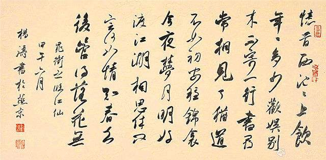

# 管得落花无

> 忆昔西池池上饮，年年多少欢娱。
> 别来不寄一行书，寻常相见了，犹道不如初。
>
> 安稳锦屏今夜梦，月明好渡江湖。
> 相思休问定何如，情知春去后，管得落花无。
>
> ——晁冲之《临江仙》

读词如观人，词和人一样亦有各自的性格。

读《水调歌头·明月几时有》是在看一个人在中秋之夜举杯邀月舞弄清影，而这个人不一定是东坡；读《声声慢》是在看一个人在萧条庭院里茕然孑立寻寻觅觅，而这个人不一定是易安。当你的心境遇上作者的心境在某个瞬间豁然打通时，词中的字字句句会把你带回东坡易安的世界，那时你就是东坡，你就是易安。而词的性格也不一定遵循作者惯有的脾性，东坡摧刚为柔，可吟出“相顾无言，惟有泪千行”的婉约佳句，易安化柔成刚，可吟出“生当作人杰，死亦为鬼雄”的慷慨豪歌。词的性格决定于作者挥笔时的心情。

这首《临江仙》的作者是北宋的晁冲之，但我以为它的性格像极了黛玉，让人又爱又恨。所爱之处在于它的善解人意，寥寥数语就戳破了你的心事；所恨之处在于它的不留情面，几句话柔声细语地说出，看似轻描淡写，实则句句伤人，尤其“情知春去后，管得落花无？”一句，当真摧人心肝，绵里藏针，把人逼到了无可逃遁的地步。“相思休问定何如”竟像是为黛玉量身定做的台词——我想你，但请不要问我过得怎么样。能把深情告白说得如此冷峭之人，除了黛玉我想不出第二个。

此词以“忆昔”开篇，注定要浸透伤感的气息。很多事一旦触碰到了记忆，就会因时间的积累而变得无比沉重。词中提到的“西池”是一个如何美丽的地方，我们已无从知晓，但我们知道那里留下了词人一生中最斑斓的岁月。多年之后，那些曾与词人一同隔座送钩分曹射覆的诗朋酒侣已经散落人海，大多杳无音讯，分手那天所说的“后会有期”便成了镜花水月的幻景。有几个人倒是可以像从前那样相约相见，只是彼此之间残存的默契在刻意安排的相逢里显得过于单薄。

寻常相见了，犹道不如初，我想每个人读到这里都会恍惚起来吧。毫无棱角的十个字隐藏在波澜不惊的词句中，然而它却在被你的眼神扫到之时，骤然离纸，倏然入怀，一下子刺破你的心，如剑。这句话讲述的是真真切切的事实，正因如此才让我们感到真真切切的疼痛，不会痛彻骨髓却会连绵不绝，让你在抬首低眉间都可以触摸得到。

回忆徒增烦恼，词人只好“安稳锦屏”，打算在今夜的梦里重归西池，在明月的指引下泅渡江湖，将遗失的美好一一寻回。然而梦如人生，又岂是一句祷告所能安排？他终究还是妥协了，坦白了，情不自禁了，承认自己相思成病，但他又拒绝用别人敷衍的问候来进行医治。最美的春天已过，曾经在西池边盛开的恋情友情已经在无边的冷落里悄悄枯萎了，谁也无法凭着几句“何如”换回一个灿烂的季节。

从词中看到“相思”时，我被这温暖的两个字感动了。尽管春归花落是我们无力改变的事实，但是我知道有一种惦念还留在每个人的心底，从不曾因为时光的流逝而消解。相思，确实是个勾魂摄魄的字眼，就像两颗玲珑的红豆，从王维的手中滑落继而在世间传递了千年，而它依然光鲜圆实，明艳如初。

词人在相思之后，似乎对尘世的不圆满有所了悟，别有一番滋味在心头，接着“休问定何如”的余音发出销魂一叹——情知春去后，管得落花无？这句比“寻常相见了，犹道不如初”透彻了许多，也尖锐了许多。它把词中的伤感由不可名状的缥缈引向了可感可知的具体。可是这对我们来说不见得就是幸事，犹如把一团萦绕于心的雾化作一腔苦水，伤感的范围是缩小了，浓度却要成倍地扩大。

情知春去后，管得落花无？短短十个字如一串奇异的情感密码，细细品来，可读出多种答案。

既然知道春天已经过去，香径无主花自落，无人怜惜坠红。你我只是冷眼旁观，任其零落成泥，有谁曾为之驻足回望，送上爱怜的一瞥？这是对人情冷暖的质问。

明明知道春天已经过去，东风无力百花残，韶华易逝，落红难缀。执拗的东君何曾因你我的不舍而稍作停留？这是对冷酷现实的责问。

早就知道春天已经过去，当初你我共同赏过的花枝坠粉飘香，应是绿肥红瘦。是否有人记得把那些落蕊收入锦囊葬之花冢，以供你我在以后的岁月里前来凭吊？这是对美丽过往的探问。

当一首词有了自己的性格，它在被读者选择的同时也会为自己选择读者，人读词，词亦读人。邂逅一首好词，就像在江南雨巷遇着一位如丁香般结着幽怨的姑娘，抑或在苍凉古道碰到一位吟啸徐行的天涯沦落人，两者眼神相对，沉默中对方道出一句你想要说又说不出的话，于是你在刹那间心领神会，感动不已，然后彼此对视，颔首，微笑而过。爱上一首词和爱上一个人一样，需要的只是一瞬间，它不必是传世佳作，不必是圣手名篇，可以为你注解人生中的悲欢就已足够。就像这句情知春去后，管得落花无，那么简单，那么平实，却能让你在听到之后泪如雨下。

一首《临江仙》，字字含悲，句句堆愁，引我们走向了平日不敢逼视的荒芜。

我们习惯了沉默，继而习惯了寂寞。有些话可以在彼此心头深藏一个月，一年，乃至一生都不露痕迹，因为我们明白，沉默着，兴许相安无事，说出来，怕是两败俱伤。

别来不寄一行书，并非意味着尘缘已断相思已停。我们有时也会翻出那些泛黄的照片去指认故人略显模糊的容貌，一些曾经天天挂在嘴边的名字如今却要努力地回想，通讯录上的电话号码依然清晰可辨，而我们却找不出一个再次拨通的理由。

也许纳兰容若说的“有情终古似无情”是无奈的事实吧，当一段年华逝去，悲欢已成往事，我们常常不知该如何面对那些一起走过的日子。情知春去后，管得落花无，春天去了，花儿谢了，如果刻意去寻找就会变得矫情，徒增失不复得的伤感。繁华如三千东流水，我们无法将之一一盛取，一一饮下。

有过很多很多地方，我们来过又离去；有过很多很多朋友，我们认识又分开；有过很多很多事情，我们经历又忘记……

曲终人散，时过境迁，一路走来我们实在需要承受太多的伤感。面对幼时的伙伴，我们已不能像从前那样偷偷靠近，捂住他的双眼让他猜你的名字，也不能再不打招呼就推开朋友家的门，大叫“看剑！”剑刺来却是长长的一根甘蔗。面对昔日的恋人，我们已不能霸道地逼他放下手中所有的事情，陪你去逛一下午的街，也不能再在半夜里打电话把他吵醒，只为告诉他“下雪啦”。再次相遇，我们只能把许多心里话深藏，用一句“多年不见，你还好吗？”代替。虽然你还是你，我还是我，可我们已不是我们。

那么就让我们在各自的世界过各自的生活，穿梭于熟悉的街头，和陌生人擦肩，或喜或悲只与自己有关。

一月赏雪。

四月观花。

七月听蝉。

十月采菊。

一个人的四季过好一个人的生活，不要让远方的祝福落空。

当两个人的幸福不能重合，你的幸福，就是我的幸福。
