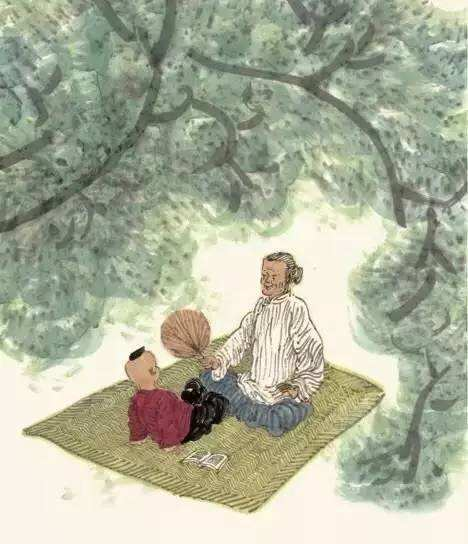

# 哭祖母

## 一

二〇〇八年的夏天，灰色一直统治着我的世界。

高考以一种强硬的手段把我的梦想冷却，揉碎，然后折价卖给了现实。

三年前，当我背上行囊，准备去远方求学时，奶奶曾摸着我的头说：“小飞子，好好上，奶奶等着你考大学！”

可惜，奶奶这次没能等到她期盼已久的结果。因此，我没有告诉她我在高考中的惨败，便匆匆逃到了哥哥那里。白天在北京城里漫无目的地闲逛，晚上回来胡乱写些东西，挨到深夜才昏昏沉沉地睡去。

七天后的早晨，我刚从夜里的噩梦中惊醒，却走进了另一场噩梦。

母亲突然打来电话，说奶奶病重，让我马上回去。寥寥数语，却让我和哥哥面面相觑，一时无言。因为我们知道，以母亲的谨慎，不到万不得已她绝不会惊动远方的亲人。作为儿媳、同时是母亲的她说不定在向我们转述时已小心翼翼地把“病危”改成了“病重”。可是，我临走时还安然无恙的奶奶竟在数天之内病入膏肓了吗？

回家的路上，我终于真切地感受到了“近乡情更怯”是怎样一种心境。同时，我也是第一次试着触摸“死亡”这个冰冷而可怕的词语。以前总以为“死亡”是个很模糊很抽象的概念，至少不在我的感知范围，可当它突然横亘在我的眼前，让我不得不去思考时，我才发现，接下来的一切竟都变得异常残酷。当奶奶在假设中从这个世界消失，以此为前提的每个生活场景都着实让我无所适从。所以这种假设没进行多久，我就让它匆忙结束了，然后吁一口气，心有余悸地回到现实中来。我终于知道“死亡”是个多么尖锐的问题，尖锐到让人不敢逼视。

不知道为什么，在我短暂的思考中，奶奶说的那句“等着你考大学”始终在我耳畔回响，当我把“死亡”与“等”重叠的刹那，不禁惊悚了。我恍然明白，当“等”字从一个年逾九旬的老人口中说出，那无异于拿生命做筹码来换一张通往明天的车票。可惜，那时的我没有细细掂量“等”字的分量，当它抖落尘封的旧事再次出现时已带了时间的棱角，把我的心重重击痛了。

## 二

哥哥和我的童年是在奶奶的爱护下度过的。哥哥上小学时跟奶奶住在一起，那时候奶奶身体还好，每次做了好吃的就会把哥哥和我叫来一起分享。逢年过节，有人拿来孝敬奶奶的礼品她从来舍不得吃完，总会给哥哥和我留一份。她说：“有奶奶吃的就有你们吃的，我自己吃的时候老觉得有你们在一边眼巴巴地看着似的，心里不是滋味啊。”

每当哥哥和我闯了祸，比如用弹弓打了别人家的鸽子、偷西瓜时糟蹋了别人家的瓜田，一旦事情败露就提前跑到奶奶那里，父亲或母亲追过来，一看奶奶拄着拐杖挡在我们面前，只好手下留情，我们就能顺利地逃过一劫。

奶奶身体很胖，随着年事增高，腿脚越来越不灵活，视力也每况愈下。三伯、四伯和父亲就开始轮流照顾奶奶。奶奶平日里只能在屋里活动，所以她很希望有人来到跟前对她讲讲村里最近发生的事。可是奶奶听力又很差，常常把“小妹”听成“学费”，把“六婶”听成“流水”，然后聊起“学费”与“流水”的话题，我们哈哈大笑之后只好按奶奶的思路聊下去，到最后往往是奶奶滔滔不绝地讲，我们饶有兴致地听。

后来哥哥外出求学，嘱咐我多去奶奶那看看。那时候我上小学，放学之后就去奶奶那转转。三伯爱喝酒，每次三伯喝完，将近失明的奶奶就摸索着把酒瓶藏起来，等我来了就欣喜地把酒瓶给我——酒瓶可以拿到奶奶家后面的冷饮店换一根冰棒。

再后来我也离开奶奶外出求学，半个月回家一次。有次遇到特殊情况没有回来，父亲来学校时便告诉我“你奶奶又在家里念叨你了，下次回家先去奶奶家看看”。回家后我去了奶奶那里，奶奶兴奋地拉着我的手说：“可把你等来了，奶奶这有好吃的！”说着从床头的被子底下摸出一个糕点盒，打开层层包裹拿出几个蛋糕递给我。我拿在手里一看，蛋糕已经被捂得发霉了。奶奶说：“你哥哥在外地上大学，赶不上了，过年才回来呢，快尝尝，好吃吗？”我大声地在她耳边说：“好吃！好吃！”顺便看了一眼放在远处的蛋糕，花花绿绿的霉菌此刻显得煞是好看。

奶奶身患多种疾病，好在胃口不错，在家人的精心照顾下成为全村的寿星，提起孝敬老人来，乡亲们都会对我们这个家族竖起大拇指。

母亲是信佛的，在我们那里烧香拜佛被称为“行好”。好几次有人拉着母亲去五台山拜佛，说那里的菩萨可灵验了，母亲都拒绝了。她说：“行好在哪里都能行，家有一老，如有一宝，把家里的老人伺候好了比拜哪的菩萨都灵！”屋里，身体肥硕的奶奶正坐在炕上，神态安详，如一尊佛。

奶奶告诉哥哥和我：“你们看见你们爸妈是怎么对我的，你们长大了也要这样孝顺他们，听见了吗？”

我们郑重地点点头。

## 三

我回到家时才知道，叔叔一家已经在我之前从北京赶了回来。这让我的心一下子紧张起来。而且从父亲凝重的脸色中，我似乎读出了一些不寻常的东西。难道奶奶真的病重至此吗？我还没来得及询问，母亲就把我悄悄拉到一旁，轻声说道：“还不快去看看你奶奶，都四五天没吃东西了！”

我走进奶奶的房间，叔叔和四伯红着眼睛坐在床头，奶奶静静地躺在床上，白发散乱，双颊凹陷，脸色失去了往日的红润，变得如纸般苍白。我轻轻地握住奶奶的手，在她耳边喊道：“奶奶，我是飞，我回来了！”尽管奶奶依旧双目紧闭，没能给我响亮的回答，但我确信她听到了，因为每次呼唤过后奶奶的嘴唇都在轻微地翕动。只是，我多么希望您在听到我的呼唤后能再次坐起，对我讲讲近些天发生的事，讲讲四伯从城里回来又塞给您多少好东西，讲讲三伯又做了哪些惹您生气的事，讲讲父亲怎样不听您的话而得了感冒……只要您再次坐起，我保证会耐心地听您讲完，再也不去惦记即将开始的电视剧，再也不去理会朋友们频频的催促。只要您愿意，我会像小时候那样偷偷地从邻家摘来刚熟的葡萄与您分享；只要您愿意，我会再去抱来那只温顺的白猫，让她在家中无人时与您作伴；只要您愿意，我会再次取出您珍藏的木梳，为您梳理美丽的白发……可是，您依然静静地躺着，把我这些简单的愿望变成了奢求。

前来诊断的医生眉头越皱越紧，两天后，无奈地留下一句“准备后事吧”，终止了不见起效的治疗。

整个家族震惊了。

分散在各地的亲人陆续赶回这个静默的小院。他们的焦灼忧虑对奶奶的病情无济于事，但是他们都把此行看作必不可少的生命仪式。当听到奶奶病重的消息时，每个人都立刻放下手中哪怕再重要的事情，踏上回家的路。没有犹豫，没有拖延，本能而自然。每个人只想在不多的时间里完成一次生命之河的回游，向在风雨中支撑了这个家族半个世纪的老人献上最后的祝福，并从她只能微微翕动的唇齿间记下最后的叮嘱。

没想到，在悲痛中浓缩的亲情催化出的竟是奇迹。

终止治疗后的第三天，奶奶已经十二天粒米未进，而且，因为是重症糖尿病患者，连葡萄糖都无法使用。然而，奶奶的病情却奇迹般好转了，奶奶开始吃一些流食，并能清楚地讲话。

“奶奶认出我是谁了！”我对母亲说。

“妈今天吃了两个鸡蛋！”叔叔对父亲说。

“飞，快来看呀，你奶奶能自己扇扇子了！”父亲对我说。

我们兴奋地传递着收获的幸福。

所有人都以为奶奶脱离了生命危险，闯过了最惊险的一关。于是，聚到一起的亲人带着轻松的心情离开了。

奶奶靠着一种神奇的力量等到了亲人们的归来，拼尽所有力气从垂危中站起，给满堂儿孙留下了一个和蔼的微笑。她像平常面对离别那样，缓缓地说完“孩子们，放心地走吧，在外边好好干，我没事，身体好得很”，才在所有人转过身之后，默默地离去。

我是看着奶奶停止呼吸的。那一刻，是农历七月十四晚上十点零四分。这个冰凉的数字，如利刃般把一个厚重的生命切断在人世与幽冥之间。

那个晚上，月色很暗，夜风很凉。

其他人忙着布置灵堂，让我负责打电话通知远方的亲人。我的手指在键盘上缓慢而谨慎地敲动，希望能够让悲痛扩散得不是那么猛烈。深夜时分来自老家的电话本就够让对方胆战心惊了，我在说话之前，总要用停顿给对方和自己一点缓冲的空间。我一遍遍拨通电话，重复着不幸的消息，电话那端也在重复着同样的惊愕，“啊……怎么会……我一定尽快赶回！”

叔叔一家和哥哥当晚从北京动身，凌晨四点赶到家中。

叔叔走下车后，表情木然地走进院里，没有和任何人打招呼，踉踉跄跄地走向灵堂，看到奶奶的刹那，撕心裂肺地喊了一声：“妈！我回来了！”哭倒于地。每每回想起这一幕，都让我忍不住流下泪来。

第二天将近十点的时候，我们正在院中守灵，忽听得外面一阵躁动。只见须发花白的大伯在堂哥堂姐的搀扶下颤巍巍地走进院来。父亲四兄弟先是一愣，紧接着赶忙迎了上去。大伯一声低沉的呜咽，引得满院的人哭成一片。

大伯身患重病，而且远在邢台，本来父亲与三伯已经嘱咐堂哥，奶奶去世的消息千万不要告诉他，只让堂哥堂姐回来。可大伯最终还是知道了，面对家人的苦苦劝阻，一向沉默寡言的大伯斩钉截铁地说了两个字：“回家！”

同样坚持要来的还有二伯。二伯的身体更差，下半身瘫痪，卧病在床，他是被儿女们用轮椅推来的。尽管现在连日常都要靠别人照顾，但在这个时候，他作为父亲发出的一句号令，具有不可抗拒的威严。

十一点，奶奶在一片恸哭中被抬出这个她经营了一辈子的家，随着灵车消失在远方。

下午，奶奶的骨灰被安葬在村东的祖坟。

晚上，小院又恢复了平静。白天充斥在空气中的哭声与泪水，由衷的，矫揉的，真实纯净的，别有用心的，统统沉淀在阴暗的角落，在对比中凹陷着人性的美与丑。

昨天奶奶还躺在床上，短短的十几个小时过后，却沉睡于地下了，永远回不来了。我傻傻地想着，一个人爬到房顶，看着满天的星星，任泪水流在脸上，流在心里。我不要混迹于送葬的人群，把夸张的哭声和掺假的泪水演给别人看。我只愿在深夜的星空下痛快地哭，哭给奶奶听。

## 四

奶奶就这样无声无息地走了，永远地离开了这个充满温情的世界，离开了她挚爱的亲人。可我知道，有份沉沉的牵挂从未改变，依然在每个人的心头缠绕。

一个月后，有天父亲晚上回来，给我讲了件路上发生的事。

下班之后，父亲已是疲惫不堪。当他经过一个水果摊时，停下了脚步，因为父亲看到竹筐上摆着金灿灿的香蕉——奶奶最喜欢吃的水果。一番讨价还价之后，售货员把香蕉装好递给父亲，这时父亲却茫然若失地呆立原地，没有回应售货员，而是自言自语般说了一句：“算了，老人家不定吃不吃呢。”然后在售货员诧异的眼光中一脸黯然地走开了。

原来，在父亲的意识里，还以为奶奶仍然像从前那样坐在家中，念叨着迟归的儿子。他还是想着给奶奶带回几根香蕉，再听到一句“瞧你，又给我花钱！”这种双方之间的惦记贯穿了父亲的一生，尽管奶奶已经不在了，可失衡的惦记仍在父亲心中不停地摆动，成为永远无法消解的习惯。

后来，三伯向我们讲，他在夜里半睡半醒之际，经常听到奶奶喊他的名字，让他在瞬间惊起，再也无法睡去。

次年正月初三，我们上坟回来，三伯、四伯、父亲和叔叔四兄弟坐在一起喝酒，提到奶奶的时候，我看到他们都在悄悄地抹去眼眶的泪水，华发苍颜的长辈竟像四个无依无靠的孩子。

别人家的老人去世后，我也见过儿女们在出殡时呼天抢地，哭得死去活来，可事情一了，不就很快笑出声来了吗？我还见过亲兄弟像踢皮球那样把老人推来搡去，最终兄弟反目成仇，老人抱病离世。我甚至见过有人把老人视作累赘，暗地里大骂“老不死”，真的死了还要一身轻松地扬眉吐气：“这下院子里可就宽敞了！”

喝完酒后我问父亲：“你们已经不需要父母的照顾了，奶奶的去世为什么还会令你们无法适应？”

父亲沉默了许久，对我说：“孩子，记住，一个人不管多大，没了父母，都是孤儿。”这句话，我会铭记一生。
