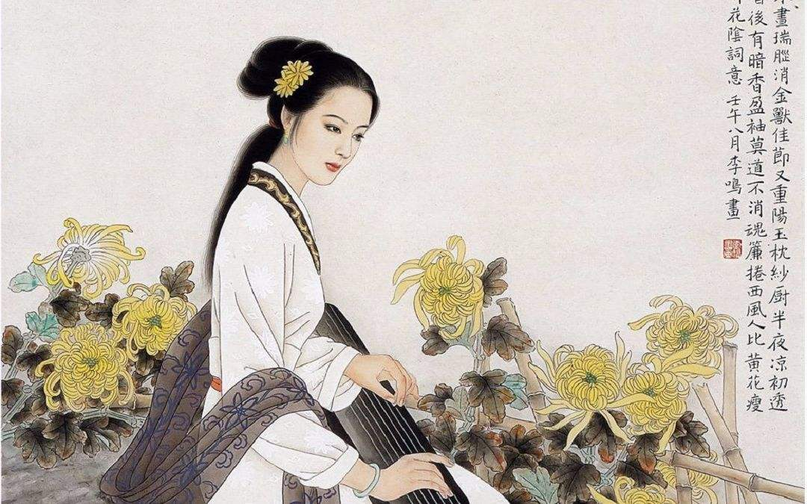

# 人比黄花瘦

## 一

在中国漫长的封建社会里，政治上风云变幻，朝代更迭，出现过几百位皇帝，其中只有一位女性，是武则天；文化上推陈出新，源远流长，产生了上百位大师，其中也只有一位女性，是李清照。

皇帝中有位武则天让人惊诧，大师中有位李清照则让人惊喜。

古人讲究男尊女卑，早在春秋时代孔夫子就凛然抛出一句：“唯女子与小人为难养也！”一下子把女性与小人捆绑在了一起，而负责推崇礼乐的政治、文化天经地义地隶属于君子系统。所以古代的女性历来与政治、文化无缘，历史中盛产的是烈女、孝女，而非权女、才女。

可以想象，假如有一两个女性能够气压须眉，突出重围，在只为男子留座的盛宴上夺得一席之位并让所有男子心悦诚服，她该有多大的胆魄与才智。

不同的是，武则天突围成功靠的是高位、党羽、权术、计谋乃至枷锁、屠刀，而李清照靠的仅仅是一支玲珑的生花笔。可见这支笔是多么光彩耀目，锋芒毕现！

之所以称李清照为大师，是因为她不仅是词的继承者、发展者，更是词之美的缔造者、总结者。但凡是介绍宋代文化的著作，写得再精简也不会漏掉李清照的名字，没有她宋代文化就是残缺的。她那寻寻觅觅的眼神是一个时代的印记，不容错过。

她是愁的化身，瘦的别名。“绿肥红瘦”“人比黄花瘦”“新来瘦，非干病酒，不是悲秋”，正是由于她如此瘦弱的身躯才使那段文化显得丰腴。

诗词文化的主体内容基本上是由男性一手构建的，但是其中的很大一部分都与女性有关。《诗经》以一位窈窕淑女的倩影开篇，《楚辞》以香草美人作为最高的人格理想和形象追求，乐府多以女性为主要的表现对象，唐诗中借女子之口来写宫词、闺怨、征妇、伤春的佳作不在少数，宋词中涉及女性的作品更是不可胜举。乃至有人戏称中国的文化史就是一部男性书写女性的文化史。

可是，这个牵扯着文化的女子时而俟我于城隅，爱而不见；时而在巫山之阳，朝云暮雨；时而低头向暗壁，千唤不一回；时而见有客来，刬袜和羞走。她参与了无数场由男性导演的演出，她自己又常常是只能旁观的局外人。任我们钟鼓乐之，琴瑟友之，看到的也只是她迤逦而去的背影，关于她的所有记忆都是来自别人的转述。

当我们追随到北宋与南宋的交界处，她终于回头了。千呼万唤始出来，她果然没有让我们失望，一颦一笑都让天下人为之惊艳。

这一次回头，当真如清辉照夜。

## 二

李清照生于书香世家。其父李格非官至礼部员外郎，是名重一时的文学家兼学者，他精于诗文，并在经学、史学、佛学、文学理论等领域均有建树，因此深受文坛盟主苏轼的赏识，后人把李格非与廖正一、李禧、董荣并称“苏门后四学士”。其母王氏是仁宗朝状元王拱辰的孙女，也有很高的文学修养，《宋史》称她“亦善文”。

如此优越的家庭环境使李清照度过了一个幸福快乐的少年时代。她一方面饱读诗书，学习礼义，接受中国传统文化的滋养；一方面与小伙伴们嬉戏游玩，春园斗草，溪亭荡舟，享受天真烂漫的豆蔻年华。这种无忧无虑的成长经历无非是大家闺秀之中常见的生活状态，可是李清照却有与众不同的地方。到了待字闺中的年龄，别人家的千金小姐都是静坐闺阁潜心女红，刺一对鸳鸯，绣几朵牡丹。而这时候李清照正在趴在书案上托腮苦想，以纸当绢，以笔作针，以情为丝，她绣出的是锦词丽句。

天才少女仅是霜刃初试，就令人眼前一亮：

> 点绛唇
>
> 蹴罢秋千，起来慵整纤纤手。
> 露浓花瘦，薄汗轻衣透。
>
> 见客入来，袜刬金钗溜。
> 和羞走，倚门回首，却把青梅嗅。

假如让小说家来刻画一个呼之欲出的少女形象，使她率真有之，羞怯有之，娇憨有之，黠慧有之，恐怕费尽千言也不能尽如人意。而十几岁的李清照做这件事只用了四十一个字。

家事安和，国事无虞，少年不知愁滋味，唯一值得让李清照忧虑的可能只有她的终身大事了。自古才子配佳人，才女降世自然也该有佳婿来伴，期盼中的美满没有落空，李清照的婚姻确实算得上天赐良缘。

有人考证，《点绛唇》中使李清照“和羞走”的“客”就是她未来的夫婿——赵明诚。赵明诚是个聪明博雅的翩翩少年，其父赵挺之与李格非同朝为官，当时任礼部侍郎一职。李清照十八岁那年嫁于二十一岁的赵明诚，婚后两人琴瑟和谐，鸾凤和鸣，堪称一对神仙眷侣。

且看他们是如何的鱼水相欢：

> 减字木兰花
>
> 卖花担上，买得一枝春欲放。
> 泪染轻匀，犹带彤霞晓露痕。
>
> 怕郎猜道，奴面不如花面好。
> 云鬓斜簪，徒要教郎比并看。

她拿着刚买来的一枝花挡在夫婿面前，把花斜插在自己的云鬓上，然后深情地望着他撒娇道：“你说，是我好看还是花好看？”这时的李清照俨然一个被幸福包围的少妇，愁对她来说还只是“才下眉头，却上心头”般的相思之苦，一种甜蜜的忧伤。

可是婚后不久，李清照平静的生活就被北宋末期的党争之祸打破了。

崇宁元年（1102年），“元祐党籍”案爆发，李格非因坐党籍而遭到迫害，李清照曾向公公赵挺之为父求情，而赵挺之当时正与蔡京合力打击旧党，考虑到自己的政治利益竟坐视不理。后来赵挺之晋升相职，与蔡京争权并取得上风。大观元年（1107年），蔡京东山再起，官复相职，接着赵挺之被罢去尚书右仆射，五天后即忧郁而死。赵氏家族广受牵连，赵明诚自身也招致牢狱之灾。出狱后，赵明诚及其家眷逃离汴京，回到故里山东青州。

至此，李清照的生活才又恢复了平静。

李清照作为一个刚走出闺房的女子，一连串的政治风波足以使她心力交瘁，进而也使她充分感受到了宁静淡泊的可贵，所以陶渊明在李清照年轻的时候就提前进入了她的生命。屏居青州之后，李清照借《归去来兮辞》与陶渊明进行了一次深入的对话，然后取“倚南窗以寄傲，审容膝之易安”之意给自己取号“易安”，并把书斋命名为“归来堂”。在一片温馨的小天地里，李、赵二人一起赏花赋诗，搜集文物，空则点阅金石，倦则赌书烹茶，过了十余年的逍遥生活，这段生活成为一生中最让李清照眷恋的时光。多年之后风住尘香花已尽，她回忆起当年那些事来还说：“甘心老是乡矣。”

可是接下来命运却露出了狰狞的面目，在前方等待她的是接连不断的沉痛打击。

靖康元年（1126年），金兵破汴京。次年四月，北宋亡。李清照夫妇苦心搜集的书册文物十余屋焚于战火。

建炎三年（1129年），赵明诚病逝于建康，李清照大病一场，仅存喘息。十一月，金兵犯洪州，李清照寄存此地的文物损失殆尽。

绍兴二年（1132年），李清照患重病，市侩之徒张汝舟巧言骗婚，实欲夺取残存文物，未能得逞即对李清照日加殴打。李清照奋起反抗，向朝廷揭发了张汝舟的旧罪，结果按宋代刑律，张汝舟法办，李清照也因告发丈夫入狱。这件事在当时的社会上引起了极大的轰动，那些道貌岸然的君子们隔岸观火，不亦乐乎，讥之为“晚岁颇失节”“晚节流荡无归”，并且“传者无不笑之”。

此后，李清照的踪迹渐渐消匿于史传，连逝世于何时何地都难以确定。她在一片哄笑中踽踽独行，流落江南，吟着凄苦的词句走向了历史的迷蒙处。

## 三

大宋大度地用一条长江把自己斩作两段，雄浑豪迈的一段赐予金人分食，孱弱柔媚的一段留给子民吸吮。自此，在李清照的生命里，长江就成了一道宽深的伤口，任是以江南的杏花春雨下药也不能使之愈合。

舴艋舟可以摆渡她单薄如叶的身躯，可以摆渡她仅存的几箱书画文物，却摆渡不了她与北岸胶结的眼神，也摆渡不了她几十年间的幸福往事。北岸有金人的鞭影在驱赶，南岸有悲苦的遭遇在潜伏，她不得不渡江了。可是，这边有故土和家院，往前一步是弃乡；那边有亲人和朝廷，退后一步是弃国。这一进一退之间，又怎一个愁字了得！

国既破，家已亡，朝廷似乎成了李清照后半生唯一的精神依靠。她沿着皇帝奔逃的路线一路追随，希望把以命相护的文物上交国库。可皇帝正被一群大臣簇拥着四处逃命，哪里顾得上去抚慰一个小女子的拳拳之心？史学家忙着记录皇帝的行踪，也不屑对她这个“晚节不保”之人稍作提及。为避皇家之讳，史学家们练就了高超的春秋笔法，他们故作从容地告诉后人：高宗一路上幸扬州，幸镇江，幸杭州，幸建康，幸越州，幸明州，幸定海。他们仅用一个“幸”字就轻巧地击退了紧追不舍的金兵，把圣明天子逃命时的狼狈变成了游山玩水般的潇洒。在国将不国、百姓危亡的大不幸中突兀地冒出一个“幸”来，实在是对满天下人的嘲弄。倒是那个被朝廷遗弃的老妇在乌江边吟出的一句“至今思项羽，不肯过江东”在满耳的吁叹里显得异常嘹亮。

佛家说人生有七苦，生、老、病、死、怨憎会、爱别离、求不得。生乃万苦之源，死是万念俱寂，人人都躲不过，李清照真正的酸辛处在于生死之外的其余五苦。而且这五苦在她的前半生里不露痕迹，偏偏都赶在她的后半生接踵而至。从她渡江的那一刻起，老、病就开始不动声色地侵蚀她的生命，爬上她的词篇，那个“徒要教郎比并看”的少妇仿佛一夜间变成了“病起萧萧两鬓华”的老人。赵明诚是她所爱，张汝舟是她所憎，可是她不仅要与所爱之人永别，还要与所憎之人相会，“猥以桑榆之晚景，配兹驵侩之下材”，“爱别离”与“怨憎会”之间自然裹挟着她的“求不得”，美满幸福求不得，天下太平求不得，甚至连一个安稳的栖身之所都求不得。

人们常说“国家不幸诗家幸，赋到沧桑句便工”，殊不知这沧桑又是文化之幸，诗家自身之不幸。

为了熔铸一个女词人，上天似乎进行了煞费苦心的安排，先是毫不吝啬地赐以贤父、慈母、佳婿，置她于蜜罐中冶炼，再毫不手软地施以身穷、家败、国破，扔她于冷水中浸淬。巨大的人生落差产生了巨大的文化内力，使得她的柔肠能够深度消化腹中的悲欢。

## 四

以南渡为界，李清照分别生活在冰火两重天的两个世界，前一个世界里是罗裳、兰舟，月满西楼，后一个世界里是梧桐、细雨，黄花堆积。她的《漱玉词》因此也明显地分为两个时期，前期作品不乏相思之愁，但愁中藏乐；后期作品也有佳节之乐，但乐中埋愁。

> 一剪梅
>
> 红藕香残玉簟秋。
> 轻解罗裳，独上兰舟。
> 云中谁寄锦书来？
> 雁字回时，月满西楼。
>
> 花自飘零水自流。
> 一种相思，两处闲愁。
> 此情无计可消除，
> 才下眉头，却上心头。

> 永遇乐
>
> 落日熔金，暮云合璧，人在何处？
> 染柳烟浓，吹梅笛怨，春意知几许？
> 元宵佳节，融和天气，次第岂无风雨？
> 来相召、香车宝马，谢他酒朋诗侣。
>
> 中州盛日，闺门多暇，记得偏重三五。
> 铺翠冠儿，捻金雪柳，簇带争济楚。
> 如今憔悴，风鬟霜鬓，怕见夜间出去。
> 不如向、帘儿底下，听人笑语。

李清照出现的时候，发展了几百年的婉约词已经非常成熟，按常理来说应该到了难辟蹊径的顶峰状态，可是这个才气过人的女子硬是带着婉约词闯出了另一番天地。她的词纤巧细致，清灵秀丽，常以平淡之字造非常之境，其造诣、声誉都可直追被奉为“婉约之宗”的秦观。

词自诞生之初就带着一种与生俱来的女性光辉，以温庭筠、韦庄为代表的花间派更是使之展现得淋漓尽致。到了山雨欲来风满楼的南宋，如泣如诉的婉约之音依然不绝如缕。在李清照出场前的漫长岁月里，词人们仿佛都在等待女性光辉的最终到来，而先前的锦词丽句倒像是男性挖空心思对女性光辉进行的种种猜测。他们有时候猜得确实很到位，常常博得满堂的喝彩。李清照的词则是对女性光辉的权威解读，她直接以我笔书我心，不用猜测就能给出精彩的答案，因此她的《漱玉词》包含着一种毫无阻隔的近距离的美。

不过，男性的猜测只注重于婉约一面，李清照身上洋溢的豪放之气是他们所始料未及的。

她的豪放之气首先在文学作品里有所表现。

李清照精于婉约词，但她绝不是一个只会自伤自怜的怨妇。她在路长日暮的凄苦之境犹能发出“九万里风鹏正举”的慷慨豪歌；避难金华时，她对着八咏楼啸出了“水通南国三千里，气压江城十四州”的豪迈长吟；站在乌江之畔，她所思的是“生当作人杰，死亦为鬼雄”的项羽，而不是娇魂易散的虞姬；绍兴三年，朝廷派韩肖胄、胡松年通使金国，她在诗中为韩、胡二人擂鼓呐喊：“愿奉天地灵，愿奉宗庙威，径持紫泥诏，直入黄龙城”。

其次表现为她的反抗精神。

在宋代，新媳妇和公公是连一句话都说不得的，李清照却敢在父亲李格非遭受政治迫害时公然指责赵挺之袖手旁观，称他“炙手可热心可寒”。晚年她不慎落入张汝舟的婚姻陷阱，假如别的女子遇到这类事大概会有两种结果，一是把文物交出乖乖就范，二是忍气吞声，任他折磨。而张汝舟遇到的是李清照，她宁肯拼个鱼死网破也绝不向一个伪君子屈服。

另外，豪放之气还体现在李清照的生活爱好上。

酒与诗常常是文人生活的两大主题，好多传世的名篇里都氤氲着醉人的酒香。李清照虽然是一位女性，但她对酒的喜爱不比男性少丝毫。在她现存的词作中有半数以上都与饮酒有关，她高兴了喝，忧愁了喝，年轻气盛时喝，体衰多病时喝，到后来“三杯两盏淡酒”对她已经不起任何效果了，让她与太白对饮她恐怕也敢欣然领命。李清照的另一个嗜好是“打马”——古代的一种赌博游戏，为此她还兴致勃勃地写过一篇《打马图经》。她在《打马图经序》中说：“予性喜博，凡所谓博者皆耽之昼夜，每忘寝食。但平生随多寡未尝不进者何？精而已”。看来她不单单是赌博的爱好者，还是一个逢赌必赢的高手。

以上种种豪放之气表现在男性身上并不值得大惊小怪，可是表现在笔风婉约的李清照身上就不禁让人称奇了。很多男性在词篇之中模仿了女性的婉约，而大师中唯一的女性则在词篇之外塑造了男性的豪放，这当真是一种有点戏谑化的双向补充和双向回馈。

## 五

据陆游的《夫人孙氏墓志铭》记载，李清照在晚年曾遇到一个聪明伶俐的小女孩，她打算收小女孩为徒，授其平生所学，可是小女孩却说：“才藻非女子事也”，一句话呛得李清照险些晕倒。

把“才藻非女子事也”刻进墓志铭里显然是为了抬高孙氏的道德水准，证明她幼时就有辨别是非的能力，没有受人引诱而误入歧途。可是陆放翁在抬高孙氏的同时也把李清照树为了反面人物，为什么呢？就因为李清照身为女子还要写诗填词，舞文弄墨。这种因果关系现在听起来太不合逻辑，可在当时理学盛行的社会上它却是完全成立的。

才藻非女子事也，李清照听到这句话是不是会有当头棒喝的感觉呢？钱钟书在《围城》里说过：“说女人有才学，就仿佛赞美一朵花，说它在天平上称起来有白菜番薯的斤两。”在风雨如晦的南宋，李清照势必为她的才情所累，她的才情比别的女子高出了几倍，她的国恨家愁也就比别的女子多出了几倍。但是她没有停下脚步，仍然执着地向生命与艺术的高峰攀爬，左一脚，十年，右一脚，十年，把围堵她的冷眼和嘲讽全都踩在了脚下。

她的攀登是一场孤独的文化苦旅，路途是孤独的，终点同样是孤独的。她最终站在了一座超越时代的高峰上，目之所及，别无他人，只能看到自己的影子。

孤独是一种最大的愁，愁越来越浓，她越走越瘦，最后瘦成一朵飘零的黄花。
