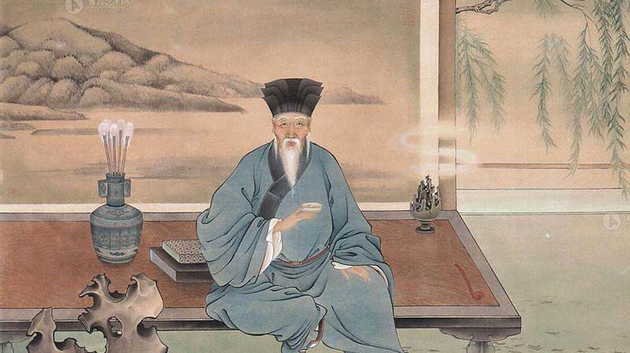

# 北宋的长者

## 一

二零零七年是欧阳修诞辰一千周年。欧阳修的祖籍地江西永丰、出生地四川绵阳、终老地安徽阜阳、宦游地江苏扬州等十六座城市发起了一系列盛大的纪念活动。欧阳修在中国大地——哪怕是贬谪之所，留下的足迹都成了各个城市争相供奉的文化遗产。这些城市做得并不矫揉，也不空泛，它们有理由向千年之前的大师致敬。因为那里的山水曾接受过大师的点化，那里的子民曾仰戴过大师的恩德。

不可否认，各地的纪念活动包含着“文化搭台，经济唱戏”的成分，但是，作为一种朝拜文化的集体仪式，其中透出的神圣和虔诚依然是感人的。

一千年是个可怕的时间长度，沧海可成桑田，峰峦或为深谷。

一千年里，有多少个一统天下的王朝灰飞烟灭，有多少个生龙活虎的民族绝迹尘寰，有多少个煊赫一时的名字湮没无闻。

一千年，可怕而又可亲，它能滤去一切外在的浮华，戳破一切深藏的虚伪，使重者愈重，轻者愈轻。

虽然隔了一千年，欧阳修的名字却能铭勒山河，镌刻人心。于文于德，欧阳修都该历千年而不朽，很值得我们纪念。

## 二

在中国各个朝代中，我一直对北宋情有独钟。

诚然，北宋论气度比不上唐朝的雍容华贵，论疆域比不上元朝的囊括四海。尤其是在大动干戈的战场上，北宋经常自缚手脚，露出一副瑟瑟索索的窘相。可一旦进入文化领域，北宋就能马上变得信心十足，敢摆开架势与任何朝代一决高下。北宋能拥有这种自信应该感谢一位长者，那就是欧阳修。

欧阳修在政治上是北宋改革弊政的先驱，文化上是开一代风气的宗师。他前承先贤，中扶同仁，后导新秀，穷毕生之力为北宋打造了一个俊彦辈出的人文环境。这使得北宋在文化领域坐拥良将千员，精兵百万，自然有充沛的底气去和任何朝代争锋。

北宋立国不过一百六十七年，从中走出的文人队伍却蔚为大观。我想过一个问题，假如让如此多的文人齐聚一堂去推举一位盟主，得票最多的会是谁呢？我相信，绝大多数人在济济才俊中扫视一遍后，会把目光锁定在两个人身上：欧阳修和苏轼。而苏轼在欧阳修面前还要俯身作揖，尊称一声“恩师”，所以他断然不会去抢老师的风头。最后的结果不难猜测，欧阳修会成为众望所归的盟主。

只需看看站在欧阳修周围的面孔，就会知道他处在了一个什么样的位置上。为欧阳修引路的前辈有晏殊、钱惟演、尹洙、谢绛；与欧阳修志同道合的朋友有范仲淹、韩琦、富弼、蔡襄、苏舜钦、梅尧臣；受欧阳修赏识提拔的后进有苏洵、苏轼、苏辙、曾巩、王安石、程颢、张载。这个阵容的豪华程度实在让人叹为观止，北宋前期和中期的精英几乎尽在其中了。

欧阳修宽大的袍袖里东风浩荡，竟隐隐包罗了北宋的大半风光。

对欧阳修在北宋所达到的声望，苏轼曾说过一句话：“天下翕然师尊之”。自古文人相轻，舞文弄墨的人大都自视甚高，他们不会轻易崇拜一个人，可一旦崇拜就肯定是心悦诚服，毫不掺假地崇拜。在宋朝的立国之初，天下的士子们确实需要有这么一个“师”去尊之敬之，崇之拜之。

宋朝的统一虽然在疆域上结束了分裂局面，但是，近百年的动乱对文化系统造成的重创一时还难以愈合。新生的宋朝站在文化废墟上茫然四顾，呼唤着一个从学识到人格都可为人师表的长者。欧阳修的出现无疑让宋朝精神一振，在他的指点下宋朝找到了正确的方向，从此大步前进，开创了继大唐之后又一个文化的黄金时代。

北宋前期的文坛充斥着一股浮艳之风，诗以“西昆体”为宗，文以“太学体”为贵。“西昆体”一味强调辞藻、句式的讲究，因而走进了华而不实的死胡同；“太学体”过度追求语言的奇崛，因而陷入了险怪晦涩的泥潭。于是，欧阳修和他的一批文友掀起了一场文学改革，经过几十年的努力，最终带领北宋文学冲破重重阻碍，走上一条金光大道。

## 三

科举考试是欧阳修进行文学改革的阵地。

比起隋唐来，宋朝的科举考试是相当正规的。唐朝也有科举考试，但是一来规模很小，每次只录取二三十人，二来形式不严格，士子们能否榜上有名与权贵的支持有很大关联。在宋朝，科举考试才有了一套公平而周密的制度。宋朝的科举考试分为解试、省试、殿试三级。解试由各州府或国子监主持，通过解试的考生称为“贡生”或“举子”，次年春天到京师参加由礼部主持的省试。省试的考场由皇宫侍卫严加看守，考试结束后，先由内侍官收取试卷，再由编排官密封考生的个人信息，对试卷另行编号；然后由封弥官誊写一遍，校对无误后盖上御书院的印章；然后试卷交由覆考官初判，再交由启封官二判，以两次判卷的结果分出等级；最后交还编排官，把试卷与考生的个人信息重新对应起来，上报朝廷，以供殿试作最后的裁决。

宋朝的科举考试对国家的人才选拔起了关键作用。欧阳修当年连中监元、解元、省元，他就是从科举考试中脱颖而出的。

在宋朝，上至皇帝，下至草民，对科举考试都倾注了巨大的热情。

北宋有一首传唱极广的《神童诗》是这样说的：

> 天子重英豪，文章教尔曹。
> 万般皆下品，惟有读书高。

在这种高度的热情之下，科举考试的文学取向必然会对整个文坛产生直接影响。考生们走进考场，就要迎合考场上盛行的文风，考生们走出考场，又会把他们熟悉的文风带入文坛的各个角落。所以说通过科举考试来进行文学改革是一条捷径。

经过欧阳修、梅尧臣等人的革新，“西昆体”对北宋文坛的不利影响渐渐消除。可是科举考试中又兴起了怪诞不经的“太学体”，北宋的大批文人对此趋之若鹜。后来欧阳修主持科举，力挽狂澜，痛革弊端，才使散文摆脱病态，重新回到了健康的发展道路上。

嘉祐二年，欧阳修知礼部贡举。有个名为刘几的考生最喜欢用险怪之语，对自己写的“太学体”深为自得。刘几的文章在考生中广为传诵，人们都认为刘几必能高中。这一年省试的题目是《刑赏忠厚之至论》，阅卷时欧阳修发现一篇奇涩异常的文章，其中有这样几句：

> 天地轧，万物茁，圣人发。

欧阳修一眼就看出了这是刘几的作品，于是在试卷上用“太学体”诙谐地批道：

> 秀才剌，试官刷。

就是告诉其他考官，遇到这样的文章一律毙掉。

阅卷过程中，有位考生的文章让梅尧臣眼前一亮，他惊喜地拿给欧阳修看。欧阳修读罢，激赏不已，拍案叫绝，想把这篇文章点为头名，可是转念一想，这等文章除了他的得意门生曾巩之外，怕是没有人能写得出来，要是把自己的门生点为头名肯定会招致非议，所以为了避嫌只好把此文列为第二。

这届省试放榜之后，有两件事让欧阳修心头不宁，一件在意料之外，一件在意料之中。

原来，被欧阳修有意降为第二的那篇文章并非曾巩之作，而是出自另一位考生之手，他就是后来承欧公余风接管北宋文坛的下一任盟主——苏轼。本该独占鳌头的苏轼最后却屈居第二，这样的结果定是让欧阳修既感错愕，又觉惋惜。

在这届科考中，欧阳修在刘几卷子上划下的一道朱红使那些醉心于“太学体”的考生纷纷落榜，他们又惊又怒，纠聚千余人在京城游行示威，还把欧阳修堵在上早朝的路上，对他百般谩骂。更有甚者，把一篇《祭欧阳修文》扔到他的家里发泄私愤。这种状况就像一群顽童不理解父母的良苦用心，反而扯着父母的衣襟大哭大闹，放刁撒泼。

对于眼前的一切欧阳修早已料到，但是他深信自己的选才方法是正确的，历史也将证明欧阳修确实独具慧眼。仅这一场科考，欧阳修就为北宋的文学界、思想界、政界遴选出了多个重量级人物。其中，进入文学界的有苏轼、苏辙、曾巩，“唐宋八大家”中的宋六家至此全部登场，北宋文学界开启了一个星光璀璨的时代；进入思想界的有程颢、张载，两人是宋朝理学的奠基人，他们建立的“洛学”、“关学”都是中国思想史上的重要流派；进入政界的有吕惠卿、曾布、王韶、吕大钧，有的成为王安石变法的中坚，有的成为以司马光为首的保守派骨干。

有这么一群各个领域的巨人站在欧阳修身后，那些落榜者骂得声音再响，闹得动静再大，也是白搭。他们的愚蠢言行不仅侮辱不了静默的长者，反而间接地进行了自我贬低。

欧阳修给后人留下的印象是一个和蔼可亲的长者，但是，真正的长者不是对任何人都慈眉善目，欧阳修也有怒目金刚的一面。

景祐三年，范仲淹因为揭发官场腐败而触怒了朝廷高官，于是，以宰相吕夷简为首的大批官员群起而攻之，谏官们迫于高压一个个噤若寒蝉，结果范仲淹被群臣驱逐出朝，贬至饶州。有个叫高若讷的人当时任左司谏，他不仅没有站出来明辨是非，反而落井下石，当众诋毁范仲淹。欧阳修拍案而起，给高若讷写了一封信把他痛骂一顿，说“是足下不复知人间有羞耻事尔！”并无所畏惧地告诉高若讷，你如果认为范仲淹是奸臣，应当驱逐，那么我现在说这样的话肯定就是奸臣的同党，你有本事就拿着这封信去朝廷举报，把我定罪刑杀。

这个高若讷还真听话，果然到仁宗那里告了欧阳修一状。于是朝廷下令将欧阳修逐出京城，贬为夷陵县令。

## 四

欧公为人礼贤下士，为政光明磊落，为学精益求精，他就像一面旗帜，走到哪里都有成群的士子扈从。欧阳修是他们的文学之师，更是人格之师。

孟子说“我善养吾浩然之气”，欧阳修则善养天下浩然之气。

宋人笔记《冷斋夜话》记载：

> 欧公喜士为天下第一，常诵孔北海“坐上客常满，樽中酒不空”。

欧公的大门永远为天下士子们敞开着，他在自家厅堂里端坐，桌上放着一杯酒。时时有后生登门拜访，欧公不断起身迎客，拉住年轻人的手安排他们坐下，再递上一杯温暖的酒。送走了客人，他立即斟满酒杯，期待着下一个年轻人。

正是这杯酒，滋养了北宋的悠悠斯文和浩然之气。

酒香酽酽，书香郁郁，才俊往来，雅客进出，欧公的大门“吱呀”作响，吞吐着天下的儒雅风流。

到了欧公的厅堂里，放荡的苏轼也得循规蹈矩，倨傲的王安石也得心平气和。绝世之才不必骄傲，贫贱之士无需自惭，在这里每个士子都有资格安然入座，尝尝杯中的美酒，听听长者的教诲。

常言道：后生可畏。可欧公却愿意乐此不疲地提拔后生，他从不怕座中的哪个年轻人超越自己。读了苏轼更多的文章后，欧公在给梅尧臣的信中说：

> 读轼书，不觉汗出，快哉快哉！老夫当避路，放他出一头地也。可喜可喜。

他还告诉儿子们：“你们记着我的话，（有了苏轼）三十年后世人就不用再提我了！”与古今文坛上那些相互倾轧的文人相比，欧公的宽大胸怀实在令人深深感动。他面对下一代文豪的锋芒，丝毫没有地位不保的失落感，而是由衷地表现出后继有人的欣慰。

后来苏轼确实成为文坛盟主，有人就说苏轼超越了欧公。苏轼是这样回答的：

> 欧阳公，天人也，恐未易过，非独有不肖所不敢当也。天之生斯人，意其甚难，非且使之休息千百年，恐未能复生斯人也。世人或自以为似之，或至以为过之，非狂则愚而已。

欧公与苏子的这两段告白，完全是大师与大师之间的对话，他们在仰视对方的过程中显得越加高大。

欧公的厅堂迎纳过苏轼这样的文坛巨擘，也收容过很多默默无闻但勤勉好学的贫寒士子。

其中一个唐姓士子的事迹让我深受触动。他从大庾岭北千里迢迢地来京师求学，举目无亲，孤苦零丁，前途未卜，生活困顿。冠盖满京华，斯人独憔悴，只有欧公像亲人一样关怀他，照顾他。每当他想家的时候，就会情不自禁地来欧公的厅堂里坐坐。

是的，他只需要坐坐，坐在这可以甩掉别人的白眼，躲开思乡的煎熬，因为眼前的这个长者给了他一种家的感觉。

科举之路，坎坎坷坷；为官之道，曲曲折折。艰难求索的士子们有这么一个可以去坐坐的地方，实在是天大的幸运。

## 五

北宋已经远去，欧公却不曾远去。他依然在厅堂里端坐，斟满酒杯，等着大门再次“吱呀”地响起。

一千年后，我们纪念欧公，我坚信，再过一千年，仍会有人纪念欧公。

只是，那犹如天籁的“吱呀”一声在现代社会里已经难以听到了。充斥耳际的是所谓的文化名人卖书的吆喝声，沙沙的数钱声，相互攻讦的对骂声，随波逐流的附和声。

我们纪念欧公，更期待欧公。
