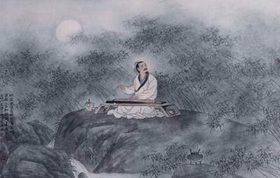

# 唐诗的后院

## 一

大唐是令每个中国人都引以为豪的朝代。

在外国，华人华侨聚居的街区往往被称为“唐人街”。可见大唐在千年之后仍然可以产生强大的民族向心力，它在后人身上留下的文化烙印是我们获得身份认同的凭据。

从大唐走出的大诗人是我们的故交，他们的名字在我们的童年记忆里都可一一寻到。几乎刚学会说话，幼小的我们便被引导着去念“床前明月光”“春眠不觉晓”了，尽管那时我们完全不知道自己含混不清地读了些什么，但从父母听到后脸上漾起的笑意大概猜到了那肯定是一种很美妙的东西。长大以后我们会知道，自己猜对了。大唐在我们幼时就开始以诗的形式向我们传递一种文化信号，正是在一遍遍鹦鹉学舌般的吟哦中，我们对大唐有了模糊而深刻的第一印象。所以在很多人最初的懵懂意识里，诗的发源地也许不是记录了先民歌唱的《诗经》，而是那个诗化了的大唐。

从某种意义上说，诗人大多时候都是天地间的旅人甚至漂泊者。李白需要遍访名山大川去挥洒诗酒风流；杜甫需要辗转市井乡野去体察民间疾苦；岑参需要远赴边塞去倾听鼓角齐鸣；杜牧需要登临古迹去叩问千古兴亡。诗，是诗人在路上偶尔驻足时采撷的风景。

跟着大唐的诗人行游，可以夜泊枫桥听听寒山寺的钟声，也可以爬上鹳雀楼看看依山的白日，一路上访云问月，歌以咏志，倒不失为一件乐事。不过走得久了，诗人会累，我们也会累，这时候就需要寻一个宁谧温馨的地方稍作休憩。

那么，就来王维的辋川坐坐吧，那里是唐诗的后院。

## 二

在陕西蓝田南部有一条三十华里长的峡谷名辋谷，谷中有河名辋水。王维四十多岁时在此购得前辈诗人宋之问的一座别墅，就是王维诗中多有提及的“辋川别业”。

辋川对于王维而言不仅是一个惬意的安身之所，更是一个让他返璞归真的精神归宿。在激情漫溢的大唐，这里曾悄然汇聚了一脉温情。那是一种大背景之下才会有的大安详，一种大气象之内才会有的大平静，一种大智慧之上才会有的大感悟，一种大胸怀之中才会有的大手笔。

每得闲暇，王维就会约上二三知己到辋川礼佛参禅，弹琴赋诗，泛舟采薇，啸傲终日。当王维褪下沉重的朝服，乘上马车驶向辋川，他肯定会有种如释重负的感觉。城市的喧嚣在他的车帘外倒退，长安在身后变得越来越渺小，终南山的翠微在眼前变得越来越分明，他终于走在回家的路上了。王维在诗中多次重申：“晚家南山陲”“我家南山下”，在他的意识里，家不是长安城里气派的官邸——那至多算是偶尔栖身的豪华旅馆，而是那座永远让他感到亲切的山居。

从广义上讲，辋川不是王维的个人房产，它是藏在大唐深处的桃花源，承载着唐代士子的精神寄托与文化诉求。王维和《桃花源记》中的捕鱼人一样，第一个发现了它的美并向世人传播了它的美。

王维用他擅长的诗画对辋川的美“处处志之”，他先用《辋川集》二十首分别记录了辋川的二十佳境：孟城坳、华子冈、文杏馆、斤竹岭、鹿柴、木兰柴、茱萸沜、宫槐陌、临湖亭、南垞、欹湖、柳浪、栾家濑、金屑泉、白石滩、北垞、竹里馆、辛夷坞、漆园、椒园，再用《田园乐》七首概括了辋川的整体印象，最后他还觉得意犹未尽，又拿起画笔用他新创的“破墨”画法绘出了一幅《辋川图》，图中峰峦倚叠，山林掩映，亭台古朴，楼榭端庄，辋川外，云水漫流，舟楫浮江。

王维在辋川之中绝对不会缺乏灵感，因为在他的眼中，辋川的一切都是诗化的，他只需将看到的景色和行动白描出来就是一首好诗。鹿柴的“返景入深林，复照青苔上”是诗，临湖亭的“当轩对樽酒，四面芙蓉开”是诗，竹里馆的“独坐幽篁里，弹琴复长啸”是诗，辛夷坞的“涧户寂无人，纷纷开且落”也是诗。只要他愿意，顺手采撷一石一木就能轻而易举地将之转化为诗情画意。

东晋的桃花源昙花一现之后就永远消匿在山林中了，人们随着那个捕鱼人“寻向所志，遂迷不复得路”。而大唐的辋川始终切切实实地存在着。人们依着王维的指点复行数十步便会豁然开朗，走进另一番天地：土地平旷，屋舍俨然，阡陌交通，鸡犬相闻。来辋川的客人，有裴迪、储光羲、崔兴宗等诗人，也有高僧道士，渔樵山民，他们一旦进入辋川，就会马上化作辋川的一道风景，包括王维。

唐代的冯贽在《云仙杂记》中记载：“王维居辋川，宅宇既广，山林亦远，而性好温洁，地不容浮尘。日有十数扫饰者，使两童专掌缚帚，而有时不给。”王维在辋川的生活可以如此纯粹而清净，地上连些许尘土都容不下。可是一旦他走出辋川，就要担任具有多重身份的角色。

作为儒士，王维不能单单做一个不问世事的隐者，其实他大多时候都是一个怀黄佩紫的官员。王维二十一岁时披着状元的红袍踏上仕途，六十一岁时戴着尚书右丞的乌纱卒于任上，一始一终都站在了政治的制高点上。四十年间他的仕途偶有坎坷并受到“安史之乱”的冲击，不过整体来说还算顺畅。王维和孟浩然不同，他没有遭遇“不才明主弃”的尴尬，所以“南山归敝庐”对他来说常常只是一种难以抗拒的诱惑，当真实践起来却是困难重重的。王维真正的隐居生活前后加起来不到十年的时间，只是他生命的六分之一而已。

作为艺术家，王维不单单是名重天下的诗人，还是精通音律的乐师、造诣高深的画家。王维出仕后的第一个官职是太乐丞，任职期间，有个官员拿了一幅没有题名的《按乐图》给王维看，问画上的乐队正演奏什么曲子，王维当即告诉他：“此《霓裳》第三叠第一拍也”，并叫来乐队当场演奏，演到第三叠第一拍时，王维让乐工们立即停止不动，那个官员一看，眼前乐工们的动作、表情和画上的一模一样，从而对王维佩服得五体投地。在绘画领域，王维更是一位开辟新天地的大师。王维研习过李思训、吴道子的画作，创造了“破墨”的新技巧。破墨是指一种用浓淡墨色相破、渗透掩映，以达到鲜活效果的用墨技巧。王维以此打破了青绿重色和线条勾勒的束缚，初步奠定了中国水墨山水画的基础。

作为诗人，王维的成就不单单在山水田园诗上，他还是边塞诗派的干将，善于写情的高手。在王维脍炙人口的佳句中，有大漠长河之雄奇，佳节思亲之孤独，也有南国红豆之相思，阳关送别之劝慰。

在以上种种“不单单”之中，历史单单抽取最有文化质感的部分构成了王维的形象：隐士、诗人、山水田园诗。而这三方面的聚焦点都不约而同地落在了同一个地方：辋川。

事实上，王维曾先后在淇上、嵩山、终南山隐居，辋川并不是他唯一的落脚点。开元二十一年，名臣张九龄拜相，王维献诗说“学《易》思求我，言《诗》或起予。尝从大夫后，何惜隶人余”，恳切地希望张九龄能够任用自己，献诗后王维就到嵩山隐居去了。当时玄宗在东都，嵩山在东都附近，王维隐居嵩山正可待机再次出仕。开元二十三年，王维即离开嵩山到东都任右拾遗。然而王维为官后不久，提拔他的张九龄就因小人排挤被贬至荆州，奸相李林甫专权，朝政陷入一片混沌，王维积极的政治热情一下子被浇灭了。他在《寄荆州张丞相》中吐露了理想幻灭后的灰心与孤独：

> 所思竟何在？怅望深荆门。
> 举世无相识，终身思旧恩。
> 方将与农圃，艺植老丘园。
> 目尽南飞鸟，何由寄一言。

开元二十九年，王维就在终南山过起了隐居生活。“终年无客长闭关，终日无心长自闲”，他无客来访，无心用世，兴来独往，胜事自知，行至水穷，坐看云起，完全成了一个超然忘世的隐者。可是在终南山隐居不到一年，王维只得再次为官。

王维隐居嵩山时一心想着入世，隐居终南山时一心想着出世，这都与他冲和敦谨的本性不相称。直到王维走进辋川他才找到了一种最合适的人生状态，那就是既要出世，也要入世，似隐而未隐，有名而不名。

## 三

走出辋川，放大眼光一打量就会发现：辋谷两侧的群山统属秦岭山脉，向西一直绵延到长安；辋水在蓝田西南汇入灞水，向西一直流向长安。辋川尽管离长安有一百余里，可是这里的山水曲曲折折还是左转右绕地奔向长安去了，地理环境似乎暗示了一种事实——辋川避不开长安强大的磁场。

大唐的盛世景象无法把陶渊明的身影从山野间抹掉，这一点在唐诗的后院里可以找到凭证，但是陶渊明的追随者不可能完全独立于政治之外。即便是陶渊明不也当过几天彭泽县令吗？王维一生都处在出世与入世的艰难选择中。他有时对朋友说“圣代无隐者，英灵尽来归”，批评那些隐士“鄙哉匹夫节，布褐将白头”，有时又对朋友说“以此为良策，劝君归旧庐”，赞誉那些辞官而去的人“解印归田里，贤哉此丈夫”。他一方面表明自己要“济人然后拂衣去”，另一方面又说自己“当亦谢官去，岂令心事违”。

自古以来，无论哪朝哪代，士子们都会不可避免地陷入出世与入世的矛盾之中。

乱世为士子们提供了一个冠冕堂皇的理由去亲近田园，去游山玩水。孔子都说了：“天下有道则见，无道则隐。”他们大可把家国百姓扔给枭雄争食而不必承担精神上的自责。到了盛世，明君在位，求贤用士，按常理来说士子们都该出来自强不息，厚德载物了，其实不然。士子们的隐居往往被指责为一种软弱的逃避，但他们逃避的不是乱世，而是政治上的波诡云谲，官场上的勾心斗角，社会上的蝇营狗苟。他们的逃避其实是一种追求，追求人格的独立，追求精神的自由，追求本真的自我。政治、官场、社会上的陋习并不会随着盛世的到来而永久祛除，相反，盛世的人们可以花更多的心思去结党营私，尔虞我诈，陋习可能会愈演愈烈。所以，士子们的追求在盛世依然会持续进行着。

唐朝呈现了儒、释、道三教合流的景象，李白、杜甫、王维这三位大诗人恰恰对应了三教的文化特征。李白代表了道家的浪漫洒脱，杜甫代表了儒家的敦本务实，王维代表了佛家的清净慈忍，因而，诗仙是狂士，诗圣是国士，诗佛是高士。

毫无疑问，儒家思想在唐朝依然处于统治地位，影响远远大于道家与佛家。儒家告诉士子们“达则兼济天下，穷则独善其身”，可实际上，儒家思想经过严重的政治化之后“独善其身”的一半已经变得无足轻重，往往被士子们忽略，他们即使陷入窘境往往也是“位卑未敢忘忧国”。道家与佛家正好有效补充了儒家缺失的部分。

王维在出世与入世的矛盾中，一边用儒家的济世情怀审视道家的避世无为，一边用道家的自然淡泊消解儒家的功名羁绊，当儒家与道家争得不可开交之时，佛家就会一脸笑意地从殿堂深处走出担任调停的角色。任儒、道在那里争来争去，王维反倒发现那张笑脸是最迷人的。最终，他拂一拂衣袖，拜倒在了含笑不语的佛家面前。

## 四

王维的母亲就是一个虔诚的佛教徒，曾跟随大照禅师修行三十余年，王维与佛教结缘与母亲的影响不无关系。王维，字摩诘，他的名与字加在一起就是一部佛经的名字：《维摩诘经》。年岁渐长，王维对佛教的认识从哲学思想方面上升到了信仰的高度。他在日常生活中对佛教的一些戒律尽量遵行，以素食为主，不茹荤血，清心寡欲，日日诵经。王维三十一岁时丧妻，此后一直独居，再无续弦，也应该是“半缘修道半缘君”吧。

王维有禅心，他的诗总会于静漠中透露出一丝禅意，读之使人物我两忘。比如：

> “行到水穷处，坐看云起时”；

> “明月松间照，清泉石上流”；

> “悠然远山暮，独向白云归”；

> “倚杖柴门外，临风听暮蝉”；

> “白云回望合，青霭入看无”。

王维的禅心是在山林美景之中才会有的，他在朝廷写给皇帝的那些应制诗和写给达官的那些唱和诗非但没有禅意，反而显得雕巧而空泛，实不足取。

不过，王维显然不会允许自己全身心地沉湎在一片禅意中，他只能身在朝廷，心在山林。如果一心隐居，不问世事，他就不敢正视孔子殷切的眼神；如果一心为政，远离山林，他又觉得辜负了释迦牟尼慈蔼的笑脸。结果，好脾气的王维只好两边都不得罪，官也做，佛也拜，而且做得都很用心，让两边都很满意。

《旧唐书》中说王维“退朝之后，焚香独坐，以禅诵为事”。儒家是一种政治文化，而佛家是一种宗教哲学，本来两者的主体思想多有抵牾，可是在王维身上却实现了高度的和谐。王维发现，佛家的普度众生与儒家的兼济天下有惊人的相似之处，他从朝堂走向佛堂并不需要经历多大的思想跳跃。在他看来，礼佛乐施也是“上报圣恩，下酬慈爱”的一种方式。

天宝九载，王维的母亲在辋川逝世，王维辞官在辋川服丧三年，哀毁骨立。

乾元元年，王维五十八岁，上《请施庄为寺表》说：

> “伏乞施此庄为一小寺，兼望抽诸寺名行僧七人，精勤禅诵，斋戒住持，上报圣恩，下酬慈爱。”

白发苍颜的王维依然在心里惦记着辋川，没有忘记替它安排一下最后的归宿。唐诗的后院交由佛家接管，王维思来想去，给了辋川一种最妥善的结局。他安排了辋川的同时也安排了自己。

三年后，王维逝世，归葬辋川。

绕了一大圈，他终于可以回到原点，与辋川长相厮守了。那时的辋川肃穆了许多，梵呗在耳，青烟入目，王维定然能够安眠。
