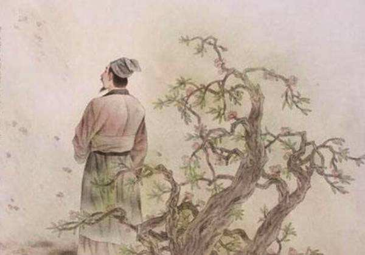

# 小山不大

## 一

北宋是个“无边光景一时新”的季节。动乱的五代十国，把盛唐阻隔成对岸的风景，“谁谓河广？一苇杭之”不再被宋人自信地吟唱。诗，这个当年袅袅婷婷的少女，已经度过了最绚烂的豆蔻年华，带着盛唐遗风开始走向对哲理的沉思。在北宋这边，词则如刚刚萌发的幼苗，沐浴着从后蜀南唐吹来的春风，蓬勃地生长起来，开出一片姹紫嫣红的春色。

走进北宋，就像一不小心走进了一座王府的后花园，繁花锦簇，群芳争艳，还有墙头马上，待月西厢式的浪漫在花间柳下悄悄地蔓延。我想象中的宋人，应该是身着一袭锦裳，腰配一把银剑，在半壶浊酒围成的意趣中吟风弄月，浅斟低唱。虽然有家事国事天下事裹挟着很多不如意扑面而来，可宋人总能在痛后找到些许亦真亦幻的安慰，以至于有时候让人觉得有自欺欺人的嫌疑。

晏小山却是个异类，他从不愿，也许是不会，欺骗自己，就算痛到骨髓里，也要保持清醒的头脑，绝不肯为了麻醉敏感的神经而去编织些虚无的美满。他甘于在坚硬无比的现实里跌撞蹀躞，哪怕自己要承担双倍的愁苦。如黄庭坚所说，晏小山是个痴人。

小山生在北宋中期，前有晏殊柳永欧阳修，后有苏轼秦观周邦彦，这些人都是词坛圣手，他们的万丈光芒让很多人都黯然失色了。小山实际上处在一个容易被忽略的位置，可走进北宋时，我还是轻而易举地从人群中找到并记住了他。

第一次遇见小山，就有种似曾相识的感觉，“与君初相识，犹如故人归。”宝玉初次与黛玉相见时，就曾说过：“这个妹妹我曾见过的。”其实就算抛开绛珠仙草和神瑛侍者的传说，宝玉的这句话也是可以讲通的，他道出的是一种真实的感受。

有时候，与某个人初遇更像是一场重逢，他的气质、秉性对你来说毫不陌生，如老朋友般让你感到亲切。小山给我的感觉就是这样。

在书中读到小山的词，题目下标明的作者都是“晏几道”（晏几道，字叔原，号小山）。

古代的文人大都有名、字、号三个称呼，虽然指代的是同一个人，可代表的意义却不一样。名使用得最广，字出现在比较正规的场合，号的诞生则标志着一个文人独立人格和审美体系的建立。以穿着来比喻，名是便衣，字是礼服，号是量身定做的正装。几道、叔原、小山这三个称呼，我最喜欢第三个，所以一直称他“晏小山”。

小山自己应该也是喜欢这两个字的，他给词集定下的名称就是《小山词》。甚至，我猜想他的亲人和朋友在生活中也会这样称呼他，比如母亲会在中午的时候推开书房的门，略带责备地说：“小山，该吃饭了。”黄庭坚会手持一卷词稿，兴冲冲地来晏府找他，指着一首词说：“小山，你的这首《鹧鸪天》写得真好！”

名字当真是个奇妙的东西，用不一样的称呼来喊同一个人，能喊出不一样的韵味来。就拿苏轼与苏东坡来说，给我的感觉就有很大差别，我一直以为苏轼和苏东坡是两个人，来黄州之前的那个人是苏轼，来黄州之后的那个人是苏东坡。东坡居士的号是他在黄州躬耕田亩时自封的，从那时起，他才真正成熟起来。苏轼是年轻时的苏东坡，苏东坡是成熟了的苏轼。晏几道和晏小山也是这样，只不过苏轼到苏东坡，是历经沧桑后的蜕变；晏几道到晏小山，剥去的只是相国公子的外衣。提起晏几道，我会想起“字叔原，号小山，晏殊第七子。曾任颍昌府许田镇监……”之类的生平简介；提起晏小山，我的眼前会出现一个青衫磊落，满目忧郁的落魄公子。

## 二

小山一生清狂不羁，孤高自负，他的朋友很少，但黄庭坚绝对算一个。

他在《小山词序》中说：

> 余尝论：叔原固人英也；其痴亦绝人。人爱叔原者，皆愠而问其旨：仕宦连蹇，而不能一傍贵人之门，是一痴也。论文自有体，不肯一作新进士语，此又一痴也。费资千百万，家人寒饥，而面有孺子之色，此又一痴也。人百负之而不恨，己信人终不疑其欺己，此又一痴也。乃共以为然。

诗人往往情感上早熟，在政治上却永远都成熟不了。他们天真的幻想从不为现实左右，所以常常显得与社会格格不入。每次读到黄庭坚的这段话，我都为小山的痴处而心酸，尤其是最后一段：很多人都背叛甚至出卖了他，小山却从不怨恨他们，一旦相信一个人，就认为这个人表里如一，永不改变，即使后来被这个人欺骗，小山仍然不肯相信他骗了自己。

小山的专一大概也是可以用痴来形容的，他专一于小令，专一于悲欢离合的恋情，专一于具体的人和事。小山注定只是“小山”，成不了独领群雄的高峰。他不是“造化钟神秀”的岱宗，也不是“雪拥蓝关马不前”的秦岭，如果非要找一座适合于他的山，那一定是巫山，有朝云暮雨相伴，晨霭夕雾相连，七十二峰，各有各的旖旎风光，却展示着同一个主题。

小山和其父晏殊都是小令的坚持者，世称“二晏”，但当时及后世的评家都认为小山青出于蓝而胜于蓝。

> 北宋晏小山工于言情，出元献（晏殊）、文忠（欧阳修）之右……措词婉妙，一时独步。
>
> ——陈廷焯《白雨斋词话》

在柳永之前，基本上是小令一统天下，而把小令推向顶峰的是晏小山。小令兼具诗的精巧和词的深婉，成就了小山词言情婉丽的艺术风格。小令与长调相比，虽然都属于词的范畴，但二者还是有很大差别的。

对于作者而言，写小令犹如扁舟舞剑，情感专注归一，力道刚柔并济，对一字一词拿捏得恰到好处，才能在狭小的空间里跳跃腾挪，回转自如，所以小令易学难工，非高手不能写出精品；写长调则如平川走马，有足够大的空间来纵横笔墨，挥洒才情，而足够大的空间就需要有足够大的气度与情怀与之匹配，情深才浅者写来会直而无味，情浅才深者写来会华而不实，所以长调是易工难学。

对于读者而言，读小令如临窗观景，千里之阔皆在尺寸之间，用老杜的诗来说就是“窗含西岭千秋雪，门泊东吴万里船”，读者特别需要有敏锐的眼力，能从差池其羽的紫燕中读出春天，能从灞桥两侧的柳丝中读出离愁，把浓缩的情感还原放大，景色才能全部显露出来；读长调则如曲径赏花，简单地走几步，看几眼，不能尽得其中妙处，只嗅到沁人心脾的幽香而不知花在何处，姹紫嫣红的美景，必在千回百转后才能看到，走得越远，钻得越深，看到的也就越多。

我向来认为小山的词一次不能多读，否则容易醉人，更容易伤人。失恋的时候，《小山词》更是碰不得的。小山的文字有种神奇而可怕的魔力，能把读者心底深埋的忧郁统统挖掘出来，有的甚至连你自己从前都没有发现——尽管它在你身上已经藏了很久。

开始读《小山词》，我们会把小山当做倾诉者，听他讲如烟的往事，似水的流年，如梦如幻的人生，执着专一的爱恋。读着读着，我们就被一句不经意的话深深触动了，不禁暗叫一声：“哦，我也是！”

小山的情感热得像火，在他面前做冷眼旁观者太难。读到后来，往往发现小山由倾诉者变成了转述者，仿佛是他从我们身上采撷忧郁，转化成浓挚深婉的词句，再讲给我们听。再负心薄幸的人，读《小山词》也能看到自己痴情的一面。读《小山词》其实就是读忧郁痴情时的自己。

## 三

小山的词应该属于很华丽的那种，但他的华丽很纯净，不是为了在形式上哗众取宠，而是用来为伤口镶边。他的情感世界虽然充满哀怨与忧郁，但却是绚烂无比的。

> 鹧鸪天
>
> 彩袖殷勤捧玉钟，当年拚却醉颜红。
> 舞低杨柳楼心月，歌尽桃花扇底风。
>
> 从别后，忆相逢，几回魂梦与君同。
> 今宵剩把银釭照，犹恐相逢是梦中。
>

彩袖如霞，纤纤玉手捧着精致的酒杯，为博你一笑，我把酒连连饮下，由倾心到倾杯不过是咫尺间的距离。

当我的世界开始旋转，你的容颜幻化成一朵娇羞的红莲。

公子，你醉了。

是的，但你不知道，让我醉了的，却不是酒。

蹁跹的舞步中，中天的明月渐渐西沉；婉转的歌声里，摇摆的画扇渐渐停止……

只可惜，到如今这些美好的往事已经冰封在记忆中了。曲终人散，本是最寻常的结局，你我，都躲不过。

离别之后，与你形同影共的场景不知梦到过多少回，可每次醒来，只有沉沉的夜色把我包围。

今生的相逢，总算是等到了。除了脸上多了几分沧桑，你我都还没有改变。

“有情不管别离久”，我轻轻地吟着。

今夜，凑近银灯，让我再把你的容颜细细地端详。一次重逢，一次重生，怕只怕，这又是一场虚幻的梦。

“从别后，忆相逢，几回魂梦与君同”，这句话，看一遍，就能记一辈子。

真正的好词，绝对不是靠雕章琢句，锱铢宫商能写出来的。小山的这首《鹧鸪天》是任何宋词选本都避不开的一篇精品，但是可以想到，小山写这首词的目的并不是要它流传后世，而是要向久别重逢的故人表露心肠，我们只是毫不相关的局外人，可还是不可克制地被小山感动了。

小山一生都在不停地回忆。

他曾贵为相国公子，后来父亲晏殊去世，家道中落，他又不懂那些蝇营狗苟的钻营之道，只能在坎坷的人生路上踽踽独行。世事的无常，人情的脆弱，让他常对人生有“如幻、如电、如昨梦前尘”的感慨。他在《小山词》自跋中说：

> 追惟往昔过从饮酒之人，或垄木已长（指坟上的树已长高），或病不偶，考其篇中所记悲欢离合之事，如幻、如电、如昨梦前尘，但能掩卷怃然，感光阴之易迁，叹境缘之无实也。

可见，小山之所以沉溺于往事，并不是贪恋温柔富贵乡里的奢靡生活，而是深深怀念那段如夏花般绚美的年华和出现在那段年华里的人。可是对小山来说，回忆的代价是沉重的，如果过去充满欢乐，就会愈加反衬出现在的落寞；如果过去充满哀愁，就会使现在的伤感变得更浓。小山在自己设下的迷宫里游走冲撞，却始终没有找到出口。“满目山河空念远，落花风雨更伤春。不如怜取眼前人。”父亲的这类词句，只是读读而已，那种从容和超脱，小山永远都学不会。

小山还有一首《临江仙》，可以说是与那首《鹧鸪天》齐名的。

> 临江仙
>
> 梦后楼台高锁，酒醒帘幕低垂。
> 去年春恨却来时，
> 落花人独立，微雨燕双飞。
>
> 记得小苹初见，两重心字罗衣，
> 琵琶弦上说相思。
> 当时明月在，曾照彩云归。
>

“落花人独立，微雨燕双飞”，深为论家所叹赏，《复堂词话》赞它“名句千古，不能有二。”这十个字大概可以当作小山的名片，谈及晏小山，如果有人会一时茫然，只需对他说：“就是写‘落花人独立，微雨燕双飞’的那个”，相信他就能想起来。

可是，若对这十个字寻起根来，它们却不是小山的原创，而是出自唐代的翁宏之手。

> 春残
>
> 又是春残也，如何出翠帏？
> 落花人独立，微雨燕双飞。
> 寓目魂将断，经年梦亦非。
> 那堪向愁夕，萧飒暮蝉辉。

我敢断言，知道这首诗的人寥寥无几，在浩繁的唐诗中，它只能做一个被埋没于书卷中的泛泛之作。“落花人独立，微雨燕双飞”，是晏小山让这两句诗脱胎换骨，有了超凡脱俗的品味和微妙空灵的情感，应该说，遇到晏小山是它的幸运。

“记得小苹初见”中提到的“小苹”，是一个歌女的名字。小山在《小山词序》中说：

> 始时沈十二廉叔、陈十君宠家有莲鸿苹云，品清讴娱客，每得一解，即以草授诸儿，吾三人持酒听之，为一笑乐而已。已而君宠疾废卧家，廉叔下世，昔之狂篇醉句，遂与两家歌儿酒使，俱流转于人间。

其中“莲鸿苹云”是小山的朋友沈廉叔、陈君宠家四个歌女的名字，小苹就是其中一个。她们身上有小山的过去，那段最绚美的年华，正是由小山填词，由她们四人演唱出来的华丽乐章。后来，沈廉叔去世了，陈君宠病倒了，小山自己也不是相国公子了，“莲鸿苹云”最后流转江湖，不知所终。小山写好的词，从此再也找不到完美的演唱者。

小山与“莲鸿苹云”不是冷冰冰的贵客与歌女的关系，他们应该是朋友，他爱她们的舞姿歌喉风情月貌，她们爱他的满腹才情多愁善感。至今，她们四人的名字还能在《小山词》中找到。

> 鹧鸪天
>
> 手捻香笺忆小莲。欲将遗恨倩谁传。
> 归来独卧逍遥夜，梦里相逢酩酊天。
>
> 花易落，月难圆。只应花月似欢缘。
> 秦筝算有心情在，试写离声入旧弦。
>

> 虞美人
>
> 秋风不似春风好，一夜金英老。
> 更谁来凭曲阑干，惟有雁边斜月、照关山。
>
> 双星旧约年年在，笑尽人情改。
> 有期无定是无期，说与小云新恨、也低眉。
>

> 虞美人
>
> 小梅枝上东君信，雪后花期近。
> 南枝开尽北枝开，长被陇头游子、寄春来。
>
> 年年衣袖年年泪，总为今朝意。
> 问谁同是忆花人，赚得小鸿眉黛、也低颦。
>

不难看出，小山是为过去所累的，说的再简单一点，就是为情所累。他对过去放不开，忘不掉，当时间已经走出很远，他还执着地站在原地痴痴回望。

有个事实，小山始终不愿相信：所有的爱恨情仇，都将有一个相同的结局，那就是成为过去。
