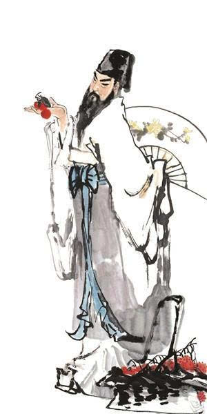

# 山抹微云处

## 一

曾有人问我，初学者若想轻快地走进词的世界最好从哪个词人入手，我毫不犹豫地回答：“秦观”。

是的，自然是秦观。

东坡词旷，稼轩词豪，而旷与豪都是以吞吐天地的气概为内蕴，以君临万物的姿态为外观，这两点共同撑起的高度是很难轻易攀越的。让东坡、稼轩来做初学者的引路人，好比让大学教授来教小学生，只会让双方陷入手足无措的僵局。

柳永风流潇洒，其词自然流畅，本来最适合当启蒙老师，但是他的主要身份是改革家。他在语言形式上把词贬谪到市井酒肆，在思想内容上把词解放到牢笼之外，他的词作更应该看做是实践探索的典例，而不是供后人临摹的范本。正因如此，柳永身后的词人几乎无不受其影响，但很少有人把他当作祖师去效仿。

周邦彦熏沐先哲，涵泳时贤，集婉约派之大成，开格律派之宗风，堪称一代宗师。所以等读者腹中有了几百首别人的词再去拜访他也不迟。

两宋之外，还有位风华绝代的李后主。只是他的佳篇大都浸透了国破家亡的血泪，让读者与他一见面就细数人生悲欢，岁月作饮，沧桑入喉，未免有些沉痛。

除此之外，还可以列出很长的一串名单：温庭筠、韦庄、冯延巳、张先、二晏、欧阳修、贺铸、叶梦得、陆游、姜夔、史达祖、周密、李清照、元好问、纳兰性德……

我们要找的是这样一个人：他首先要处于词发展的黄金时代，并且其自身堪称大家；他的身世不要与政治、历史产生太深的纠缠，以免词中夹杂过多费人疑猜的弦外之音；他要有足够多的作品流传于世，让初学者能够尽兴畅游，回转自如；他的作品题材不须广泛但要影响深远，句法要精彩讲究而又简明易懂。以上几个条件加在一起似乎有些强求，但秦观无一例外地符合了。

词之一字是个过于宏大的概念，一头扎进去随意观赏不够庄重，按年代先后一步步走近不够灵活。因此，我们选择一条通幽曲径与秦观同行。一路踏歌清唱，分花拂柳，直抵桃源深处。彼处山抹微云，天连衰草，雾失楼台，月迷津渡，有数不尽的旖旎风光。

## 二

恃才傲物似乎是少年才子的一贯作风。年轻时的秦观，负才自傲，放浪形骸，完全没有一介书生的温文尔雅。他在《精骑集序》中自述：“余少时读书，一见辄能诵，暗疏之，亦无甚失，然负此自放，喜从滑稽饮酒者游。”《送钱秀才序》一文中还有一段他与秀才钱节交游场景的描写：“大衢支径，率相觏逢，辄嫚骂索酒不肯已。因登楼纵酒狂醉，各驰驴去，亦不相辞谢。异日复然，率以为常。”

然而狂放归狂放，秦观和广大士子一样，心中有个“修身齐家治天下”的传统理想。他喜谈兵书，关注时政，希望以学入仕，为国效命，“回幽夏之故墟，吊唐晋之遗人，流声无穷，为计不朽”（陈师道《秦少游字序》引秦观语）。并且秦观用“太虚”作为自己的字，是以明志。可是，他的理想遇到现实之后，却遭到了来自科场和仕途的双重阻击。

秦观先后在元丰元年（1078）、元丰五年（1082）的科举考试中两度落榜，直到元丰八年（1085）他才考中进士。这一年秦观37岁，当年那个意气风发的少年已经成为略带沧桑的中年男子。其间，秦观还在“乌台诗案”中目睹了他的恩师苏轼惨遭横祸的经过，这对还未出仕的秦观来说无疑是场痛苦而深刻的心灵震荡。

也是在步入仕途前后，秦观弃用了先前的字“太虚”，转身成为我们所熟悉的“少游”。

北宋中后期，党争日趋激烈，出仕后的秦观屡受其害。

因为与苏轼的师生关系，秦观自然被对手划归为蜀党之列。元祐年间，秦观先是因言论被洛党攻击诬告，赠妓之作中的一句“天还知道，和天也瘦”也被人指责曰“高高在上，岂可以此渎上帝！”后来，秦观又遭朔党的检举，被朝廷罢复原职。绍圣年间，党争更加惨烈。同样是因为蜀党身份，秦观先是以馆阁校勘出为杭州通判，行至途中，遭刘拯弹劾贬为处州监酒。两年后，秦观又因别人的揭发被贬湖南郴州，此后又被贬广西横州，再至广东雷州。

眼见一位绝世才子在一串地名间颠沛迁徙，做着“古道西风瘦马”里的断肠人，我们心中多少会有一些不忍吧，因为他是秦观啊，属于他的应该是“小桥流水人家”里的白衣画扇，绝色佳人。

不过反过来想想，尽管秦观在政治上遭受了很多挫折，可放在中国几千年的贬官文化史中一比，他的政治生涯还算不上险恶。不用提前朝后代的文人命运，单比起同代的苏轼来，秦观就幸运多了。与政治狭路相逢之时，苏轼被逼到生死难卜的绝境，而秦观呢？最苦处不过是遭人诋毁，一贬再贬。如此看来，秦观真该诚惶诚恐，叩谢皇恩浩荡了。

苏轼大起大落的生涯造就了他大彻大悟的哲思，他身边的秦观随之浮沉宦海，到底学不来老师的旷达与超脱。因为秦观无冷眼而有热心，贪恋着尘世的春花秋月，或以物喜，或以己悲，率真得让人嗔怪更让人欢喜。

秦观有心做汴梁城里的一棵巨树，根扎黄土，志在青天，期望有朝一日可为国之栋梁。而迭起的狂风骤雨却令他无从应对，结果他戴罪出走，与朝廷渐行渐远，最后长成了南国的一株红豆。

政治暗藏的锋利棱角把秦观年少时的雄心壮志削磨得日见瘦损。现实僵硬到了极致，少游的心却随之柔软到了极致，柔软到不堪家国天下的重负，只能容下一个情字。

## 三

秦观是个纯粹的词人，他写的词也是纯粹的词。

词这种文体最初是以歌词的形式产生的，可以配乐吟唱。在宋朝，文人雅士相聚之时往往要在席上即兴填词，然后付与歌妓吟唱，以助酒兴。也就是说，一首完整的词要由文人和歌妓共同完成，这种才子佳人式的组合注定了词与爱情之间要产生千丝万缕的联系。所谓“诗言志，词缘情，文载道”，词，天生是“情”的容器。

词的句式参差音韵谐婉，一方面满足了适于吟唱的要求，另一方面决定了词的婉约特性。后来起笔于杯盏间的浅斟低唱在东坡、稼轩手中变成了黄钟大吕，使词有了更丰富的性格，这是时代的需要。对于创新者的魄力与才气，我们自然要投以崇敬的目光，但是有一点不可否认：婉约仍然是词的本质特征。

婉约，是柳岸离别，兰舟催发，与恋人执手相看泪眼时的无语凝噎；婉约，是深藏的心事把自己出卖，被人问起时的欲说还休；婉约，是在黄昏时候的小驿站，春寒料峭，孤灯如豆，暮色中有杜鹃的叫声由远及近，再由近到远；婉约，是醉梦初醒后只剩斜阳，临窗而立，望见满庭芳草，几丛残花；婉约，是在骤雨才过还晴的春日，飞燕穿花，落红如雨，黄鹂被凭栏人的幽幽一叹惊起，飞上柳梢；婉约，是在辗转难眠的秋夜，听着雨打梧桐的声音，点滴到天明。

柳永笔下有婉约，周邦彦笔下有婉约，李清照笔下有婉约，连苏轼、辛弃疾笔下也有婉约，但都不如秦观笔下的婉约来得连绵与清灵。我认为秦观的婉约不是学来的，而是出于心灵深处的悸动。思旧事而回肠，念故人而销魂，多愁善感，天性使然。正因如此，秦观的婉约是天成的，独创的，不可复制的。

宋人蔡伯世曾说：“子瞻（苏轼）辞胜乎情，耆卿（柳永）情胜乎辞，情辞相称者，惟少游而已。”秦观历来被推为“婉约之宗”，牵系着千年愁思，百代风情。

两宋词人之中，无论在题材结构上还是在风格情调上，晏几道与秦观都有相近之处。但是，两者的妙笔各不相同。

晏几道情在词中，秦观情在词外，故而小山词意深，淮海词意长。

写离愁，小山道是：“衣上酒痕诗里字，点点行行，总是凄凉意。”少游道是：“伤情处，高城望断，灯火已黄昏。”

写重逢，小山道是：“从别后，忆相逢，几回魂梦与君同。”少游道是：“别后悠悠君莫问，无限事，不言中。”

写伤春，小山道是：“谁知错管春残事，到处登临曾费泪。”少游道是：“那堪片片飞花弄晚，蒙蒙残雨笼晴。正销凝，黄鹂又啼数声。”

写失意，小山道是：“欲将沉醉换悲凉，清歌莫断肠。”少游道是：“郴江幸自绕郴山，为谁流下潇湘去！”

写怀人，小山道是：“落花犹在，香屏空掩，人面知何处？”少游道是：“乱山何处觅行云？又是一钩新月、照黄昏。”

自然与绚烂，简约与精致，浅淡与隽永，这些看似对立的特点在淮海词中随处可见而又相安无事。秦观用语九淡一浓，浅处随物赋形，踏雪无痕，曲终人不见，江上数峰青；浓处蓄势而发，一语中的，金钩细，丝纶慢卷，牵动一潭星。淡的整体品质使词自然、简约、浅淡，淡的层次变化使词绚烂、精致、隽永。

所以淮海词就像中国的水墨画，只用黑一种颜色就能画尽天下的山水。

爱上宋词之后就会发现，词如人生，人生如词。生命中有了词就有了梦，有了情，有了美，有了感动，有了感慨，有了感悟。每段岁月都应该有几首词来作注解，进而我们就能诗意地栖居于天地间。十几岁宜读秦观、柳永，二十几岁宜读周邦彦、李清照前期词，三四十岁宜读辛弃疾、刘克庄，五六十岁宜读苏轼，六十以后宜读晏殊、范成大。

读淮海词的最佳时期当在十七八岁，一场轰轰烈烈的恋爱刚刚开始抑或已经结束，心中贮满了相思闲愁急需挥洒，这时候遇上秦观是我们的幸运。在花季雨季相继而至的少年时代，梦是轻盈的，愁是纤细的，爱是委婉的，恨是微妙的，似乎一切都陷入了让人难以揣摩的朦胧状态。这时，秦观可以用一串生动的比喻给出答案：梦似自在飞花；愁若无边丝雨；爱像飞絮、流水，相沾便肯相随；而恨恰如芳草，萋萋刬尽还生。

读秦观的词，我们可以暂时放下压在心头的家国天下，把枯萎于平日的爱恨情愁统统贴在胸口，灌以佳酿，润以泪水，让它们随着心跳层层叠叠地开放。

年轻的心因稚嫩而无比敏感，可以感受到轻微如落花着地般的震动。尽管逝者如斯，北宋会老去，秦观会老去，但少游那颗柔软的心会留在词中，永远年轻着。爱是淮海词中不朽的主题。秦观如一位孤独的歌者，在薄冰之上深渊之侧且行且吟，用凄艳的平平仄仄教给我们什么是爱，怎样去爱。

秦观笔下的爱，可以浪漫神奇：

> 纤云弄巧，飞星传恨，银汉迢迢暗度。
> 金风玉露一相逢，便胜却人间无数。
>
> 柔情似水，佳期如梦，忍顾鹊桥归路。
> 两情若是久长时，又岂在朝朝暮暮！
>
> ----------------《鹊桥仙》

可以缠绵悱恻：

> 山抹微云，天连衰草，画角声断谯门。
> 暂停征棹，聊共引离尊。
> 多少蓬莱旧事，空回首、烟霭纷纷。
> 斜阳外，寒鸦万点，流水绕孤村。
>
> 销魂。
> 当此际，香囊暗解，罗带轻分。
> 谩赢得、青楼薄幸名存。
> 此去何时见也，襟袖上、空惹啼痕。
> 伤情处，高城望断，灯火已黄昏。
>
> ----------------《满庭芳》

可以荡气回肠：

> 西城杨柳弄春柔。
> 动离忧。泪难收。
> 犹记多情，曾为系归舟。
> 碧野朱桥当日事，人不见，水空流。
>
> 韶华不为少年留。
> 恨悠悠。几时休。
> 飞絮落花时候、一登楼。
> 便作春江都是泪，流不尽，许多愁。
>
> ----------------《江城子》

可以刻骨铭心：

> 倚危亭。
> 恨如芳草，萋萋刬尽还生。
> 念柳外青骢别后，水边红袂分时，怆然暗惊。
>
> 无端天与娉婷。
> 夜月一帘幽梦，春风十里柔情。
> 怎奈向、欢娱渐随流水，素弦声断，翠绡香减，
> 那堪片片飞花弄晚，蒙蒙残雨笼晴。
> 正销凝。黄鹂又啼数声。
>
> ----------------《八六子》

读秦观的这些词常常会让人感到心疼，而爱，就是蓦然间的一种心疼。

淮海词，一言以蔽之，是对天下有情人的怜惜。

## 四

对于上面那首《鹊桥仙》，清黄苏《蓼园词选》评曰：“少游以坐党被谪，思君臣际会之难，因托双星以写意。而慕君之念，婉恻缠绵，令人意远矣。”其实，这首词一般被认为是秦观前期所作，与“慕君之念”并无关联，根本没有必要把堂皇的君臣之道强行嵌入其中。政治并不能为少游的词增重，因为政治辜负了少游，少游也出离了政治。

皇帝的御笔一指，秦观只好离京而去，赴杭州，贬处州，谪郴州，迁横州，至雷州，一路向南，与风月为伴，朝饮木兰之坠露，夕餐秋菊之落英，直到天涯海角。

元符二年（1099）秦观到达雷州的时候，苏轼正谪居海南。这一年，苏轼年六十三，秦观年五十一。海峡两岸，是一对华发老人相望的泪眼。

第二年哲宗驾崩，徽宗即位后大赦天下，苏轼自儋州移广西廉州，于六月下旬过雷州，得与秦观相会。自元祐以来，苏轼及苏门文士屡遭贬谪，这次苏轼终于蹒跚地迈出了北归的步履，而秦观仍滞留雷州。师生重聚，自有万千感慨，但短暂的西窗剪烛之后又是各自西东。与恩师分离之时，秦观以一首《江城子》赠别：

> 南来飞燕北归鸿。
> 偶相逢。惨愁容。
> 绿鬓朱颜，重见两衰翁。
> 别后悠悠君莫问，无限事，不言中。
>
> 小槽春酒滴珠红。
> 莫匆匆。满金钟。
> 饮散落花流水、各西东。
> 后会不知何处是，烟浪远，暮云重。

自此，少游与东坡遂成永别。雷州分别后不久，秦观得以北还，病逝于途中的藤州，苏轼闻知噩耗，悲痛欲绝，把少游的“郴江幸自绕郴山，为谁流下潇湘去”书于扇上，叹道：“少游已矣，虽万人何赎！”我记起孔子在颜回逝世后曾长叹：“天丧予！天丧予！”同样是得意弟子先老师而去，白发人送黑发人，两位长者当时的心境何其相似。

幸运的是，秦观终于在有生之年等到了朝廷的赦还，但这突来的喜讯却令他恍惚生出人生如梦的感觉来。和很多中国文人一样，秦观在晚年追慕起了那个南山种豆的陶渊明。北归之时，秦观写了一篇《和渊明归去来辞》，说：

> 归去来兮，请逍遥于至游。内取足于一身，复从物兮何求？荣莫荣于无辱，乐莫乐于无忧。乡人告予以有年，黍稷郁乎盈畴。止有敝庐，泛有扁舟。濯予足兮寒泉，振予衣兮古丘。洞胸中之滞碍，眇云散而风流。识此行之匪祸，乃造物之馀休。
>

奔波了一生，愁苦了一生，他真的累了，收拾行囊，准备回家。

归去来兮，桃花源里夕阳西下，陶渊明刚从南山荷锄归来，正在东篱边笑吟吟地等他。
