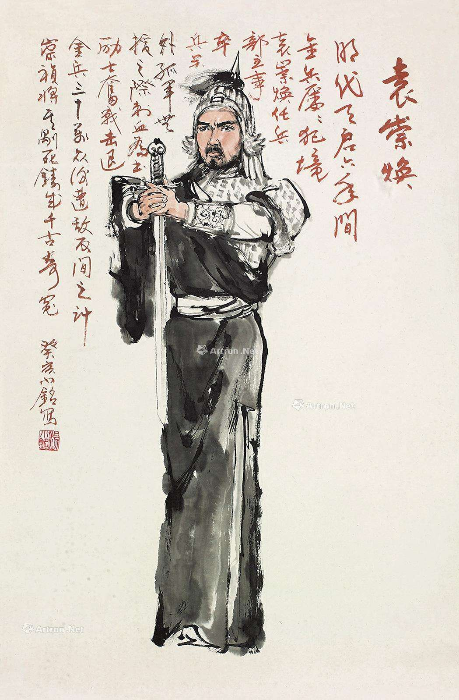

# 横戈原不为封侯

——祭袁督师崇焕

国难当头，存亡之秋，辽阳古道上飞来的翩然一骑，使大明的北门锁钥从此岿巍如山。

面对满清的十万铁骑，你原本只需在高堂之上正襟危坐，轻巧地用毛笔在边关急报上圈圈点点。

可是，你没有。

当百姓惶惶，群臣嗫嚅之时，你毅然选择远赴沙场，寄身戎马，抖落峨冠博带上沉积千年的腐酸，将直逼天地的浩然之气洒向泣血的辽东。你慷慨陈辞，临危受命，刹那间完成了儒服与战袍的转换，让慨叹国中无将的君臣看得瞠目结舌，愕然无语。

冰天雪地，虎豹出没的关外，你单人独骑，连夜兼程，出榆关，抵前屯，安抚无家可归的百姓；城郭不完，甲仗全无的宁远，你身体力行，以身作则，修壁垒，筑堞墙，把一座破败不堪的废城打造成固若金汤的要塞。天启五年，你再度出征，挥师北上，把王师的旌旗插上锦州城。至此，你已把大明的防线整整推进了四百里。四百里之外，是你和千万勇士用血肉筑起的长城；四百里之内，是中原的无垠沃野和万里云天。

烽烟不断的辽东，你用大智大勇几度扭转战局，用大忠大义数次置换生死。六载奔波，八方驰骋，先败努尔哈赤，后挫皇太极，你用铁血奇功打破了八旗健卒不可战胜的神话！

剑戈惊天，鼓角震地，你的宁远城始终在关外不屈地站着，如一座肃穆的丰碑。

你对自己说“杖策只因图雪耻，横戈原不为封侯（《边中送别》）”。可是，一捷宁远，二捷宁、锦，魏阉逆党不仅不论其功，反而交相弹劾。你最后竟然被迫辞职，含泪还乡！精忠报国，出生入死，敌战于外，谗构于内，到头来却落得如此下场，怎能不叫天下志士寒心，仁人扼腕？南归途中，当你百感交集，仰天长啸，是否曾看到岳飞壮志难酬的眼神？当你重省旧事，俯首沉思，是否曾听到于谦回天乏力的叹息？

我常想，假如边关烽火从此与你无关，对你也许是一种幸运吧。可上天却执意把悲剧的主角推到你的面前。“耳边金鼓梦犹惊，又荷丹书圣主情（《到家未百日即为崇祯元年诏督师蓟辽拜命入都》）”，当辽东战局再度恶化，明军节节败退，京师告急，朝廷这才想起了你。而你，不曾踌躇半刻，提刀上马，飞度关山，纾天下倒悬之苦，解四海苍生之困。

你不是不知道官员遇父丧当回乡守孝三年的制度，却只能含泪写下“故园亲侣如相问，愧我边尘尚未收（《边中送别》）”，这是孝道之上的孝道；你不是不清楚外将无军令不准带兵入京的规矩，却宁愿高呼：“君父有急，何遑他恤？苟得济事，虽死无憾！（周文郁《边事小纪》卷一）”，这是忠德之上的忠德。然而，你千里回师，殊死拼搏，退敌于广渠门，换来的却是君臣的猜忌和满城的谣言。时局未稳，虎狼犹在，皇帝的一纸诏书竟使你锒铛入狱！

明军失帅，举朝震动，辽将祖大寿率兵出走，使京师防线势如决堤。走投无路的崇祯只好觍颜请你写信召回祖大寿。因为只有凭你的威信才能调动这支劲旅，而皇帝的金口玉言，已在牢狱深处悄悄贬值。身陷囹圄的你念念不忘的仍然是国家百姓，立即修书一封，劝祖大寿听从朝廷的命令。远离国门的祖大寿回望京师，抚剑长叹，把信向将士宣读，全军皆痛哭流涕。当天祖大寿率兵入关，投入孙承宗麾下，随军收复永平四城。

清军既退，京畿复安，而你的英雄路却走到了尽头。

崇祯三年八月十六日，这位文武双全，智勇兼备，横戈戍边，屡立奇功的一代名将，终于以“谋叛欺君”的罪名被杀害了。在寒气逼人的屠刀面前，你留给世人最后的话是：“一生事业总成空，半世功名在梦中，死后不愁无勇将，忠魂依旧守辽东！（《临刑口占》）”

皇帝昏庸多疑，群臣妒才诋毁，最可悲的是连那刚被你从狼口救回的百姓也被谣言蒙蔽，欲置你于死地而后快！当你惨遭磔刑，皮肉寸断，百姓不仅无人垂怜，反而争相买“汉奸”的肉而食之，“食时必骂一声，须臾，崇焕肉悉卖尽（《明季北略》）”。你的一腔热血，没能溅在杀敌的战场，反而泼在了朝廷的刑场，保民卫国的赫赫战功竟成了遭祸惨死的罪名，公道何在？天理何存？

凡英雄陷于末世，注定要上演悲剧，不仅是英雄的悲剧，更是时代的悲剧。北京西市那刺目的一抹血红，使整个紫禁城的朱门碧瓦从此黯然失色。长城既倒，国难遂来，成书于清朝的《明史》冷峻地写道：“自崇焕死，边事益无人，明亡征决矣。”

沧海横流，大浪淘沙，煊赫一时的缙绅紫绶衮衮华服早已零落成泥，极尽豪奢的琼楼玉苑金銮丹陛早已坍圮为土。而你巍巍如擎天之柱的身躯，注定会在千百年后从朱明王朝的残垣断壁间站起，接受后人的揖拜。
