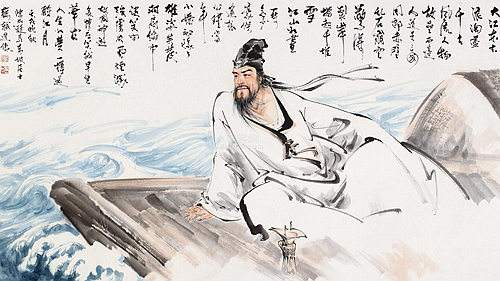

# 狂客苏东坡

## 一

在中国文化史上，称得上文豪圣手的大家，大都沾染着几分狂气。

比如庄子：妻子死后，不哭就算了，反而鼓盆而歌；见到路边的骷髅，与之相对而眠，探讨人间的生死，大有相见恨晚之意；楚王要赐他高官厚禄，他却醉心于濮水的粼粼清波，持竿不顾，那么不经意地推开了在别人看来千载难逢的机会，他认为这是打扰。

比如陶渊明：一心在南山种豆采菊，而不顾权贵们求贤问士的拜访；他悠然地闭上眼，惬意地听着深巷的犬吠，树上的鸡鸣，决不肯为那一二顶乌纱、三五串金银去劳神；他左手持杯，右手握笔，趴在案上写着《桃花源记》，却不屑为皇室的征伐浪费一点笔墨。

比如李白：在金銮殿上摆起了文人的架子，皇帝的爱妃招来研墨，皇帝的宠臣唤来脱靴；他在清江水畔自得其乐，“天子呼来不上船”；他寄情山水，访云问月，在庐山上高唱“我本楚狂人，凤歌笑孔丘”。

当然，那些正史中还有更多与狂无缘，被冠以“忠贤”的人。可悲的是，真正的明君太少了，他们不知道，自己的尽忠有时会招致君王的憎恶，自己的贤名有时也难容于社会。所以，江山代有狂人出，一反常调，领军呐喊。

正是庄子，在战鼓烽烟，刀光剑影之外，冷冷地道一句“窃钩者诛，窃国者为诸侯”。

正是陶渊明，在别人都热衷于攀附权贵时抛下一句“吾不能为五斗米折腰向乡里小人”辞官归去。

正是李白，在一片称功颂德的歌声里，愤然高歌“安能摧眉折腰事权贵，使我不得开心颜”。

这些狂人狂得可爱，狂得可敬，狂得可贵。

而在这些狂人中，无论在狂的高度还是狂的深度上，苏轼都算得上比较杰出的一个。他的狂，在诗词里是豪放，在书画里是酣畅，在政治上是坦荡，在生活中是豁达。这种狂，有时会超出名利的羁绊，摆脱世俗的偏见，而升华为一种清醒，一种淡泊。

## 二

苏轼的成就是多方面的，词开豪放派，诗承建安风，散文名列“唐宋八大家”，书法上与米芾、蔡襄、黄庭坚四分天下，绘画上是北宋湖州派的代表人物，此外，他还深通佛道哲学。如此多的闪光点汇集一身，顺理成章地造就了一代狂人。

苏轼是中国文化史上的一部神话，更是一座难以超越的高峰，以他惯有的狂放睥睨后起的群雄。

其中，他在词上的成就尤为让人叹服。王鹏运在《半塘定稿》中说：

> 北宋词人，如潘逍遥之超逸，宋子京之华贵，欧阳文忠之骚雅，柳屯田之广博，皆可抚拟得其仿佛，唯苏文忠之清雄，迥乎轶尘绝迹，令人无从步趋。盖霄壤相悬，宁只才华而已？其性情，其学问，其襟抱，举非恒流所能梦见。词家苏辛并称，其实辛犹人境也，苏其殆仙乎！

大家之所以为大家，正是因为他们的作品所具有的神韵是模仿不来的。

当然，对于苏轼还有一点不能不提，就是他对词进行了全面的革新。

词始晚唐，至花间派盛起，虽然偶有明快清新之作，但绣幌佳人的题材，浓艳绵密的词风，一直是其主流。词人们全力追求的是香径春风的游乐和红楼月下的嫦娥，正所谓半为枕前人，半为花间酒。李煜的血泪和范仲淹的羌管等，尽管能掀起一股不流于俗的清风，但词仍未能摆脱传统的束缚。要想真正把词解放出来，引向更广阔的天地，必须出现一个有气魄，有才学的狂人。

终于，苏轼来了。

正是因为苏轼是个狂人，他才敢推翻几百年来词人所信奉的“词为艳科”的清规。他提高词品，扩大词境，推进词律，从题材内容到表现手法乃至语言风格都大刀阔斧地进行了创新与改革，使词一改旧貌。刘熙载评价苏词说“东坡词颇似老杜诗”，但更重要的是苏轼是“以诗为词”，而不是“以诗代词”。词这种艺术形式自产生以来，长期被置于偏冷的位置，在文人墨客眼中，词一直没有资格和诗相提并论。但苏轼一出，词便带着他的狂气毫不客气地登上了大雅之堂，推开正统嫡传的诗，站在了时代的前沿。

我认识苏轼就是从他的词开始，我曾为柳永的《雨霖铃》折服，曾为秦观的《浣溪沙》倾倒，但是当我看到苏轼的《念奴娇·赤壁怀古》时却选择了沉默。磅礴的气势，宏阔的景象，使人有如身在高山之下，大海之滨，想要细细阅览，却被这包容天地的意象惊得不知所措，这种震撼是无法用简单的一个语句来表达的。

不得不承认，柳永、秦观对细节的描写，对心理的刻画，确实达到了炉火纯青的境界，这令步其后尘的词人难以望其项背。但他们把自己拘禁在个人的小天地里，身上缺少苏轼的那份狂气——成为巨人必需的狂气。

有人品评苏轼的书画，发现其中的精品大都创作于被贬之后，与在京城着意为皇帝高官精描细画的那些相比倒略有逊色。其实这很合情理，苏轼的狂性一旦遭到禁锢，虽然能得到贵族的认可，却难以展现其最美最真的一面。如此来看，对苏轼来说，贬谪何尝不是一种升迁？

生活中的苏轼，绝不是个严肃稳重的儒士，他谈笑风生，不拘小节，有时甚至表现出玩世不恭、游戏人生的狂放来。

民间流传着许多关于苏轼的趣闻轶事。相传，有次他去拜访一位诗僧朋友，推门就道：“秃驴何在？”高僧就是高僧，隔窗答道：“东坡吃草”。苏轼本想取笑于诗僧，最后却自取其辱，只得开怀一笑，算是心服认错。

在诗文里，苏轼的狂也是藏不住的，他常常傲气十足地跳出来发发议论。

他的《石钟山记》写得精彩，很受后人推崇。他小舟夜泊，亲身考察，终于弄清了山石发声的原因，写下“事不目见耳闻，而臆断其有无，可乎？”之后，不忘得意地说一句“盖叹郦元之简，而笑李渤之陋也”。

唐代诗人徐凝写过一首《庐山瀑布》：

> 虚空落泉千仞直，雷奔入江不暂息。
> 今古长如白练飞，一条界破青山色。

苏轼游到这里，应寺人的要求，也写了一首诗：

> 帝遣银河一派垂，古来惟有谪仙词。
> 飞流溅沫知多少，不与徐凝洗恶诗。

他对徐凝的诗大加斥责：在李白的瀑布面前还敢动笔，你比我还狂，该批！

苏轼不仅敢对先贤们大加褒贬，对同代人也不忌讳。北宋文学家石曼卿，有句写红梅的诗：“认桃无绿叶，辨杏有青枝”。

苏轼对这句颇不满意，他说“诗老不知梅格在，更看绿叶与青枝”。尊称一句“诗老”，说明他对石曼卿还是有几分敬意的，可谁让他的诗没写出梅花高洁的品质呢？

如此看来，苏轼不只是睥睨“后起”的群雄了。

## 三

苏轼的一生历经仁宗、英宗、神宗、哲宗四朝，这是北宋政治矛盾十分尖锐的时代。苏轼似乎在以中庸的思想来指导自己的人生道路。他属于旧党但不赞成一味保守，反对全面变法但是要求有所革新。这使他受到保守派和改革派的两面打击。

有人以此批判苏轼的摇摆不定，把政治上的失意归罪于他的信念不专。可是，如今反观那段历史，我们不得不承认，苏轼的中庸政治思想虽未必最可行，却可能是最清醒的施政纲领。可惜当时的封建社会已经开始走下坡路，苏轼只能同样做封建制度的受害者，他别无选择。

幸运的是，苏轼是个狂人，不至于被几场政治斗争打倒。坎坷的仕途使他困惑，更使他深思。无论处于何种逆境，他都能闯过；无论有多浓的苦闷哀愁，他都能解脱。

古代很多文人，不愿混迹官场，很多人会选择归隐，田园山林是他们精神上的一片圣土。苏轼在政治上屡遭打击，虽然有过“长恨此身非我有”的感叹和“小舟从此逝，江海寄余生”的理想，但终其一生，他始终没有选择归隐。相对于庄子的拒绝从政，陶渊明的愤然辞官，苏轼的狂实在狂到了极致，狂出了水平，他的选择是：任你红尘滚滚，浊浪滔滔，我自碧天明月，一帘清风。

苏轼深受儒家思想积极入世的影响，关注政事，爱发议论，但究其根本，是他有一颗赤诚的爱国爱民之心。也许苏轼算不上安邦定国的将相，但他绝对是个勤政爱民心系苍生的父母官。虽然多次被贬，他从不为个人的荣辱得失而耿耿于怀，在任所兴修水利，改革弊政，一心想着造福一方百姓，这等胸怀又岂是常人所能秉持？

苏轼遭受的政治磨难还有一个重要原因，就是他真的太出色了。苏辙曾一语道破说：“东坡何罪？独以名太高”。

一个巨人的成长，在扭曲的人性面前竟被当作天大的错误，这是怎样悲哀的社会！怎样荒唐的历史！

每有天才诞生，捧场的不仅有虔诚的追随者，还有心术不正的小人。他们自以为才智无人能及，却眼睁睁地看着别人抢走了“天才”的宝座。他们整天埋怨天道不公，他们好恨，恨来恨去，恨心一扭，终于酝酿出一个惊天动地的“狠”来。看吧，一幕幕冤案上演了，一场场悲剧落幕了。历史的长廊中，总有一群小人枕着巨人疲惫的身影在酣睡。

苏轼的万丈光芒更是刺得躲在暗处的小人睁不开眼，即使有点值得让他们炫耀的光辉，在苏轼面前也显得黯然，他们对这个狂人当然恨得要命。于是，皇帝的周围，小人多了，皇帝的耳边，谗言多了。苏轼放达的脚步开始变得拘谨，灵动的笔墨开始变得缓重。对于无来由的罪名，无逻辑的牵连，任他满腹才情，也找不到为自己开脱的理由。稀里糊涂地被打入大牢，甚至险些稀里糊涂地乘风归去。

一群丑陋不堪的老鼠，中了嫉妒的毒药，为了让历史的镜头给他们留个特写，竟不惜去咬噬载有文化珠玉的宝船。是的，你们可以安息了，历史记住了你们，而且奖给每人一个卑鄙者勋章，你们可以高高地举在头顶。后人也会记住你们，并献以最真诚的唾骂。

幸亏，宋神宗不是个十足的昏君，幸亏，在小人之外还幸存着几个有良知的官员，最终让苏轼得以挣脱“乌台诗案”的罗网，飞向上天赐给他的黄州。经历了这场风雨后，他在黄州漫游荒山野林，一身的狂气在大自然的净化中淡去，只留一轮明月在心间。

苏轼心地坦荡，忠君爱国，但竟遭文字狱险些丢了性命，这自然使他愤愤不平。可对他来说更为心寒的是，在他遭难时有人避之惟恐不及，有人落井下石，人情冷暖，世态炎凉，在这关键的时刻暴露无遗。在孤独的黄州只有他孤独的一个人，“酒贱常愁客少，月明多被云妨”，淡淡一句，寄托了他太多的感受。

乌台诗案的大浪莫名其妙地打在苏轼的头上，同时也把他举到了另一个人生的高度。我们仿佛看到两个苏轼，前一个苏轼承受着风雨折磨的现实痛苦，后一个苏轼却以超然的态度冷眼旁观经受现实痛苦的那个苏轼，并且引导着他走向解脱之路，给他以清醒而深透的理智。

不管风多狂，雨多骤，坚持过来，回头再看，“也无风雨也无晴”，他对那悲剧的现实基础投去轻蔑的一瞥。他终于看清了，看透了，道一声“人生如梦”，洒一杯酒向江涛明月。

## 四

感谢不太糊涂的宋神宗和那些有些良知的官员，给了苏轼一个可以反省，可以寄情，可以超越自我的黄州。

感谢黄州，耐心地等了苏轼几个世纪，最后以自身原始的粗犷接受了上天的馈赠，让中国一段辉煌的文化史得以在此稍作停留。

东坡啊东坡，我常常幻想能和你生在同一个时代，哪怕能给你捧纸研墨，能陪你对着赤壁沉思，能递给你一杯可开怀的清酒，甚至，只为在一个月色如水的夜里，看一眼那不栖寒枝独宿沙洲的孤影。