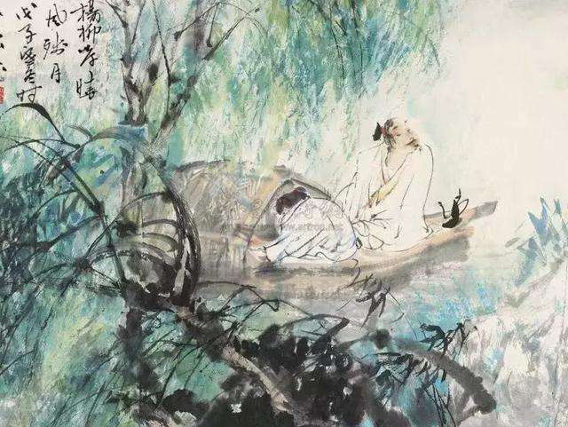

# 白衣卿相

## 一

初遇柳永，是在一个夏日的午后，闲来无事，顺手从书柜里拿出一本《唐宋词苑撷英》，书的封面是线条勾勒的古代人物，灵妙而简约，大概是取自敦煌壁画。那时候我还很小，词对我来说还是一种很模糊的概念，所以我一直以为只有诗才是最美的语言，直到翻开那本书，遇到柳永：

> 寒蝉凄切。
> 对长亭晚，骤雨初歇。
> 都门帐饮无绪，留恋处，兰舟催发。
> 执手相看泪眼，竟无语凝噎。
> 念去去，千里烟波，暮霭沉沉楚天阔。
>
> 多情自古伤离别。
> 更那堪，冷落清秋节。
> 今宵酒醒何处？
> 杨柳岸，晓风残月。
> 此去经年，应是良辰好景虚设。
> 便纵有千种风情，更与何人说？

第一遍读下来，当真把我惊呆了，我不知道世间竟有这等美妙的词句，但当时若问起好在哪里，我说不出。赵令畤《侯鲭录》记晁补之评秦观词时说过一句话：“虽不识字之人，亦知是天生好言语也。”真的是这样，每个人都有感知语言美的天赋，并不是非要才高八斗学富五车，才有资格在百花齐放的词苑中畅游。看到一朵娇艳欲滴的牡丹，尽管我们不是植物学家，但人人都能毫不费力地感受到它的美。

柳永的《雨霖铃》是我平生遇到的第一首词。正是在那个花香四溢的午后，我一下子明白过来：这种妩媚的文体，就是词！

其实把书拿在手中的时候，我丝毫没有意识到自己握着一个动人心魄的世界，“词苑撷英”对那时的我还产生不了足够的吸引力，怂恿我翻开书的倒是封面上精美的人物画。可不知不觉中，我已经以柳永喜欢的方式为这场邂逅做好了铺垫：时间是在情思缱绻的夏日，地点是在花木掩映的窗下，蔷薇开出一架柔情，绿荫铺成一方诗笺。我的手指随意拨弄着沉默的书页，摩挲过“雨霖铃”三个字后，停止，刹那间，我就一头栽进了北宋那个寒蝉凄切骤雨初歇的清秋里，在杨柳岸边看到了执手相看泪眼的柳永。

后来提到这场经历，我一直认为自己挺幸运的。那时候连词是什么都还说不清楚，没想到拿起一本书，随便一翻，遇到的竟是绝代才子和旷世佳作。好比对彩票毫无研究的人，第一次去买彩票就中了头奖，怎能不叫人喜出望外呢？

翻遍宋词，仍觉得“杨柳岸、晓风残月”是婉约派最美的词句，没有之一，其他任何词人的任何一句，单独拿出来都比不上这七个字让人惊艳。

杨柳，是离人瘦弱的背影。纵有千万条缀满泪光的柔枝，还是系不住催发的兰舟。

岸，是土与水的分割线。一路曲曲折折，转弯，转弯，复转弯，远方就真的成了远方。

晓风，是捣碎梦境的砧杵。醒来，新的隐痛又会清晰无比。

残月，是挑起思念的银钩。每次圆缺，都是一场彻骨的轮回。

七个字，信手拈来，却铺展出一片情韵无穷的风景。古人说“字字珠玑”有时未必是胡诌出来的溢美之词。

俞文豹《吹剑续录》中有段有趣的记载：

> 东坡在玉堂，有幕士善讴。因问“我词比柳郎中词何如？”对曰：“柳郎中词，只好十七八女孩儿，执红牙拍板，唱‘杨柳岸、晓风残月’；学士词，须关西大汉，执铁绰板，唱‘大江东去’。”公为之绝倒。

纵观词海，能与“杨柳岸、晓风残月”分庭抗礼的大概只有“大江东去、浪淘尽”这七个字了。两者双峰并峙，横绝千山，一边是江南的小桥流水，杏花春雨，一边是塞北的大漠孤烟，长河落日。两种景致相互对立又相得益彰，共同构成了宋词美学特征的基本骨架。婉约与豪放，少了任何一方，两宋词坛都会减却一半的风光。

## 二

柳永是引我读宋词的第一人，所以我一直对他有种“初恋”情结，以至于有段时间只要一看到或听到柳永的名字，就会热血偾张，激动不已。可是，在柳永生活的那个年代，他却不是那么受人喜欢，常常招致士大夫的非议。他的放浪形骸，他的疏狂不羁，在那些道貌岸然的君子眼里，都是对礼教的挑衅。真正爱他的，是酒楼的歌妓、往来的客商、街头巷尾的贩夫走卒。柳永天生是一个人民艺术家，他的词本不属于王谢侯府，达官显贵，注定只是在黎民百姓，凡夫俗子间盛开的奇葩。但是，无论当时的上层社会抛出过多少白眼，柳永为词中大家是不容争辩的事实。北宋若少了柳永的万种风情，会让人有良辰美景虚设的遗憾。而对于那些指着别人文章哂未休的看客，老杜说得好，“尔曹身与名俱灭，不废江河万古流。”

王国维说：

> 大家之作，其言情也必沁人心脾，其写景也必豁人耳目。其辞脱口而出，无矫揉妆束之态，以其所见者真，所知者深也。

若以此为标准来衡量古今文人，能无愧于大家的怕是少之又少。做到言情沁人心脾，写景豁人耳目，倒不是难事，心通七情才高八斗者都可勉强为之而得其神似，真正的难处在于“无矫揉妆束之态”。

中国的文人向来有两大毛病，一是要面子，二是爱显摆。为人处世，讲究循规蹈矩名正言顺才不至于贻笑大方；写诗行文，讲究字字雕琢句句粉饰才不至于沦为下品。所以，“无矫揉妆束之态”对他们而言就成了一项艰深的课题。可放在柳永手里，这项课题轻而易举地就被破解了。

因为柳永，可能只有柳永，肯放下文人清高傲岸的架子，俯下身来，从士大夫们不屑光顾的社会底层拾起几段被人冷落的美丽，这是同时代的任何文人都模仿不了的动作。

勾栏瓦肆里的酒和泪，孤舟旅社外的雨和霜，被柳永勾兑成炫目的色彩，借手中的生花妙笔涂抹出一片缠绵凄美的风月。以此为背景，任是再辉煌的伦理道德也未免显得苍白。初入青楼，柳永也许带着科场失意的苦闷，想借壶底的残醪放逐自己的灵魂，他的浅斟低唱偎红倚翠起初难免带着自暴自弃式的赌气，是痛苦中的快意。当柳永与庙堂彻底决裂之后，他举杯填词时的情感，则变成了自若自足自得自豪，是快意中的快意。如果说“忍把浮名，换了浅斟低唱”还只是一个落榜仕子所发的牢骚，后来他唱出“我不求人富贵，人须求我文章”，则近乎是在向上层社会叫板了。

柳永一世风流，出入于烟花巷，时人对他多有非议。但柳永与舞女歌妓的交往，却要比那些正人君子光明得多，坦荡得多。对流落于风尘的悲苦女子，柳永是发自内心地尊重与同情。他看到的不只是她们在酒筵歌席上的千金一笑，还有忍辱含垢时的咽泪装欢。在柳永心中，不把她们当作低人一等的贱人，而是把她们摆在与自己相同的高度。她们之中，有聪明美丽的，有才华横溢的，有情韵雅洁的，有志行高卓的，都值得柳永用一阕妙词来做注解。她们把能结识柳永当作此生最大的安慰，得到他的只言片语，更是胜过别人的一掷千金。

那些正人君子，并非就真的如自己所标榜的那样不近酒色，无欲则刚，只不过他们都擅长“变脸”的拿手好戏，在秦楼楚馆里，声色犬马，交杯换盏，放纵得好不自在，回到厅堂之上，正襟危坐，屏气凝神，把先前的所作所为忘得一干二净，俨然一副稳重儒雅的君子形象。走出青楼时，他们不会有丝毫的负罪感，因为在他们眼中，女人只是花鸟般的玩物，无论有多悲惨的命运都是活该。就算青楼的女子再优秀，他们瞬息万变的表情里透出的也是鄙夷。只是他们不知道，也许对面那个自斟自饮的男子就是柳永，在以同样鄙夷的眼光注视着他们裸呈的丑恶。在这种注视里，柳永对自己苦苦追求的仕途，多少会产生几许轻视，蔑视，甚至是鄙视的情感吧，灯红酒绿之下，有多少衣冠禽兽正是顺着仕途爬上来的书生！

秦楼楚馆诚然不是高雅的去处，但其中就算有低俗卑劣的地方也都泼辣地摆在明处。那些富丽堂皇的宫殿，明镜高悬的公堂，豪华气派的官邸，滋生的低俗卑劣未必就比秦楼楚馆里少到哪里去，只不过被千方百计地掩藏了。虽然柳永日日喝得烂醉，但他对青楼与官场的认识却要比别人更加清醒，“以其所见者真，所知者深也。”

历代文人中，亦不乏出入青楼，广交歌妓的风流才子，比如杜牧、周邦彦、秦观。可很少有人敢像柳永这样，把大把的青春与才情挥洒在风月场上。青楼歌妓，一向是个带有风险性的话题。文学，被士大夫垄断的产业，不喜欢沾染太浓的脂粉气。一旦有人敢冒天下之大不韪，公然挑衅普遍认可的规则，很容易被众人视为异己，惨遭排挤。人间的恋情，尽管艳若春花，美如秋月，可在民歌之外，还难以找到一个甘于为恋情拼尽全力的文人。偶尔有人来写，也大都写得扭扭捏捏，遮遮掩掩。柳永看不过去了，大笔一挥，一下子颠覆了人们的看法。他不仅要写，而且要写得轰轰烈烈，坦坦荡荡。面对正人君子们的千夫所指，他没有横眉冷对，而是置若罔闻，继续谈情，甩给他们一个傲岸的背影。

## 三

浓烈直白的柳词，如西风里的秋海棠，浅淡明丽却又芳气袭人。

爱恋在柳永笔下从不是难以开口的秘密。他把耳鬓厮磨的相处，刻骨铭心的相思，表现得直率而真实。爱情不是奢侈品，人人都能买得起，需要花费的是一片真心。太多的装饰徒增文辞的华美，真正能深深打动人的往往是平淡至极，朴素至极的语言。

对于柳永直抒胸臆的风格，评家多有“词格不高”的指责，就是说柳词比较俗。但是俗也有高下之分，若能把俗提升到一定的高度，俗不比雅逊色丝毫。《诗经》中的国风，乐府中的民歌，元曲中的俚语，都是以俗胜雅的例子。

柳永的作品有三大题材，即情场生活、羁旅行役、都市风光。人们所说的柳词之俗实际上集中在第一种题材上。以柳永的才气，若想把情场生活写得脱俗近雅并非难事，只不过他炽烈的情感需要以一种无拘无束的方式喷薄而出，一开口就毫无遮拦唱出了自己的心声，其直爽，其真诚，其朴质，正是可爱之处。

柳永的俗不让于雅，他的雅同样不输于俗。“三秋桂子，十里荷花”之清丽，“帝居壮丽，皇家熙盛”之雍容，“锦里风流，蚕市繁华”之盛美，都是雅的具体表现。对这些词句，评家们除了点头赞许之外是说不出什么的。苏轼早就说过：世言柳耆卿曲俗，非也。如“霜风凄紧，关河冷落，残照当楼”，此语于诗句不减唐人高处（赵令畤《侯鲭录》卷七引苏轼语）。“霜风凄紧，关河冷落，残照当楼”出自柳永的名篇《八声甘州》：

> 对潇潇、暮雨洒江天，一番洗清秋。
> 渐霜风凄紧，关河冷落，残照当楼。
> 是处红衰翠减，苒苒物华休。
> 惟有长江水，无语东流。
>
> 不忍登高临远，望故乡渺邈，归思难收。
> 叹年来踪迹，何事苦淹留？
> 想佳人、妆楼颙望，误几回、天际识归舟。
> 争知我，倚栏杆处，正恁凝愁。

景写得极致漂亮，情抒得漂亮极致。通观全篇，无一处用典，无一处晦涩，即便是古文功底不佳的人也能流畅地读下来，明白柳永在说什么，所谓“看似寻常最奇崛”才是写词的高境界。

美丽的爱情，旖旎的风光，经过柳永的点化，传递起来变得毫不费力，因而柳永的词向来具有广泛的群众基础，以至于到了“凡有井水饮处，即能歌柳词”的地步。若在词人中颁发一项“最高人气奖”，那得主非柳永莫属。柳永在词的发展史上作出的一大贡献，就是带领词冲出文人的垄断，走向寻常百姓家。

词滥觞于唐，至温庭筠为一变，“递叶叶之花笺，文抽丽锦”，使词正规化；至李后主为一变，“变伶工之词而为士大夫之词”，使词高雅化；至柳永为一变，“凡有井水饮处，即能歌柳词”，使词平民化；至苏轼为一变，“如诗，如文，如天地奇观”，使词开阔化；至辛稼轩为一变，“有英雄语，无学问语”，使词实用化。

柳永在这五人中尤为重要，是个承前启后的人物。

## 四

人们常说“文章憎命达”，似乎成了颠扑不破的真理。如果有人才大如海让老天嫉妒了，命运就非得在他的人生路上安排些坎坷甚至陷阱，让他在一次次跌倒后变得心力交瘁，伤痕累累。逆境使他趋于困惑，困惑使他陷入思考，思考使他走向明悟。

巨人的成长其实是场蚕蛹化蝶的痛苦经历。文学的辉煌，往往要背负着生活的困顿，政治的失意。

柳永也不例外。

说起来，柳永算是出身于一个官宦世家。他的父亲、叔叔、两个哥哥、儿子和侄子都是进士，但柳永本人的仕途却异常坎坷。第一次赴京赶考，落榜了，第二次再去考，又落榜了。那时的柳永年轻气盛，怎能吃得消这等打击，于是在第二次落榜后，由着性子写了首牢骚极盛的《鹤冲天》：

> 黄金榜上，偶失龙头望。
> 明代暂遗贤，如何向？
> 未遂风云便，争不恣狂荡。
> 何须论得丧？
> 才子词人，自是白衣卿相。
>
> 烟花巷陌，依约丹青屏障。
> 幸有意中人，堪寻访。
> 且恁偎红倚翠，风流事，平生畅。
> 青春都一饷。
> 忍把浮名，换了浅斟低唱。

这一写不要紧，柳永心里是痛快了，可他忘了自己是词坛的名人。那首《鹤冲天》传来传去，就传到了仁宗的手里。仁宗反复看着，越读越不是滋味，越读越恼火。特别是那句“忍把浮名，换了浅斟低唱”，当真刺到了仁宗的痛处。好在仁宗并没有对词的作者严加追究，但柳永的名字，他是记住了。

三年后，柳永第三次参加考试。一路过关斩将，脱颖而出，最后就等皇帝朱笔圈点，放榜天下了。没想到，当仁宗在名册里看到“柳永”二字时，立刻龙颜大怒，恶狠狠地抹去了柳永的名字，在旁批道“且去浅斟低唱，何要浮名？”结果，柳永再次落榜。

直到五十一岁时柳永才进士及第，被授予屯田员外郎一职，世称“柳屯田”。上任两年，柳永的名字就被收录到《海内名宦录》，可见柳永的腹中不只装着相思闲愁，亦不乏经纶济世的锦绣文章。可惜好景不长，没过多久，相传柳永因出言不逊得罪了朝廷，仁宗罢了他屯田员外郎的官职，圣谕曰“任作白衣卿相，风前月下填词。”

自此，柳永便与那森然的庙堂彻底决裂了，专门出入青楼，与歌妓交游，以填词为业。他当真在风前月下放浪起来，再也不去惦念什么“致君尧舜上”的仕途，还不无诙谐地自称“奉旨填词柳三变”。他把自伤自怜的软弱转化成昂然的姿态，以一种戏谑化的方式与朝廷对立起来。

岁月从酒杯舞袖间悄悄地流过，当年意气风发的柳郎终于老了。相传他最后死在一位名妓家中。

柳永死后，无亲人过问，汴京的歌妓们念他的才学和性情，凑钱把他安葬。出殡之时，东京满城的妓女都披麻戴孝地来了，十里缟素，一片哀声。这幅感天动地的画面，对柳永来说是生命结束时的安慰，对柳永之外的多数男人却是别开生面的讽刺。一群为正人君子所不齿的女子，敢于站在大街上为了一个男人的逝世而痛哭，其中有的人甚至不曾见过柳永一面，但她们哭得毫不娇柔，毫不虚假，完全发自内心，因为这个男人是柳永，唯一的一个柳永，几千年的历史里找不出第二个！

## 五

提到柳永，还有一首《蝶恋花》不能不提。

> 伫倚危楼风细细，
> 望极春愁，
> 黯黯生天际。
> 草色烟光残照里，
> 无言谁会凭栏意。
>
> 拟把疏狂图一醉，
> 对酒当歌，
> 强乐还无味。
> 衣带渐宽终不悔，
> 为伊消得人憔悴。

王国维在《人间词话》中说：

> 《蝶恋花》“独倚危楼”一阕，见《六一词》（欧阳修的词集），亦见《乐章集》（柳永的词集）。余谓：屯田轻薄子，只能道“奶奶兰心蕙性”耳。“衣带渐宽终不悔，为伊消得人憔悴”，此等语固非欧公不能道也。

静安先生说得太过偏颇，余谓：

> 欧公沉稳之士，只能道“泪眼问花花不语”耳，“衣带渐宽终不悔，为伊消得人憔悴”，此等语故非屯田不能道也。

“衣带渐宽终不悔，为伊消得人憔悴”这样痴情的自白，要说是出自秦观、晏小山等人之手还说得过去，可若硬说是出自欧阳修之手总觉得不大可能。《蝶恋花》字字透着柳永的味道，我更相信自己的感觉。

每次读到这首《蝶恋花》，我都仿佛看到微醺的柳永依然站在春日的楼上，一竿残照里独自凭栏，脉脉地望着远方，脸上写满思念。
