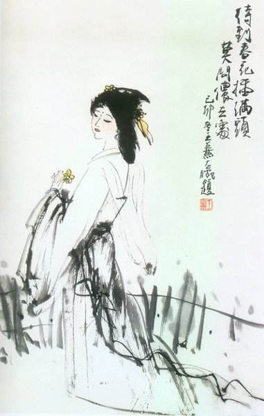

# 莫问奴归处

## 一

中国古代的女子若想流芳百世，仅凭一副倾国倾城貌是远远不够的。她们的才华、品德、性情必须有让男子汗颜的地方，才不至于淹没在历史的长河中。比如才情高妙的李清照，芳心如冰的班婕妤，忠贞决绝的绿珠，虽然没有史学家的春秋笔法为她们渲染着色，但她们美丽的身影至今依然光彩照人。她们的名字依然在市井的闲谈、戏曲的唱词、文人的论著中被一次次提起，每次提起，后人都是一脸的肃然。

除了凭借才与德，还有一群女子因为与政治结缘同样在历史上留下了深深的足迹。只不过，精巧的银簪一旦与炙手的玉玺产生纠缠，留名容易，流芳就成了难事。妲己、褒姒、陈圆圆都是世间不可多得的尤物，可惜她们身后都背上了红颜误国的罪名。

包括后人选出的四大美女也与政治有着千丝万缕的联系。西施客串了勾践灭吴的历史剧；昭君成了和亲政策的献礼；貂蝉执行了王允的美人计；杨玉环充当了唐玄宗的替罪羊。四人之中，大概只有杨玉环可以说是收获了真正的爱情，也只有她承受着身后连绵不绝的指责。贵妃何罪？只因她非常投入地谈了一场惊世骇俗的恋爱，而且恋爱的另一方是皇帝，更要命的是这个皇帝是被人奉为明君的唐玄宗。人们不愿看到开元之后接着一个黯然失色的天宝，尽管杨贵妃并没有教唆玄宗误国误民，可在安史之乱扬起的绝地烟尘中，她的窈窕身姿太过扎眼了，最后“六军不发无奈何，宛转蛾眉马前死”是难逃的结局，连心爱的三郎也救她不得。

杨玉环之外的其他三人无奈地做了政治博弈中的棋子，耗费宝贵的青春为风云际会的天空添上一抹异彩。后人对她们的情感倒是叹赏多于悲悯，以旁观者的冷眼看着她们饱满的生命被剥蚀得瘦损不堪，并施舍几句寓意复杂的叹息。她们一步一回头地走过历史，得到的“也只是虚名儿与后人钦敬”。

可见古代的女子，尤其是出色的女子，还是远离政治为妙，怒放的生命应该在枷锁之外寻找归宿。

因为古人信奉“女子无才便是德”的真理，对女子而言，才与德似乎成了不共戴天的冤家。狭路相逢，才多半会败在德的手下。女子即便有才也要被告知守拙，不可张扬，不可炫耀。才若是比德更引人注目就成了罪名。如今看来这显然是荒谬的悖论，可在封建社会里它却被装扮得冠冕堂皇大行其道。因而，如果有一个地方允许女子的才华轰轰烈烈地释放，它的存在必定会让很多人感到不舒服。在悖论泛滥成灾的世界，多才多艺的女子只有以悖论化的方式与之周旋才可能冲出重围。结果无论她们突围成功与否，青春都一点点地滴溅在了路上，如血般殷红，如泪般晶莹，却再也拣不回手中。

古代的社会确实有这么一个地方：女子的姿容可以用最妖娆的方式呈现，女子的才华可以用最自由的方式表达，礼教在杯盏间摧折，伦理在脂粉中褪色，来往其间的有腰缠万贯的富商，有身着便服的官员，有游手好闲的浪子，有谈诗论画的雅士……另一方面，肮脏的交易，丑陋的人性，也在氤氲的酒气里时隐时现，外在的华美与内在的颓废交融得异常妥帖。

顺着君子们略带怒意的眼光寻去，这个地方就卑怯而谦恭地侍立于通衢闹市，它的名字，说得高雅一点叫青楼，说得低俗一点叫妓院。

青楼远离政治，却在历史上留下了浓艳的一笔。从青楼走向历史的优秀女子其姿色、才华、品行甚至不输于皇宫内的三千粉黛。较之耀眼的朱门碧瓦和奢靡的富贵生活，她们的残碑荒冢更让人肃然起敬，她们的悲惨故事更让人感慨万千。

南北朝的苏小小，唐朝的关盼盼、薛涛、鱼玄机，五代的花蕊夫人，宋朝的严蕊、谭意歌，明朝的张红桥、卞玉京、李香君都是风尘女子，但她们能歌善舞，兼通诗文，其中亦不乏琴棋书画诗词歌赋样样精通的全才，即使是男子见到也要自叹弗如。

她们身处卑贱的地位，灵魂却占领着精神的高峰，她们的身体属于别人，心灵却属于自己。佛早就说过，肉体只是一副皮囊而已，灵台若是纯洁的，倒可反问世人一句“何处惹尘埃？”

她们虽然身不由己，对命运的安排常常显得无能为力，但她们从不曾轻弃了对真爱的追求。和很多少女一样，她们希望在最美的年华里与一个人相遇，那个人懂她，爱她，而且要爱得发自肺腑，心无旁骛。他在她眼里是晨曦里半开的蔷薇，嗔一嗔是眉颦柳竖，笑一笑是目眄波横，一呼一吸里都有工笔描绘不出的风情……这个梦中的王子，有的人还没来得及等到就在风刀霜剑严相逼的摧残下凄然老去了，即便是有幸等到了，结局可能也是有情人难成眷属，最后的选择是绝世佳人从此绝世，或者孤单才女继续孤单。

## 二

一般来说，一个女子若能在才、貌、德中任一方面达到出类拔萃就很是动人了。若能占住其中两条，则可称之为完美组合，比如才貌双全、德艺双馨、秀外慧中一向是出众女子的典型特征，这类女子却是可遇不可求。想得再大胆些，如果有人才、貌、德三者兼备，那就可以称之为超完美组合了，这类女子虽如凤毛麟角般稀少，可毕竟还可以寻到，宋代名妓严蕊就算得上其中一个。

既然身为名妓，严蕊的姿色自不必说。周密《齐东野语》说她“色艺冠一时”，其美貌可见一斑。

严蕊的才华更是独冠群芳。她善琴弈、通丝竹、工书画，学识通晓古今，诗词语意清新，“四方闻其名，有不远千里而登门者”（周密《齐东野语》）。我想那些慕名而来的人中应该有一两个揣着朝拜式的虔诚，如果他们仅为看一眼珠帘内的皓齿明眸，随便走进哪座青楼都能如愿，没必要“不远千里而登门”。美女难得，才女也难得，既是美女又是才女就更难得，唯有如此才能让古代自视甚高的男子枉驾而顾之。

按照宋时的法度，官府举行酒宴都要召歌妓前来捧场，但她们只是以歌舞助兴，不许入座逢迎，更不许私侍寝席，官员如与之走得太近甚至有获罪的危险。她们被称为官妓，在官府注册，名字编入乐籍。薛涛、严蕊就属于这一类。她们与明清时期大张艳帜的秦淮歌女有很大区别。严格来说应该称她们为“伎”，此伎非彼妓也，两字别看就差在偏旁上，代表的意义有着本质的区别。伎出卖的是才艺，而妓出卖的是色相。前者“支”的旁边站着一个“人”字，对于伎，支撑生命的骨架是相对完整的人格，她们至少是以人的姿态立于天地，如荆棘丛中的木槿花。后者“支”的旁边偎着一个“女”字，对于妓，支撑生命的骨架却是淡妆浓抹的粉面，如攀援而生的凌霄花。

严蕊芳名远播，连台州以外的人都不远千里而来以求一会，当地的雅士近水楼台，自然不会错失先机。当时台州太守是唐仲友，此人饱读诗书，形貌俊伟，做太守时不过二十七八的年纪。

唐仲友的身边美女如云，上门提亲者络绎不绝，既有大家闺秀名门千金，亦有小家碧玉里巷淑女，可这位才子一个也看不上。他在等一场美丽的邂逅，如同古老的城堡等着故事里的公主，除了她任何人都推不开城堡厚重的大门。

故事的开端是在浪漫的七夕——牛郎和织女相会的日子。

此日，唐仲友大摆水陆宴席，广邀文人雅士，良辰、美景、赏心都有了，“四美”中唯独少了乐事，于是唐仲友的一个朋友谢元卿极力推荐严蕊前来助兴，唐仲友爽快地答应了。在他的意识里，以为朋友说的这个人不过是哪个姿色出众的歌妓罢了，没想到，她，就是那位姗姗来迟的公主。

严蕊到场不卑不亢，谈笑自若。一阕琵琶曲，一支羽衣舞，艺惊四座，满座宾朋听得如痴如醉，看得举箸忘食。

唐仲友的眉倏然一动。

酒至半酣，谢元卿手持酒杯，走至严蕊面前：

“久闻姑娘雅好诗词，才气过人，今日以‘七夕’为题，以小人之姓为韵，作词一首，以助酒兴，如何？”

严蕊莞尔一笑，欣然领命，略加沉吟之后吟道：

> 鹊桥仙
>
> 碧梧初出，桂花才吐，池上水花微谢。
> 穿针人在合欢楼，正月露玉盘高泻。
>
> 蛛忙鹊懒，耕慵织倦，空做古今佳话。
> 人间刚道隔年期，指天上、方才隔夜。

吟罢，谢元卿连连称赞，四座宾朋无不颔首。

唐仲友的心倏然一动。

宴会散了，唐仲友望着严蕊迤逦而去的倩影发呆，忽然记起秦少游的一句词：金风玉露一相逢，便胜却、人间无数。

此后每有宴会，唐仲友都会请严蕊前来捧场，平日里对她也多有眷顾。

严蕊对这位青年才俊早有耳闻，多次往来，更觉得他异于那些逢场作戏的官吏，是个重情重义表里如一的君子。

两人开始频频相会，但却是淡水之交。

一段恋情在正式开始之前，两个人就像在进行一场温情脉脉的拉锯战，谁能故作镇静故作深沉谁就能握住更多的主动权，当有人先一步被对方吓倒说出“我爱你”，更像是举起白旗向另一个人说“我投降！”

严蕊是情场高手，最后败下阵来的自然是唐仲友。

唐仲友把浓浓的爱意化作诗句去温暖她，感动她，可是结果大违心愿，严蕊装作不解风情，没有给他想要的回答。

不是不爱他，实在是不能爱他。严蕊对这个僵硬的世界有更透彻的认识，她清醒地看到有一种可怕的力量叫世俗，就硬挺挺地横亘在他们之间。她知道自己不过是只寂寞而柔弱的飞蛾，即便扑向火焰，换得一次畅快的燃烧又有何妨？可唐仲友呢？身为朝廷命官，前程似锦，让他抛开一切陪她去赴扑火的盛宴，她不忍心。

严蕊很珍惜与唐仲友之间的感情，但她不想破坏那种若即若离的关系。尽管唐仲友聪慧多情，闻弦歌而知雅意，但严蕊却不能和他永结同心，欢好一世，她只要唐仲友站在生命的窗栊之外，像一位圣者，静静地听她吹奏快乐与忧伤的旋律，再把掌声远远地传递。

清醒的爱，看起来狠心，其实是一种疼惜。

## 三

可是，严蕊小心翼翼，麻烦却来势汹汹。

接下来出场的是朱熹。

历史上，朱熹与唐仲友之争本是朝堂之上的政争，后世的笔记与演义却给它涂抹上了一层旖旎而残酷的色彩。

朱熹当时任提举浙东常平茶盐公事，他早已闻得严蕊是个才貌双绝的官妓，闲暇时常把严蕊召至府上，看完严蕊的歌舞后，再板着脸对她讲一堆“饿死事小，失节事大”之类的理学精髓，一次如此，两次如此，三次还是如此，后来实在把严蕊恶心坏了，给朱熹来了个不辞而别。

朱熹被严蕊气得火冒三丈，正为找不到堂皇的理由整治严蕊而发愁，正巧有个与唐仲友不和的小人前来告状，说唐仲友与严蕊交往过密，必有奸情，何况唐仲友治经制之学，素来反对朱熹的理学。

于是朱熹连上六道奏疏，弹劾唐仲友。其中第三、第四两状谈及唐仲友与严蕊的罪行，说严蕊“蛊惑上官”，唐仲友“亵昵倡流”，并下令黄岩通判抓捕严蕊，关押入狱，施以鞭笞，逼其招供。严蕊虽为一介纤纤弱女，可巾帼之下却是一身的铮铮铁骨。她惨遭鞭棍加身，却始终坚持自己与唐仲友的关系清白如玉，日月可鉴。

《二刻拍案惊奇》中有这样一段描述：

> 严蕊到了狱中，狱官着实可怜她，吩咐狱中牢卒不许为难，好言问道：“上司加你刑罚，不过要你招认，你何不早招认了？这罪是有分限的，女人家犯淫，极重不过是杖罪，况且已经杖断过了，罪无重科，何苦舍着身子熬这等苦楚？”严蕊道：“身为贱伎，纵是与太守为好，不到得死罪，招认了有何大害？但天下事，真则是真，假则是假，岂可自惜微躯，信口妄言，以污士大夫？今日宁可置我于死地，要我诬人，断然不成的！”

严蕊的这段话当真字字铿锵，掷地有声！她用行动教给朱熹什么叫“饿死事小，失节事大”，什么叫“出淤泥而不染，濯清涟而不妖”。

后来此事震惊朝野，孝宗亲自过问，并派人严加调查才得以真相大白。

接手此案的是提点刑狱岳霖——一代名将岳飞之子，他对严蕊的遭遇深怀同情，对她的气节甚是赞赏。送严蕊出狱时，岳霖对她说：“闻你长于词翰，你将自家心事作成一词诉我，我自当与你做主。”

严蕊俯身拜过，口占一首《卜算子》，含泪吟道：

> 不是爱风尘，似被前缘误。
> 花落花开自有时，总赖东君主。
>
> 去也终须去，住也如何住。
> 若得山花插满头，莫问奴归处。

“不是爱风尘，似被前缘误”，淡淡一句，把前世今生统统揽入怀中，每个字经过了泪水的打磨，因而并不尖刻，如颗颗光滑的贝壳，散落于苦海的岸边。

“若得山花插满头，莫问奴归处”是一种单薄的向往，读者面对这样的词句往往显得脆弱无比，毫无抵抗之力。仿佛平静的湖面暗暗涌起一道宽广的波澜，我们心如小舟，等到发现被包围时，湖水早已漫过船舱。

严蕊吟罢，岳霖对眼前这位奇女子越发欣赏，立即取乐籍来为她除名，使严蕊彻底摆脱枷锁，获得自由身。

四方的达官显贵闻风而动，纷纷携重礼来严蕊门前下聘，可严蕊尽数回绝了。她最后选择的是一位并不主动的中年男子，因为严蕊看到他在丧妻后是怎样的悲痛欲绝，她知道，这样的男子才值得托付终身。

品透了红尘的滋味，看淡了世间的繁华，她现在只想与一个人过简简单单的生活。

可严蕊毕竟与唐仲友，那个本该给她幸福的人，在茫茫人海中失散了。严蕊出狱后，唐仲友已经调离台州，在母亲的坚持下与一位豪门闺秀结为夫妻。

她与他，只有靠回忆来弥补此生的遗憾。

而尘世中，有些人，是只能用来回忆的。
