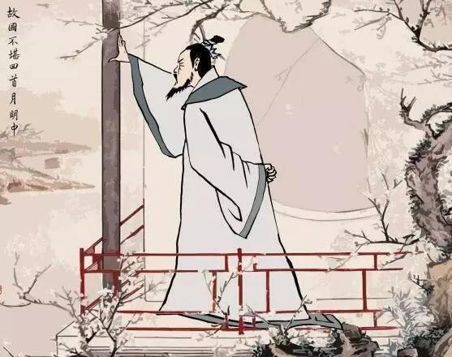

# 词人中的帝王

## 一

自古以来，中国文化一直保持着完整的连续性，这一点常常让世界上其他民族艳羡不已。

时至今日，古埃及昔日的风华被现代人倒卖殆尽，古巴比伦在战争的废墟里进一步深埋，古印度业已在恒河两岸老去了很久。四大文明古国之中，中国文明是唯一一个在几千年的风雨里巍然不倒，从未中断过的文明。

在一定程度上可以说，是文化的连续性暗中保驾了文明的连续性。文化赋予文明一种内在的韧力，使它能够在战争、灾难的猛烈冲击下不会轻易摧折。

中国文化的连续性不是机械地层层传递，而是在不断继承中不断更新，不断超越。问渠那得清如许，为有源头活水来。先秦散文尽处乃出汉赋，汉赋尽处乃出唐诗，唐诗尽处乃出宋词，宋词尽处乃出元曲，元曲尽处乃出明清小说。这就是王国维所说的“凡一代有一代之文学，后世莫能继焉者也”。

静安先生所说“后世莫能继”，是指一个时代整体的文化风格，而这个时代的前奏和余音都不足与它的主调相抗衡。这就像别的瓷器产地不能和景德镇并称，别的陶器产地不能和宜兴争宠。

词是属于宋的。

在宋的怀抱里，有晏殊的小园香径，柳永的晓风残月，苏轼的大江东去，秦观的山抹微云，辛弃疾的吹角连营，李清照的绿肥红瘦……可谓琳琅满目，应有尽有。但是，即便我们赏遍两宋三百年的风光，心里还会留下那么点有所遗漏的遗憾。有一个人，本该是与东坡、少游为伍的，可在宋的怀抱里却看不到他飘扬的衣衫，清绝的眉目。

他曾以血泪成全了宋词并统摄了宋词，可是最后怎么被温厚包容的宋朝拒之门外了呢？

更让人难过的是，宋词里不仅寻不到他的身影，也寻不到他的遗韵。这显然不是由于时代的阻隔。同是两宋之外的词人，温庭筠、韦庄、冯延巳等人在宋代都有大批的继承者，他们的风采在宋词中依然处处闪现，文化的连续性在这里宛然可见。

只有他一个人的风采在后世杳如黄鹤，再无重现。文化的连续性在他的身后竟然出现了一个断点！

悠悠苍天，此何人哉？

## 二

他就是李煜。

李煜是词人中的帝王。而后世的帝王没有哪个像他一样风华绝代，精于词，痴于词，献身于词。

李煜是帝王中的词人。而后世的词人没有哪个像他一样有机会站在一国之君的高度上睥睨世事，俯瞰人生。

于是，后主之词就成了难以为继的风采。南唐悲歌，竟成绝响。

五代十国的词人都被宋朝的继承者簇拥着迎进门来，争相拜访。只剩下一个李煜还在南唐的雕栏玉砌间游荡，前不见古人，后不见来者，念天地之悠悠，独怆然而涕下。

孤独的故国明月之下有孤独的一个人在徘徊，这是一种只能远观的意境。没有谁能走近那轮明月，也没有谁能走近那个人。

算起来，在宋代只有宋徽宗赵佶最有可能成为李煜的接班人。他无论在艺术造诣上还是人生经历上都与李煜有着惊人的相似。首先，两人都是天纵奇才，通乐理，擅风情，诗、词、书、画更是样样精通，冠绝当世。其次，两人都曾作为末世之君目送了一个王朝的背影，并以臣虏的身份在异国咀嚼过最难下咽的国恨家愁。

李煜和赵佶挑出任何一个来去当艺术家都绰绰有余，可上天却阴差阳错地安排他们做了皇帝。艺术家的浪漫气质必然会折损皇帝的威仪，一片江山被他们用写意的手法涂抹得一塌糊涂，结果两人不仅丢了皇帝的宝座，连身家性命都捏在了别人手中。

宋人从赵佶身上依稀看到了李煜的影子，就凄凄惶惶地说赵佶乃李煜转世，是来为南唐报仇的。在他们眼中，一个拿笔的皇帝是几乎等同于一个拿刀的昏君，金銮殿上的艺术家几乎等同于刑场上的刽子手。可见，艺术家真的不适合皇帝，自己当出了生命危险不说，还惹得天下百姓担惊受怕，不得安宁。

当年的宋太祖瞄了一眼南唐的李煜，说“卧榻之侧，岂容他人鼾睡！”，接着大宋的金戈铁马就踏过长江，直抵金陵城下。而围城中的李煜正在干什么呢？不是一头汗水地与大臣商讨应敌之计，而是在写一首“樱桃落尽春归去”的咏春词，最后还差两句没有写完，宋军就攻进城来了。宋太祖事后说：“李煜若以作诗工夫治国事，岂为吾虏也”。他对李煜这个词人皇帝多少是有点轻蔑之意的。李煜亡国后被押送汴京，宋太祖在宴席上让李煜写一首咏扇的诗，李煜当即诵出了“揖让月在手，动摇风满怀”的绝妙好句，太祖意味深长地赞了一句“好一个翰林学士！”言外之意就是说“你也就是块当翰林学士的料，哪里配当皇帝！”。

宋太祖说这句话的时候不会想到，一百多年后他的子孙中竟冒出一个“翰林学士”，晃晃悠悠地站到了他的身后。

北宋真不愧是个风流四溢的朝代，立国时有李煜俯首迎接，亡国时有赵佶匍匐远送，一始一终都要有皇帝兼艺术家的重量级角色前来捧场。李煜和赵佶却不是那么高兴，站在北宋的两端换了换眼色，摇了摇头。

北宋覆国后，赵佶被金人掳往北方的五国城，在北行途中写了一首词《宴山亭·北行见杏花》：

> 裁剪冰绡，轻叠数重，淡著燕脂匀注。
> 新样靓妆，艳溢香融，羞杀蕊珠宫女。
> 易得凋零，更多少、无情风雨。
> 愁苦。问院落凄凉，几番春暮。
>
> 凭寄离恨重重，这双燕、何曾会人言语。
> 天遥地远，万水千山，知他故宫何处？
> 怎不思量？除梦里有时曾去。
> 无据。和梦也新来不做。

赵佶治国不怎么样，词倒是写得凄切感人。要不是前面有个李煜，作为词人他可以算是历代帝王中数一数二的佼佼者了。

同为抒发亡国之痛，李煜写出的词是这样：

> 帘外雨潺潺，春意阑珊。
> 罗衾不耐五更寒。
> 梦里不知身是客，一晌贪欢。
>
> 独自莫凭栏，无限江山。
> 别时容易见时难。
> 流水落花春去也，天上人间。

王国维在《人间词话》说道：“后主之词，真所谓以血书者也。宋道君皇帝（即赵佶）《宴山亭》词亦略似之。然道君不过自道身世之戚，后主则俨有释迦、基督担荷人类罪恶之意，其大小固不同矣”。

赵佶与李煜擦肩而过，终究没有成为李煜的接班人。

## 三

在李煜之前，词主要以两种形象示人。一种是以敦煌曲子词为代表的民间形象，粗服乱发，素面朝天；一种是以花间派作品为代表的富贵形象，披罗戴翠，淡妆浓抹。前者得之于真，失之于拙；后者得之于雅，失之于雕。是李煜榨干生命的血泪，洗去浮华，还给了词一个自然与精妙并存的形象，“遂变伶工之词而为士大夫之词”。

干将、莫邪铸剑，开始铁汁不流，莫邪纵身跳入炉中，二剑乃成。以剑喻词，李煜就是那个跳入火炉的殉剑者。

一种文学用生命拜祭过之后，才能蔚然成形，反过来拜祭生命。

李煜的词就是最好的例子：

> 无言独上西楼，月如钩。
> 寂寞梧桐深院锁清秋。
>
> 剪不断，理还乱，是离愁。
> 别是一般滋味在心头。

清代的词学大家陈廷焯阅人无数，评词无数，可他看到这首《乌夜啼》时曾写下一句评：“哀感顽艳，妙在说不出”。

后主之词，就是让人觉得有说不出的妙处，别是一般滋味在心头。

李煜身为亡国之君，本该招致源源不断的骂名，可是南唐的臣民及后世的文人学者对他不仅不忍苛责，反而多有谅解，充满同情。我想这主要有三方面原因。

第一，李煜作为皇帝虽然算不上励精图治的明君，但他确实做了很多勤政爱民的好事，与隋炀帝之流有本质的区别。李煜天性仁厚，宽以待人，主政后他极力推行儒学，招纳贤士，并在经费上大力资助庐山国学（即白鹿洞书院的前身）。在那个遍地烽烟的时代，南唐是最有文化氛围的一块圣地，连远在朝鲜半岛的高丽国都慕名而来，年年遣使进贡。南唐的文化之盛代表了五代十国的最高水平，这是史学家一致公认的。

第二，大宋灭南唐是大势所趋，不是李煜一个人能左右的。南唐长年向后周和宋朝纳贡，国库空虚，经济凋敝，战备废弛，国防虚设，根本无力抵抗宋太祖的威武之师。南唐旧臣在国破后入宋为官，他们只是认为南唐气数已尽，对后主毫无谤怨之言。后主死讯传至金陵时，百姓痛哭，设奠遥祭，尊李煜为仁主。

第三，李煜的人品让后人心仪，才情让后人倾倒，遭遇却让后人惋叹。他自登基以来就面临国将不国的困境，处处小心，仰看北宋的脸色行事，但是仍然躲不过国破身亡的悲惨结局。这种忍辱负重，力求向善，却仍不免陷于危困的命运，正是无数生不逢时的文人和士大夫的共同遭遇，尤其是在改朝换代之际，后主之词往往能在他们心中产生巨大的共鸣。

词人不是谁都做得好，可皇帝也不是谁都当得起。

孙权曾劝曹操废汉立魏，自个当皇帝，曹操却说：“是儿欲使吾居炉火上耶！”意思就是：“孙权这小子是想把老夫放在火堆上烤啊！”生在皇家的李煜却没有曹操那么幸运，面对皇帝的龙袍旒冕，他别无选择，只能任历史放在火堆上烤了。

皇帝的宝座可求不可遇，词人的天分却是可遇不可求。我们对身为皇帝的李煜无所求，然而在历史的转角处遇到了身为词人的李煜，山穷水尽之后往往才见得奇观。

## 四

宋太平兴国三年（978年）七月七日，宋太宗派人祝贺后主四十二岁的生日，礼物是一杯毒酒。

据说，让太宗动了杀机的是李煜的一首词：

> 春花秋月何时了，往事知多少。
> 小楼昨夜又东风，故国不堪回首明月中。
>
> 雕栏玉砌应犹在，只是朱颜改。
> 问君能有几多愁？恰似一江春水向东流。

七夕那天，李煜在囚禁的住所令乐伎演唱这首词，声闻于外，太宗听说后大怒，就用“牵机药”毒死了李煜。

那么，这首《虞美人》就成了李煜生命最后的悲歌。

嵇康临刑前曾把《广陵散》最后弹奏一遍给世人听，然后说“《广陵散》于今绝矣！”。不知道是谁有幸在墙外听到了后主的绝唱，如果我是其中一个，定要拉住那个送毒酒的仆人大哭一场，告诉他“后主之词于今绝矣！”。此曲只应天上有，人间能得几回闻啊。

宋太宗毒死一个小国皇帝不足惜，可是他同时毒死了一个诗人，一个书法家，一个画家，一个收藏家，一个鉴赏家，一个音乐理论家。总之，他毒死了一段特别辉煌的中国文化。

但是，我们没有理由去责怪宋太宗，他只是正确行使了一项皇帝的权力，并无意与文化作对。

史书上说李煜“一目重瞳子”，就是一只眼有两个瞳孔。在我的印象里，中国历史上还有两个名人也是重瞳的，一个是五帝之一的舜帝，另一个是西楚霸王项羽。重瞳似乎是上天留在他们身上的惊叹号。果然，舜帝为后人留下了一种对太平盛世的殷殷向往，项羽为后人留下了一种对悲情英雄的款款追慕，李煜则为后人留下了一种对血泪人生的绵绵怅惘。
