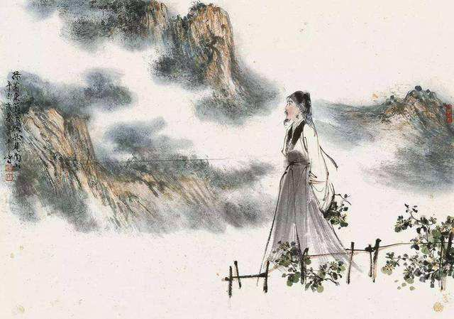

# 采菊东篱下

## 一

魏晋是不折不扣的乱世时代，礼乐崩毁，朝野不宁，一切都在混沌无序中演变。政治放逐了文化，文化疏离了政治，结果政治也乱，文化也乱，连士族一向坚定的精神信仰都变得模糊起来。

三国乱，但沧海横流，群英荟萃，气吞万里如虎，尽显英雄本色，乱得让人心旷神怡；两晋乱，却是步步有绊绳，处处有陷阱，阴谋阳谋满天飞，乱得让人心惊肉跳。

三国之乱在外，两晋之乱在内。

无论在内在外，乱对文士来说都不是好事。兼济天下的传统理想受尽了强权的嘲弄，文士们开始在独善其身的自我救赎中渐渐清醒。可在举世皆醉的时代，清醒者注定是孤独的。他们抬起惺忪的醉眼，大胆地向孔孟投去第一束怀疑的目光。儒家的思想体系已经被践踏得支离破碎，只手难以补天，他们索性抛开四书五经，成群结队地走向老庄的怀抱。结庐山林，曲水流觞，任诞简傲，谈史论玄，竟使得人人身上都散发出一分仙气，三分傲气，外加五分才气，凝聚成为后人所称道的魏晋风骨。

“竹林七贤”可谓其中的代表人物。阮籍、嵇康、山涛、向秀、王戎、阮咸、刘伶皆为一时才俊，可他们不用自身的有利条件去争作孝廉、秀才，等着官府提拔，反倒一个个跑到山林里发起疯来。打铁的打铁，喝酒的喝酒，还有人整天驾着牛车乱逛，找不到路了就哭着返回，走一路，哭一路，只哭给自己听。

竹林七贤后面还跟着一个更不像话的陶渊明，干脆把乌纱往地上一扔，兴致勃勃地当起了农夫。他以锄为笔，同时以笔为锄，在田垄间东挖挖，西刨刨，开垦出一个远离尘嚣的桃花源。南山种豆，东篱采菊，不仅满足了自己的需要，还为身后数不清的文人提供了精神食粮。

魏晋南北朝总体上给人的感觉就是混乱与散乱，其三百六十余年的时间跨度能够轻轻松松地吞咽掉整个大唐，因而要想给这段历史找一个明晰的坐标很是艰难。政治本身就扭曲得不成样子，拿它来当坐标显然不大合适，泰始、隆安毕竟没有贞观、开元那样强烈的时代印记，难以对大段的历史形成统治力。

政治的坐标失效了，文化的韧性便显示出来了。熙熙攘攘的人群之外，站着一个眼神淡定的陶渊明，像逆风而立的路标，可以为后人指点迷津。我们以陶渊明为原点，向上可以漫溯将近断流的魏晋风骨，向下可以遍赏无限延伸的田园风光。

时间的风，能把官衙内的金印变成废铁，能把皇陵前的石碑化作齑粉，唯独吹不干陶渊明从东篱采下的那朵黄花。

## 二

说来奇怪，像陶渊明这样开宗立派的大诗人在生前竟然没有一个追随者。颜延之是与他相知甚深的至交，也只是欣赏他的性情，而非才情。陶渊明死后，颜延之在《陶征士诔》中赠给他一个“靖节”的谥号，对他的诗文却鲜有称誉。

陶渊明的田园在荒芜了近百年之后，才开始有人怀着崇敬的心情来叩东篱的柴门。

最先到达的是梁朝的昭明太子萧统。他对陶渊明这位隔代的先贤偏爱有加，从陶渊明不流于俗的诗文里读出了不流于俗的新意。在他眼中，“其文章不群，词采精拔，跌宕昭彰，独超众类，抑扬爽朗，莫之与京”。这种说法与后人给陶渊明“豪华落尽见真淳”的文风定位显然是有所出入的。苏轼曾一语道破说陶诗“质而实绮，癯而实腴”。其实，说陶诗“词采精拔”也好，“豪华落尽见真淳”也罢，都言之有理。陶诗质朴处在词句，华美处在意蕴，视角不同，得出的结论自然不同。

陶渊明的诗文是正统文学之外的一脉异音，而且它本身也有着奇妙的际遇。它隐秘在远离官场的山林，最先赏识它的却是身居内宫的太子；它生长在逼仄灰暗的东晋，繁盛期却出现在开豁明朗的唐宋。看似杳渺的两端最后毫不牵强地连在了一起。但凡是文学中的精品，本就具有超越时空的能力。

陶渊明的诗文铅华落尽，素面朝天，可它硬是把六朝那些精巧绮丽的篇章比得六宫粉黛无颜色。比如这首《饮酒》：

> 结庐在人境，而无车马喧。
> 问君何能尔？心远地自偏。
> 采菊东篱下，悠然见南山。
> 山气日夕佳，飞鸟相与还。
> 此中有真意，欲辨已忘言。

落脚点仍是在人境，而车辚辚马萧萧的喧闹不属于这里。声音是有的，暮归的牛在叫，深巷的狗在叫，争食的鸡在叫，每种音籁做一个声部，入耳成曲。

不必向他发出任何形式的疑问，身体的远行是为了心灵的回归。他只是想让眼里的风景向着心里的风景渐渐靠近，渐渐融合，最后连成一片。

秋意正浓，黄灿灿的菊花诱惑着荷锄而归的农夫。当农夫洗过双手，到东篱采下一瓣馨香，农夫就成了诗人。南山，是在悠然一瞥时映入眼帘的。《山海经》中也许收录了关于南山的传说，只是南山的曾用名他还不曾在书中找到。

山色空蒙，青霭是恋上山林的精灵。夕阳为媒，成全了一幕美景。归巢的鸟儿滑过天空，“啾啾”的音符落入青霭，溅得黄昏好清婉。

眼前的一草一木似乎是一连串的隐喻，他从中依稀读出了答案。豁然开朗的感觉，却是意会得来，言传不出。何况，此中有真意，不足为外人道也。

有的诗就是这样，浅浅淡淡的语言偏能营造出浓浓郁郁的意境，如阳光，蕴藏着赤橙黄绿青蓝紫诸般色彩，表现出来却是水晶般澄澈透明，当它偶尔照进读者温润的心灵，又能折射出绚烂的彩虹。

陶渊明大概不会想到，他在豆田里倚锄而憩时随意吟出的诗句会被后人奉为典范，在半醉半醒时写下的文章会被后人当作精品，就连自己不为五斗米折腰这类傻事也被后人当作样板，成为流传千年的美谈。然而出乎意料的只能是陶渊明自己，遥遥相望的我们则毫不意外，因为他的言之率真，行之洒脱，让后人看得心驰神醉，足以成为一道炳耀千古的风景。

高堂之外，田园将芜，我们的精神绿洲实在需要一个诗人前来耕种，陶渊明在最恰当的时候来了，他的一言一行自然会散发出明亮而不刺眼的光辉，引人赏阅。

陶渊明虽为隐逸之宗，事实上却做了一派文化的代言人。在南北朝之后成长起来的文学巨匠无不受到田园思想的影响，在他们构建的精神殿堂里几乎都能发现有个陶渊明端坐其中。

孟浩然把他当作榜样，在《仲夏归汉南园寄京邑耆旧》中写道：

> 尝读高士传，最嘉陶征君。
> 日耽田园趣，自谓羲皇人。

李白把他当作偶像，在《戏赠郑溧阳》中写道：

> 陶令日日醉，不知五柳春。
> 素琴本无弦，漉酒用葛巾。
> 清风北窗下，自谓羲皇人。
> 何时到栗里，一见平生亲。

杜甫把他当作知己，在《可惜》中写道：

> 宽心应是酒，遣兴莫过诗。
> 此意陶潜解，吾生后汝期。

白居易把他当作老师，在《效陶潜体十六首》中写道：

> 先生去我久，纸墨有遗文。
> 篇篇劝我饮，此外无所云。
> 我从老大来，窃慕其为人。
> 其他不可及，且效醉昏昏。

到了宋代，陶渊明的诗文更加受人推崇。欧阳修盛赞《归去来兮辞》说：“晋无文章，唯陶渊明《归去来兮辞》”。王安石读到“结庐在人境，而无车马喧。问君何能尔，心远地自偏”时，说“有诗人以来无此句者”。苏东坡在《与苏辙书》中说“吾于诗人无所甚好，独好渊明之诗”。辛弃疾说“须信采菊东篱，高情千载，只有陶彭泽”。

## 三

陶渊明的诗文之所以能倾倒诸位大师级的人物，除了其自身的语言魅力之外，还有更深层的心理因素。

古代的文人或多或少都要涉足政治，而文人特立独行，率真执着的天性，却与政治上行事圆滑，顺势而为的要求南辕北辙。在这种矛盾之中，陶渊明就悄悄地成了他们的精神导师。仕途得意时，陶渊明可以帮他们看护心田，以免欲望的野草在其中疯长；仕途失意时，陶渊明可以做他们的良师益友，以免人格随着官职一同遭到贬谪。

自汉武帝“罢黜百家，独尊儒术”以来，文化实际上成了政治的附庸。儒家学说主张“学而优则仕”，要求文化为政治服务，具体到文人身上，就是要他们以天下为己任，积极入世。而文人大都天真，他们满怀热情地踏上仕途，希望能够实现自己在书房勾勒出的人生宏图，了却君王天下事，赢得生前身后名。可现实的冷酷，官场的复杂，常常超出他们的想象，来来回回折腾几次，疲倦了，困惑了，迷茫了，那个采菊于东篱的模糊身影一下子变得清晰无比。

陶渊明的诗文是他们在懵懂的岁月里埋下的种子，历尽风雨之后，再回首，种子已成大树，撑出一片可以供他们稍作停留的绿荫。

中国历史上有三种典型的垂钓形象：在渭水之畔等待周文王“上钩”的姜子牙；在濮水之畔面对高官厚禄持竿不顾的庄子；在愚溪之畔“独钓寒江雪”的柳宗元。从某种意义上说，从这三种形象上可以反映出中国文人普遍存在的三种心态。他们往往是仰慕着孤高超逸的庄子，艳羡着得遇明主的姜子牙，同时怜悯着弃置不用的柳宗元。其中柳宗元最接近大多数人的真实状态，庄子和姜子牙是两个完美的极端，只适合远远地欣赏。

姜子牙横竖做不成，浑浑噩噩一个转身做了柳宗元，是文人之中最常见的人生轨迹。陶渊明不一样，他转身之后做了庄子，登东皋以舒啸，临清流而赋诗，悦亲戚之情话，乐琴书以消忧。而且陶渊明做庄子还异于竹林七贤做庄子，竹林七贤来山林是为了避难，陶渊明来山林是为了回家。

文化总被文人拿来当作通向政治的铺路石，当他们在仕途上碰几回壁，摔几回跤，被政治从云端狠狠地推下，文化又会反过来用宽厚的双手接住他们瘦弱的身躯，并帮助他们依傍山水构建起更完整的人格。中国文人的幸与不幸都在这里。他们接受了儒家思想，注定要与政治纠缠在一起，但他们从孔子那学来的仁，从孟子那学来的义，又很难在政治那里找到归属。正如他们就算身在长安，也常常在意识里寻找那个雁落青塔花接渭水的古都。

当他们从案牍间挺直酸痛的脖颈，恍惚间听到陶渊明啸出一句“归去来兮！”，可以想到，他们心中会产生多大的震撼。连一向豪迈的苏轼都低下头，说了一句“深愧渊明，欲以晚节师范其万一”。

庙堂诚然是实现政治抱负的最高舞台，可那里毕竟是狭窄的，窒碍的。做事诚惶诚恐，说话畏首畏尾，还要时刻观察皇帝的脸色，提防小人的诋毁，太累。陶渊明的意义在于为中国文人开辟了一片桃花源式的文化腹地，在仕途上走得累了，回头看看陶渊明在南山下耕种的身影，多少是一种慰藉。他们从陶渊明那里知道，自己还有退路。

“采菊东篱下，悠然见南山”，陶渊明不知道他不经意间做出了一个多么妩媚的动作！

他也不知道一首《归园田居》创造了一个为多少人共享的至高理想。

> 少无适俗韵，性本爱丘山。
> 误落尘网中，一去三十年。
> 羁鸟恋旧林，池鱼思故渊。
> 开荒南野际，守拙归园田。
> 方宅十余亩，草屋八九间。
> 榆柳荫后檐，桃李罗堂前。
> 暧暧远人村，依依墟里烟。
> 狗吠深巷中，鸡鸣桑树颠。
> 户庭无尘杂，虚室有余闲。
> 久在樊笼里，复得返自然。

幸亏我们有一个陶渊明。没有他，中国太喧闹，同时会太寂寞。
