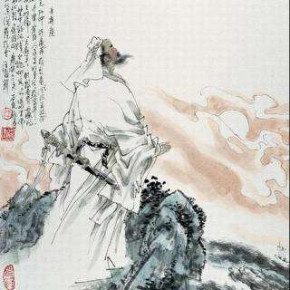

# 错位的长剑

## 一

时至南宋，历史又进入了一个风雨飘摇的时代。

渡江之后的宋人对战争仍然心有余悸，怯怯地回望一眼遍地狼烟的北国，便开始在江南的温柔富贵乡里寻找安慰，直把杭州作汴州。假若子孙问起昔日的汴京如何繁盛，他们还可以拿出褪色的《清明上河图》来指指点点，细加评说。

东坡的豪迈长吟似乎已经渐行渐远，江南的水太软山太秀，“大江东去”的豪歌唱得再嘹亮在这里也引不起一点回响。黄河两岸适于仰天怒吼，燕赵大地适于慷慨悲歌，可长江北岸的江山插满了金兵的旌旗，宋人已经无法随意亲近。

然而一个民族若想自立自强，就不能没有怒吼，没有悲歌。

绍兴三十二年（1162年），辛弃疾从满目疮痍的北国走向惊魂甫定的江南，他为大宋带来了万余名忠心报国的壮士，带来了治国克敌的良方，同时带来了一个民族急需的怒吼和悲歌。婉约了百余年的宋朝终于开始有铿锵之音响起，并逐渐成为时代的主旋律。

## 二

绍兴三十一年（1161年），金主完颜亮大举南侵，企图将南宋政权彻底消灭。辛弃疾在沦陷的家乡率领二千余人的农民军起义，随后加入耿京领导的起义军，辛弃疾任掌书记一职。

这年十一月，军中的义端和尚盗得义军大印叛逃金国，辛弃疾听说后怒火满腔，提刀上马，单骑出城，追击两日后在一个偏僻的山道上擒获义端，搜出大印，枭其首级而还。

次年，辛弃疾作为义军代表奉表南下建康，说明了归附宋廷的意愿。孰料返回途中惊闻噩耗：叛贼张安国已将节度使耿京谋杀，挟军降了金人！辛弃疾悲痛不已，但又不甘心前功尽弃，几经策划，他率领一支五十余人的骑兵队，在一个月黑风高的夜晚直扑济州，到达后巧妙周旋，把醉酒的张安国诱至跟前将其制服，耿京旧部立刻响应。行动成功后，辛弃疾过关斩将，昼夜兼程，率军返回建康。

这一年，辛弃疾二十三岁。

当辛弃疾率领着义军南下之时，他一定坚信有朝一日会以气吞万里如虎的姿态重返江北，再赴沙场。而就在二十二年前，有位和他一样一心报国的壮士刚被十二道金牌从沙场上召回，两者一前一后走在南归的路上，身后是北国落寞的天空。

同一段由北向南的路程，朝廷来走是张皇失措地奔逃，辛弃疾来走是昂首阔步地前进，当前进的勇士受制于奔逃的懦夫注定要留下遗憾。南宋小朝廷柔弱无骨，找不到一个强硬的支点来负载辛弃疾炽烈的报国之志，最终使英雄无用武之地，国家有累卵之危。

南渡之后的四十余年里，辛弃疾被朝廷支来调去甚至罢免不用，再也没有得到过重返沙场的机会，他的军旅之梦刚以一个激昂的序曲开始就被溺死在江南的烟雨中了。辛弃疾踏上南岸之后仿佛走进了一座围城，围城之内的人勾心斗角，阴阳相克，围城之外的人尸位素餐，苟安现状。元气大伤的宋朝有“弃疾”的良方在手却不曾一试，如同宝剑在鞘而不知拔剑御敌，怎能不叫人顿足叹之？

## 三

辛弃疾和南宋确实给历史留下了许多遗憾，这些遗憾中尤以两方面的错位让人留恨。

首先是英雄与时代的错位。

我以为辛弃疾不该生在宋朝，尤其不该生在南宋。他文武兼备，骁勇多谋，应该在“平明吹笛大军行”的威严雄壮中与岑参同行；他豪爽放达，诗酒并重，应该在“会须一饮三百杯”的酣畅淋漓中与李白共醉；他仰慕陶潜，喜好佛老，应该在“桃红复含宿雨，柳绿更带朝烟”的山林美景中与王维携手；他登山临水，吊古伤今，应该在“隔江犹唱《后庭花》”的秦淮歌吹里与杜牧对谈……总之，辛弃疾身上处处彰显着大唐的风骨。

可惜辛弃疾晚了一步，当他匆匆赶到的时候大唐已成历史，其后的宋朝尽管也气宇轩昂，满身风流，可终究少了大唐帝国的那种自信与从容。唐朝如一位羽扇纶巾的儒将，走进中军帐可以统帅千军，运筹帷幄，败突厥于西域，屈回纥于国门，顺便把边塞开垦为一方适于诗歌生长的田地，供岑参高适们耕种；走进书斋又可以灯下论文壁上题诗，用如椽巨笔写下一篇篇文学精品，引得后人赞叹千年而意犹未尽。在唐朝魁伟的身影里，宋朝更像一位白衣洒落的书生，论及诗书礼仪他比儒将更加精专，可是一旦遭遇战事他却缺少指挥若定的大将风度，虽然有宝剑悬在腰际，但很多时候只是玉佩般的饰物——出鞘杀敌它远远不能胜任。

宋朝的骨子里自始至终总透露着一种与生俱来的柔弱，靖康之后，王室南迁，这种柔弱渐渐发展成难以治愈的顽疾，最终使宋朝病入膏肓。而南宋近于病态的柔弱在辛弃疾身上却也找不到一点痕迹，他的一言一行与大唐的性格遥遥呼应。

如果在烽烟四起的乱世，辛弃疾可能是一位横戈跃马智勇双全的武将；如果在海晏河清的治世，他可能是一位雄才大略励精图治的贤相。事实上他所在的南宋既非乱世也非治世，而是处在乱世与治世之间的模糊状态。南宋毕竟还有顽强的生命力来守住仅存的半壁江山，能够残喘一百五十年，所以不是十足的乱世；同时沦陷的汴京一直被陌生的羌管纠缠，关于靖康的记忆是其无法摆脱的梦魇，所以南宋更不能称为治世。

这种模糊状态使辛弃疾陷入了一种非常矛盾的人生困境，他若想获得朝廷的重用必须要向整体性的柔弱妥协，这意味着他的行动和目的将会产生剧烈的冲撞。要他停止北上抗敌的呼喊，混入主和派以得高位，他做不到，因为他是一个以天下自许的武将，有坚定的政治信仰和军事理想。另一方面，要他长期闲居不问世事，与二三知己在田园里饮酒谈词，他也做不到，因为他同时是一个身逢国难的中国文人，忧国忧民是他的本能和精神需要。

国家危难往往会使一些人从惊慌的人群中脱颖而出，他们铁肩担道，力挽狂澜，或成人杰，或为鬼雄，引领着一个时代的潮流。他们的命运牵扯着时代的命运，时代的命运又决定了他们的命运，两者相容则英雄得以尽才，国家得以稳定，如周亚夫之于“七国之乱”，郭子仪之于“安史之乱”；两者相斥则英雄难以得志，国家难以长存，如岳飞之于南宋，袁崇焕之于明末。显然，辛弃疾与南宋属于后一种关系。

没有英雄的时代是可怜的，有英雄而不为所用的时代是可悲的。

辛弃疾文能陈策治国，武可平戎安邦，却偏偏赶上了一个重病在身又讳疾忌医的朝代。对于英雄，终老故里是比马革裹尸更悲惨的结局。毕竟，时代造就英雄不是仅仅为了证明英雄的存在。

其次是武将情结和文人身份的错位。

辛弃疾的出场彻底颠覆了人们对书生“手无缚鸡之力”的惯论。辛弃疾的那双手不仅握得住熠熠生辉的妙笔，更拿得起铮铮作响的利剑。

出将入相式的人物历来是统治者极力搜寻的贤臣，而气节、才气、胆识兼备的辛弃疾并没有受到南宋朝廷足够的礼遇。辛弃疾南归，“壮声英概，懦士为之兴起，圣天子一见三叹息”（洪迈《稼轩记》），朝廷似乎是把他当作艺术品欣赏了一番，然后就打发他到地方上任职了。

身逢国难的辛弃疾没有尊奉儒家“不在其位，不谋其政”的信条。他上《美芹十论》、《九议》等军事论疏为朝廷拨云见日，因位卑言微而不被采纳，以文报国这条路没有走通。他欲披坚执锐北伐复国，因与主和派政见相左而屡遭排挤，以武报国这条路也没有走通。

文武兼备本来是种可遇不可求的完美组合，到辛弃疾身上却成了双重的精神负担。他主动将三千里江山担负起来，即使前路坎坷也不肯放下肩头。丢掉半壁江山，对南宋小朝廷而言不过是割去了半个胃，并不妨碍他们继续啖肥饮甘，对于辛弃疾而言却是割去了半颗心，自然令他痛心疾首愤恨不已。他深知收复北国要靠金戈铁马而非笔下千言，因此在他心里始终有种挥之不去的武将情结。睡了他会梦回连营，醉了他会挑灯看剑，郁孤台北望长安，凭栏处抚看吴钩。

直到双鬓斑白之时，他依然对当年与金兵激战的经历念念不忘：

> 壮岁旌旗拥万夫，锦襜突骑渡江初。燕兵夜娖银胡䩮，汉箭朝飞金仆姑。

> 追往事，叹今吾，春风不染白髭须。却将万字平戎策，换得东家种树书！

> ----------------《鹧鸪天》

辛弃疾投笔从戎，率军南归以图大业，他绝不甘心只作一介文人。若谈报国，文书上的纵横笔墨终究不如一场实实在在的厮杀来得痛快。只是，他立志做一个驰骋沙场的赳赳武夫，历史却执意把他逼回到安静祥和的书案面前，十万铁骑与三千羊毫的转换太过牵强，但他也只能忍受着理想的错位把报国之志在笔端恣意地挥洒。

## 四

辛弃疾壮志难酬诚然让人惋叹，不过当我们摩挲历史被“莫须有”刺得心痛之时，除了抱着“精忠报国”四个字痛哭之外也许会替辛弃疾感到庆幸，庆幸他的刚强不曾被朝廷狐假虎威般征用，因此保全了一个充满张力的灵魂。朝廷柔弱如丝，辛弃疾刚强似剑，以丝御剑难免有丝断剑脱的危险，所以朝廷对辛弃疾还有陆游、陈亮等一干利剑一向采取敬而远之的态度。岳飞本是一柄刚强的利剑，一路向北，所向披靡，欲直捣黄龙，迎二帝还于旧都，结果金兵怕了，南宋小朝廷也怕了。讽刺的是，朝廷的柔弱在猜忌中纠结起来攻击刚强之时反而表现出连下十二道金牌的果断。辛弃疾若得重用进而作一柄岳飞似的利剑，最后怕是也要以悲剧收场。南宋整体性的柔弱容不下个别的刚强，风波亭就是铁证。

辛弃疾以雄姿英发的武将形象出场，最后却以“词中之龙”的文人身份留名于世，这恐怕是他所始料未及的吧。其实当我们站在千年之后回望那段历史，辛弃疾从文从武已经不再那么重要，毕竟像他这种人物能够出现就是南宋的大幸。既然做不成利剑，就任他穿着官袍醉酒高歌或者闲居村野笑傲林泉，如此倒可为南宋的文化史添上几笔雄浑的色彩，未尝不是好事。

辛弃疾的报国之路费尽周折，然而他鬓虽残，心未死，郁积于胸的情感必定会沿着某个渠道喷薄而出。从政庸人当道，从军鼠辈掣肘，进亦忧，退亦忧，最后只剩下一杆秃笔与之为伴。

辛弃疾写词绝不是把它当作词来写，而是当作战表，当作檄文，当作请战书。我们从中读出的是一个孤胆英雄的呐喊，“大声鞺鞳，小声铿鍧，横绝六合，扫空万古。”“词为艳科”的藩篱被苏轼一脚踏破之后继而被辛弃疾彻底焚毁了。辛弃疾让词和他一道背负起了时代的苦痛经历和英雄的历史责任，于是，丽句转作豪言，软语顿成悲歌。

刘辰翁在《辛稼轩词序》中说：

> 自辛稼轩前，用一语如此者，必且掩口。及稼轩，横竖烂熳，乃如禅宗棒喝，头头皆是，又如悲笳万鼓，平生不平事并卮酒，但觉宾主酣畅，谈不暇顾，词至此亦足矣！

辛弃疾写词确实达到了一种炉火纯青的境界，浩叹沉吟，无非块垒，嬉笑怒骂，皆成文章，势如江出三峡，一泻千里，吞天坼地，溅玉喷珠，携五湖百溪之水赴海朝宗。

辛词豪放处最快人心，然而它的精彩并非只限于豪放一面。温婉如《青玉案·元夕》；哀艳如《念奴娇·书东流村壁》；苍劲如《鹧鸪天·鹅湖归病起作》；清逸如《临江仙·探梅》；诙谐如《沁园春·将止酒，戒酒杯使勿近》……以上种种远非豪放二字所能尽述。但是词中的豪放体更多地熔铸了辛弃疾的爱国心、英雄梦，故而赢得了后人更多的目光。

清代学者江顺诒曾说过“稼轩仙才，亦霸才也。”应该说辛弃疾首先是一个英雄，其次才是一个词人，史载辛弃疾临终前大呼“杀贼！”数声才停止了呼吸，然而最终为他赢得生前身后名的并不是了却君王天下事的功业，而是书案上那几卷皱巴巴的词稿，这究竟是英雄的幸运还是不幸？

总之，把辛弃疾安排在南宋，成全了历史，却委屈了英雄。
