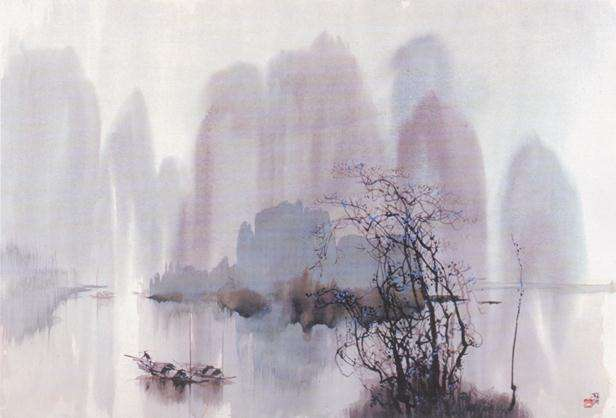

# 梦江南

追寻江南，在春风吹透的梦里。

沿着唐宋元明清的路线逶迤走去，是杜牧口中清丽的诗句，是唐寅笔下灵动的色彩，是吴侬软语唱出的婉歌……

江南如诗。自在飞花轻似梦，无边丝雨细如愁。在江南的怀抱里，哪怕是一花一草，一石一瓦，都承载着丰盈的情思。湿润的混着芬芳的空气，浸着杜牧的烟雨楼台和柳永的晓风残月。长亭之侧，执手相看泪眼的离人；望江楼上，数着过往千帆的少妇；清明雨中，借问酒家何处的行客；夏日午后，溪头卧剥莲蓬的顽童，分不清这些人是从江南走进了诗中，还是从诗中走进了江南。白居易来过，拖着沉重的脚步徘徊在浔阳江畔，和着呜咽的琵琶声写下一曲哀歌；苏轼来过，在山高月小，水落石出的夜里，泛舟赤壁，叩问人生；李清照来过，从北宋走向南宋，舴艋舟的桨篙在江南的瘦水里寻寻觅觅，声起声又落。江南永远是一个诗化的天地。只有诗，才是江南最生动的注解，只有江南，才是诗最完美的演示。

江南如画。不必讲究布局、手法，采一片与孤鹜齐飞的落霞，引一泓共长天一色的秋水，就是一幅绝美的杰作。放眼望去，一江碧水，两岸青山，紫燕穿柳，落英缤纷。薄脆的蓝天是丝锦织就，满眼的草木是碧水染成，绿气氤氲上升，漂染着蓝天，漫溢的绿汁遍地流泻。你会发现，所有的渲染修饰都是多余，江南本身就是一幅无限的画卷。松竹之青翠，嫩柳之鹅黄，江花之红艳，任何一种简单的颜色都被表现得淋漓尽致。造化如此偏爱江南，似乎执意要把天地间所有灵气汇集一处，让神游画中的人相信：阆苑仙境不是神话。

江南如歌。琴弦是曲折的古道边的柳丝，琴键是清浅的小河里的石子，每一根草上都长着一个音节，每一片叶上都伏着一个音符，就连每一块呆呆的鹅卵石里也藏着一个等待回应的声部，清风细雨，稍加拨动，就能奏出一段天籁般的乐曲。雨滴敲着朱红色的窗；日暮的长江里，渔父手中的船桨发出“欸乃”的声响；溪水流过，留下湿润的滑音在山林里穿插；枯藤老树之上的孤鸦，偶尔发出一句慵懒的啼叫；夜半的寒山寺，传出低沉悠远的钟响……此时，闭上眼睛，屏住呼吸，你就能听到来自江南的呼唤。

江南的美，让人忍不住去相信，又让人忍不住去怀疑。
有时候，江南抽象得只是一种宏阔的意象，包含千般滋味，万种风情，数不尽的良辰美景；有时候，江南具体得就像一幅伸手可触的画卷，描绘出春江花月夜，秋窗风雨夕，西湖画船，小桥流水。所以，江南对于我们，总是虚幻缥缈又真实无比。

有时候，我们只能从诗画词曲中感受到江南于尘世间的存在，知道她就隐匿在万里神州的某个地方；有时候，江南悄悄潜入了我们的生活，每当看到似曾相识的归燕，飞过秋千的乱红，听到黄昏里的横笛，月夜下的玉箫，总会从心底涌出蛰伏了很久的情愫，与她暗暗契合。因而，江南与我们之间，总是遥隔千里却近在咫尺。

江南，一个沉淀在心里的梦。
