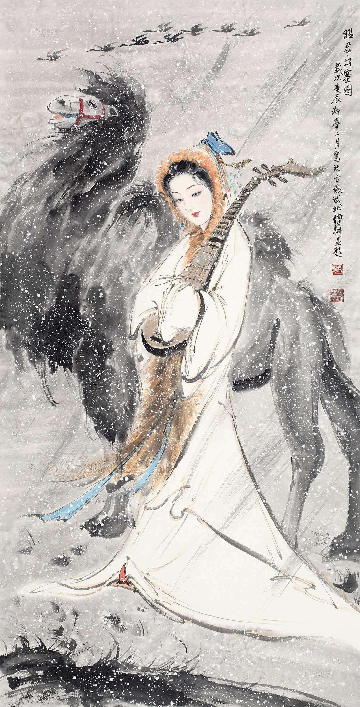

# 独留青冢向黄昏

锦衣玉食，从不曾赢得你满足的一笑，绣楼画阁，从不曾还给你自由的梦境。年年岁岁，桃花自开自落，何曾等到过半只蜂蝶？你早已看透，这个隔绝了人间春色的后宫，分明是座华丽的囚笼。

匈奴和亲的消息传至长安，惊呆了后宫的三千佳丽。而你，从一队战战兢兢的宫娥中走出，冲宣诏的太监浅浅一笑，接过圣旨，也接过了历史。

没有过问琳琅满目的嫁妆，你只是轻轻抱起心爱的琵琶，跨出宫门，走向天涯。身后的丹陛金銮之上，汉元帝呷一口酒，满意地笑了。

你的目光，不屑在金钗银钿、雕鞍玉辔上稍作停留，只对灞桥两侧的垂柳投去深情的一瞥。她们，可攀可折，而不可断。

漫漫长路，凛凛寒风，一列严整的马队行进在苍茫的天地间。车轮碾过，两道车辙深深，向南一直延伸到益加缥缈的长安。那时的你，一定没有回头，不肯或是不敢。

纤指拨动冰弦，风沙的低吟中掺进一段如泣如诉的琵琶曲。你终于奏出了属于自己的乐章，不为皇帝的赞许，不为嫔妃的赏赐，只为袖边的那几缕啼痕。

两个民族的恩怨，最终要让一个纤弱的女子来承担。如雨的马蹄，如雷的呐喊，如注的热血，白发母亲的呼唤，春闺少妇的期盼，湖湘稚儿的啼哭，都在一片琵琶声里淡去，飘逝……

那塞外风沙中的身影，幻化成分隔战争与和平的标点，印上《汉书》的扉页。

你的跋涉完成了一次超越时空的征途。从矫揉的繁华走向犷悍的蛮荒，从渺远的朝代走向漫漶的墨迹。左一脚，十年，右一脚，十年，把塞外的广袤解读为空旷，把大漠的寥廓咀嚼成凄凉，最后归结为一座黄昏下的青冢，将几卷刻满血泪的青史深埋其中。

而青冢背后，正是中原的万里云天。

从此，长河落日里，大漠孤烟下，你的琵琶声就回荡了千年。
