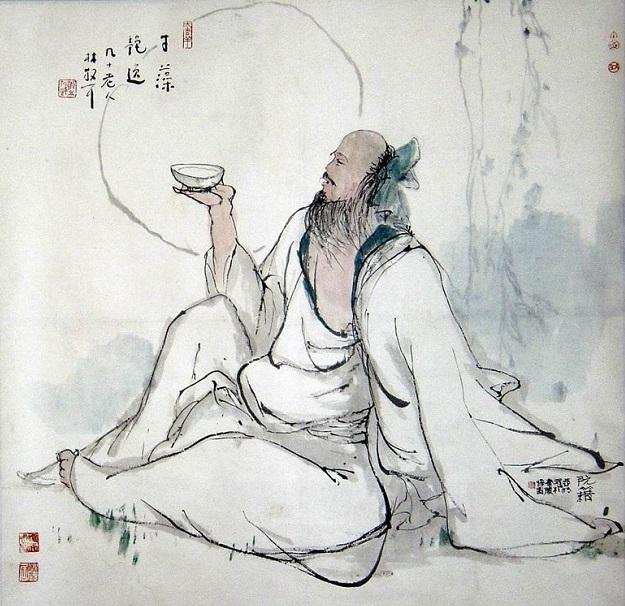

# 醉眼问青天

孤鹤嘹唳，愁猿哀啸，风声似咽，霜林如血。

秋，已经很深了。

一架牛车踽踽于广武山曲折似羊肠的山路。

牛，已经很老，瘦骨嶙峋，步履蹒跚。

车，已经很旧，辕轼无彩，轮辐疏残。

而车上的人正趴在酒缸上酩酊，青衫一角，沾湿了那种叫酒或叫泪的液体，一滴又一滴地淌下，被飞尘截获，踪影全无。

牛突然停下了脚步。车上的人抬起迷茫的醉眼：车前是丛生的荆棘，荆棘之后，是万仞绝壁。

没有路了吗？真的没有路了吗？深深的车辙在身后蜿蜒成一个巨大的问号。

定然是哪里错了。是牛？是车？还是——人？

他每天重演着穷途哭返的独角戏，然后站在高崖之上仰问青天，花开依然，花谢依然，一任冬去春来，四野沉寂。他相信，苍天不会永远沉默。

此时，他走下牛车，临风而立，似乎想说些什么。突然，他听到一个颤抖的声音从身体内迸出“时无英雄，使竖子成名！”没有上文，没有下文，只有短短的九个字，却使他泪飞如雨。

他分明看到绮丽华美的锦衣之下，包裹着行尸走肉，金碧辉煌的高堂之上，坐着豺狼虎豹。有人揣着冠冕堂皇的礼法，历数他践礼背道之种种，有人在一边对他挤眉弄眼，牵衣扯带，还有人在阴暗的角落里窃笑，掰着手指替他算着剩下的日子。他深陷重围，只有默默地闭上眼睛，任黑白被颠倒，任真假被篡改，任对被扭曲，任天地被翻覆，只是，谁看不出他袍袖间的一把辛酸泪？

西风残照，暮云合璧，深秋的寒意刺痛了他敏感的神经。他蓦然想起，楚国的三闾大夫，那个“虽九死其犹未悔”的先贤，在汨罗江边一定也曾如他这般流泪，因为“举世混浊而我独清”，因为“其志洁，其行廉”。似乎是屈原错了，错得光明正大，流芳百世。还有那个曾做过漆园小吏而后垂钓濮水的庄周，也一定曾如他这般流泪。因为那句“窃钩者诛，窃国者侯”，因为那句“往矣！吾将曳尾于涂中”。似乎是庄周错了，错得坦荡从容，搏誉神州。还有……

他终于明白，那些敢于冒天下之大不韪，屏除众议，不涉俗流的独行者们，才是真理的主宰。他们用美丽的错误编织成历史最绚烂的彩虹，用孑立的身影拼凑出时代最壮丽的风景，用嘶哑的歌声打造出人间最凄美的绝唱。

山谷间，传出一阵爽朗的笑声。

他重新驾上牛车，听到广武涧的水声有如天音。

他知道自己从此不会再有泪了。

只记得很久很久以前人们叫他阮籍。
